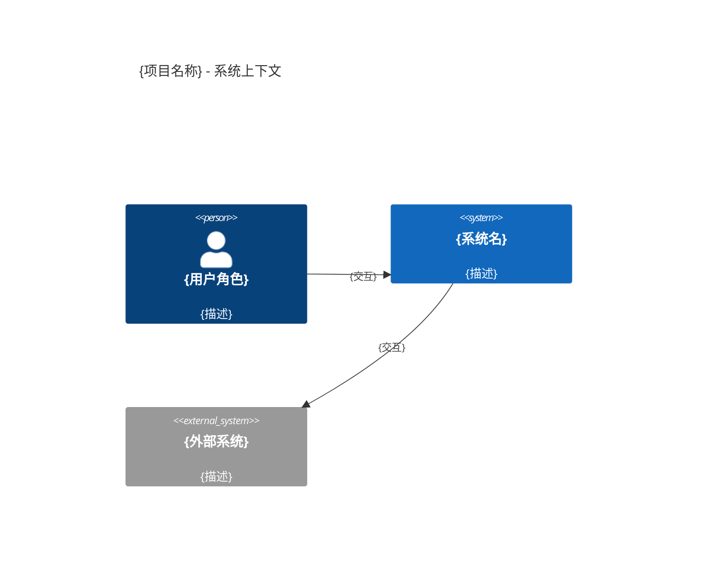

# Architecture: {项目名称}
<!-- required_sections: ["## 1. 架构概览", "## 2. 模块划分", "## 3. 接口契约", "## 4. 数据模型"] -->
<!-- id: arch-{project}-{ver} | author: architect | status: draft -->
<!-- deps: prd-{project}-{ver} | consumers: tech-lead, developer, devops -->
<!-- volume: main -->

[NAV]
- §1 架构概览 → §1.1 项目类型, §1.2 架构风格, §1.3 系统上下文图, §1.4 技术栈
- §2 模块划分 → M-001..M-{NNN}
- §3 接口契约 → API-001..API-{NNN} (详见分卷arch-{project}-{ver}-api)
- §4 数据模型 → E-001..E-{NNN} (详见分卷arch-{project}-{ver}-data)
- §5 非功能架构 → §5.1 性能, §5.2 安全, §5.3 错误处理, §5.4 配置管理
- §6 目录结构
- §7 开发约定 → §7.1 命名, §7.2 代码风格, §7.3 Git约定
[/NAV]

## 1. 架构概览

### 1.1 项目类型
- **类型**: fullstack | backend-only | CLI | API-only
{选择一项，orchestrator据此决定是否跳过UI设计阶段}

### 1.2 架构风格
{选型 + 选型理由 + 调研依据引用}

### 1.3 系统上下文图

{补充说明(可选)}

### 1.4 技术栈
| 层次 | 技术 | 版本 | 生命周期 | 选型理由 | 调研来源 |
|------|------|------|----------|----------|----------|

## 2. 模块划分

### M-001: {模块名称}
- **职责**: {单一职责描述}
- **映射功能**: F-001, F-003 (引用PRD)
- **对外接口**: API-001, API-002 (引用接口分卷)
- **依赖模块**: M-002, M-005
- **内部关键组件**: {类/组件列表}

## 3. 接口契约
> 当接口数量 > 10 时拆分为独立分卷 arch-{project}-{ver}-api.md

### API-001: {接口名称}
```yaml
path: /api/v1/{resource}
method: POST
module: M-001
request:
  headers: { Authorization: "Bearer {token}" }
  body:
    field1: { type: string, required: true, desc: "{}" }
response:
  200: { schema: "{ResponseType}" }
  400: { schema: "ErrorResponse" }
```

## 4. 数据模型
> 当实体数量 > 8 时拆分为独立分卷 arch-{project}-{ver}-data.md

### 4.1 实体关系
```mermaid
erDiagram
    {实体关系定义}
```

### E-001: {实体名}
| 字段 | 类型 | 约束 | 说明 |
|------|------|------|------|

## 5. 非功能架构
### 5.1 性能方案
{缓存/异步/分页策略}
### 5.2 安全方案
{认证/授权/加密}
### 5.3 错误处理
{错误码/重试策略}
### 5.4 配置管理
{环境变量清单 / 配置文件格式与加载策略 / 敏感信息处理}

## 6. 目录结构
```text
project/
├── src/
│   ├── module-a/
│   └── module-b/
├── tests/
└── config/
```

## 7. 开发约定
### 7.1 命名规范
{文件/变量/接口}
### 7.2 代码风格
{Lint/格式化}
### 7.3 Git约定
{分支策略/Commit格式}