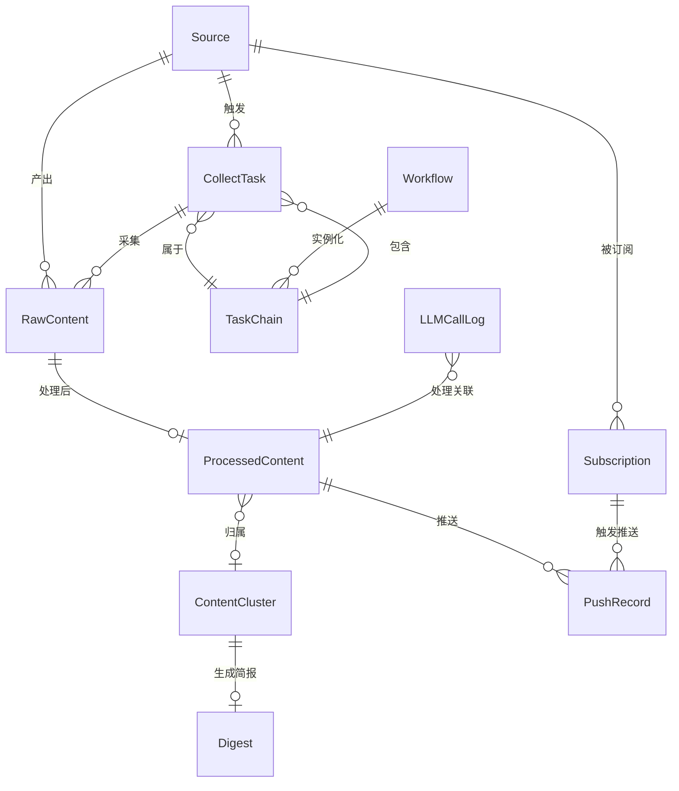

# Architecture 分卷 -- 数据模型: IntelliSource
<!-- required_sections: ["## 4. 数据模型"] -->
<!-- volume_type: data -->
<!-- id: arch-intellisource-v1-data | author: architect | status: draft -->
<!-- deps: prd-intellisource-v1 | consumers: tech-lead, developer, devops -->
<!-- volume: data | split-from: arch-intellisource-v1 -->

[NAV]

- §4 数据模型 → §4.1 实体关系(不含 ChatMessage 独立实体，对话消息内嵌于 E-011 context JSONB), E-001..E-012
[/NAV]

## 4. 数据模型

### 4.1 实体关系

### E-001: Source (信息源)

| 字段 | 类型 | 约束 | 说明 |
|------|------|------|------|
| id | UUID | PK | 信源唯一标识 |
| name | VARCHAR(255) | NOT NULL, UNIQUE | 信源名称 |
| type | VARCHAR(20) | NOT NULL, CHECK IN ('rss', 'api', 'web') | 信源类型 |
| url | TEXT | NOT NULL | 信源 URL |
| tags | JSONB | DEFAULT '[]' | 学科标签数组 |
| status | VARCHAR(20) | NOT NULL, DEFAULT 'active', CHECK IN ('active', 'paused', 'error') | 信源状态 |
| schedule_interval | INTEGER | NOT NULL, DEFAULT 3600 | 采集间隔（秒） |
| schedule_adaptive | BOOLEAN | NOT NULL, DEFAULT true | 是否启用自适应频率 |
| proxy | VARCHAR(500) | NULL | HTTP 代理地址 |
| rate_limit_qps | DECIMAL(8,2) | NULL | QPS 限制 |
| rate_limit_concurrency | INTEGER | NULL | 并发限制 |
| metadata | JSONB | DEFAULT '{}' | 自定义扩展元数据 |
| last_collected_at | TIMESTAMP WITH TZ | NULL | 上次采集时间 |
| next_collect_at | TIMESTAMP WITH TZ | NULL | 下次计划采集时间 |
| error_count | INTEGER | NOT NULL, DEFAULT 0 | 连续错误计数（自适应用） |
| avg_update_interval | INTEGER | NULL | 历史平均更新间隔（秒），自适应频率计算依据 |
| http_etag | VARCHAR(255) | NULL | 上次响应的 ETag 值，用于 HTTP 条件请求 |
| http_last_modified | VARCHAR(255) | NULL | 上次响应的 Last-Modified 值，用于 HTTP 条件请求 |
| config_version | INTEGER | NOT NULL, DEFAULT 1 | 配置版本号 |
| created_at | TIMESTAMP WITH TZ | NOT NULL, DEFAULT NOW() | 创建时间 |
| updated_at | TIMESTAMP WITH TZ | NOT NULL, DEFAULT NOW() | 更新时间 |

**索引**: `idx_source_status` (status), `idx_source_next_collect` (next_collect_at), `idx_source_tags` (tags, GIN)

### E-002: CollectTask (采集任务)

| 字段 | 类型 | 约束 | 说明 |
|------|------|------|------|
| id | UUID | PK | 任务唯一标识 |
| source_id | UUID | FK → Source.id, NOT NULL | 关联信源 |
| task_chain_id | UUID | FK → TaskChain.id, NULL | 所属任务链 |
| status | VARCHAR(20) | NOT NULL, DEFAULT 'pending', CHECK IN ('pending', 'running', 'success', 'failed', 'paused', 'cancelled') | 任务状态 |
| priority | VARCHAR(10) | NOT NULL, DEFAULT 'normal', CHECK IN ('low', 'normal', 'high') | 优先级 |
| trigger_type | VARCHAR(20) | NOT NULL, CHECK IN ('scheduled', 'manual', 'message') | 触发方式 |
| items_collected | INTEGER | NOT NULL, DEFAULT 0 | 采集条目数 |
| error_message | TEXT | NULL | 错误信息 |
| retry_count | INTEGER | NOT NULL, DEFAULT 0 | 已重试次数 |
| started_at | TIMESTAMP WITH TZ | NULL | 开始时间 |
| finished_at | TIMESTAMP WITH TZ | NULL | 完成时间 |
| created_at | TIMESTAMP WITH TZ | NOT NULL, DEFAULT NOW() | 创建时间 |

**索引**: `idx_collect_task_status` (status), `idx_collect_task_source` (source_id), `idx_collect_task_chain` (task_chain_id)

### E-003: RawContent (原始内容)

| 字段 | 类型 | 约束 | 说明 |
|------|------|------|------|
| id | UUID | PK | 原始内容唯一标识 |
| source_id | UUID | FK → Source.id, NOT NULL | 来源信源 |
| collect_task_id | UUID | FK → CollectTask.id, NOT NULL | 采集任务 |
| title | TEXT | NULL | 标题 |
| author | VARCHAR(255) | NULL | 作者 |
| body_html | TEXT | NULL | 原始 HTML 正文 |
| body_text | TEXT | NULL | 纯文本正文 |
| source_url | TEXT | NOT NULL | 原始 URL |
| published_at | TIMESTAMP WITH TZ | NULL | 发布时间 |
| fingerprint | VARCHAR(64) | NOT NULL, UNIQUE | 内容指纹（SHA-256） |
| raw_metadata | JSONB | DEFAULT '{}' | 原始元数据 |
| created_at | TIMESTAMP WITH TZ | NOT NULL, DEFAULT NOW() | 入库时间 |

**索引**: `idx_raw_content_fingerprint` (fingerprint, UNIQUE), `idx_raw_content_source` (source_id), `idx_raw_content_published` (published_at)

### E-004: ProcessedContent (处理后内容)

| 字段 | 类型 | 约束 | 说明 |
|------|------|------|------|
| id | UUID | PK | 处理后内容唯一标识 |
| raw_content_id | UUID | FK → RawContent.id, NOT NULL, UNIQUE | 关联原始内容 |
| title | TEXT | NOT NULL | 标题（可能经 LLM 优化） |
| body_text | TEXT | NOT NULL | 处理后正文 |
| summary | TEXT | NULL | LLM 生成摘要 |
| tags | JSONB | DEFAULT '[]' | 语义标签数组 |
| sentiment | VARCHAR(10) | NULL, CHECK IN ('positive', 'neutral', 'negative') | 情感倾向 |
| cluster_id | UUID | FK → ContentCluster.id, NULL | 所属聚类 |
| fingerprint | VARCHAR(64) | NOT NULL | 内容指纹（继承自 RawContent） |
| embedding | VECTOR(1536) | NULL | 内容向量表示（pgvector）[ASSUMPTION: v1 默认使用 1536 维度的 embedding 模型（如 OpenAI text-embedding-ada-002），维度值通过 M-001 配置管理模块的 embedding_dimension 配置项管理，切换 embedding 模型时需同步调整并执行 Alembic 迁移] |
| structured_data | JSONB | NULL | LLM 结构化提取结果 |
| processing_status | VARCHAR(20) | NOT NULL, DEFAULT 'pending', CHECK IN ('pending', 'processing', 'completed', 'failed', 'fallback') | 处理状态 |
| processed_by | VARCHAR(20) | NOT NULL, DEFAULT 'llm', CHECK IN ('llm', 'fallback', 'manual') | 处理方式 |
| source_url | TEXT | NOT NULL | 原始 URL（冗余，方便查询） |
| source_name | VARCHAR(255) | NOT NULL | 来源名称（冗余） |
| published_at | TIMESTAMP WITH TZ | NULL | 发布时间 |
| processed_at | TIMESTAMP WITH TZ | NULL | 处理完成时间 |
| created_at | TIMESTAMP WITH TZ | NOT NULL, DEFAULT NOW() | 创建时间 |

**索引**: `idx_processed_content_cluster` (cluster_id), `idx_processed_content_tags` (tags, GIN), `idx_processed_content_embedding` (embedding, HNSW/IVFFlat), `idx_processed_content_published` (published_at), `idx_processed_content_ts` (to_tsvector('chinese', title || ' ' || body_text), GIN) -- 全文检索

### E-005: ContentCluster (内容聚类)

| 字段 | 类型 | 约束 | 说明 |
|------|------|------|------|
| id | UUID | PK | 聚类唯一标识 |
| topic | TEXT | NOT NULL | 聚类主题（LLM 生成） |
| tags | JSONB | DEFAULT '[]' | 聚合标签 |
| content_count | INTEGER | NOT NULL, DEFAULT 0 | 包含内容数 |
| centroid | VECTOR(1536) | NULL | 聚类中心向量 [ASSUMPTION: 维度与 E-004 embedding 一致，跟随 embedding_dimension 配置] |
| status | VARCHAR(20) | NOT NULL, DEFAULT 'active', CHECK IN ('active', 'merged', 'archived') | 聚类状态 |
| created_at | TIMESTAMP WITH TZ | NOT NULL, DEFAULT NOW() | 创建时间 |
| updated_at | TIMESTAMP WITH TZ | NOT NULL, DEFAULT NOW() | 最后更新时间 |

**索引**: `idx_cluster_tags` (tags, GIN), `idx_cluster_updated` (updated_at)

### E-006: Digest (综合简报)

| 字段 | 类型 | 约束 | 说明 |
|------|------|------|------|
| id | UUID | PK | 简报唯一标识 |
| cluster_id | UUID | FK → ContentCluster.id, NOT NULL | 关联聚类 |
| title | TEXT | NOT NULL | 简报标题 |
| summary | TEXT | NOT NULL | 综合摘要 |
| timeline | JSONB | NULL | 时间线数据（事件演进） |
| key_points | JSONB | NOT NULL, DEFAULT '[]' | 要点列表 |
| generated_by | VARCHAR(20) | NOT NULL, DEFAULT 'llm', CHECK IN ('llm', 'fallback') | 生成方式 |
| created_at | TIMESTAMP WITH TZ | NOT NULL, DEFAULT NOW() | 生成时间 |
| updated_at | TIMESTAMP WITH TZ | NOT NULL, DEFAULT NOW() | 更新时间 |

**索引**: `idx_digest_cluster` (cluster_id)

### E-007: LLMCallLog (LLM 调用日志)

| 字段 | 类型 | 约束 | 说明 |
|------|------|------|------|
| id | UUID | PK | 日志唯一标识 |
| model | VARCHAR(100) | NOT NULL | 模型名称 |
| provider | VARCHAR(50) | NOT NULL | 提供商 |
| call_type | VARCHAR(50) | NOT NULL | 调用类型: extract/dedup/cluster/summarize/tag/sentiment/search/optimize |
| content_id | UUID | NULL | 关联内容 ID |
| input_tokens | INTEGER | NOT NULL | 输入 Token 数 |
| output_tokens | INTEGER | NOT NULL | 输出 Token 数 |
| latency_ms | INTEGER | NOT NULL | 延迟（毫秒） |
| input_length | INTEGER | NOT NULL | 输入文本长度 |
| output_length | INTEGER | NOT NULL | 输出文本长度 |
| status | VARCHAR(20) | NOT NULL, CHECK IN ('success', 'failed', 'fallback') | 调用状态 |
| error_message | TEXT | NULL | 错误信息 |
| created_at | TIMESTAMP WITH TZ | NOT NULL, DEFAULT NOW() | 调用时间 |

**索引**: `idx_llm_log_model` (model), `idx_llm_log_created` (created_at), `idx_llm_log_type` (call_type)

**分区策略**: 按 `created_at` 月份分区（Range Partition），超过 3 个月的分区可归档 [ASSUMPTION: 3 个月保留期为默认值，用户可调整]

### E-008: TaskChain (任务链)

| 字段 | 类型 | 约束 | 说明 |
|------|------|------|------|
| id | UUID | PK | 任务链唯一标识 |
| workflow_id | UUID | FK → Workflow.id, NULL | 关联工作流（手动触发则为空） |
| status | VARCHAR(20) | NOT NULL, DEFAULT 'pending', CHECK IN ('pending', 'running', 'success', 'failed', 'paused', 'cancelled') | 任务链状态 |
| trigger_type | VARCHAR(20) | NOT NULL, CHECK IN ('scheduled', 'manual', 'message') | 触发方式 |
| total_steps | INTEGER | NOT NULL | 总步骤数 |
| completed_steps | INTEGER | NOT NULL, DEFAULT 0 | 已完成步骤数 |
| current_step | VARCHAR(50) | NULL | 当前执行步骤 |
| error_message | TEXT | NULL | 错误信息 |
| started_at | TIMESTAMP WITH TZ | NULL | 开始时间 |
| finished_at | TIMESTAMP WITH TZ | NULL | 完成时间 |
| created_at | TIMESTAMP WITH TZ | NOT NULL, DEFAULT NOW() | 创建时间 |

**索引**: `idx_task_chain_status` (status), `idx_task_chain_workflow` (workflow_id)

### E-009: Subscription (订阅规则)

| 字段 | 类型 | 约束 | 说明 |
|------|------|------|------|
| id | UUID | PK | 订阅唯一标识 |
| name | VARCHAR(255) | NOT NULL | 订阅规则名称 |
| source_id | UUID | FK → Source.id, NULL | 关联信源（空则匹配全部） |
| channel | VARCHAR(20) | NOT NULL, CHECK IN ('wechat', 'wework', 'email') | 推送渠道 |
| channel_config | JSONB | NOT NULL | 渠道配置（OpenID/CorpID/邮箱等） |
| match_rules | JSONB | NOT NULL | 匹配规则: {keywords: ["+必选词", "普通词", "!排除词", "/正则模式/"], tags: [], sentiment: [], min_score: 0.0}。关键词语法: 普通词(包含即匹配)、+前缀(必须包含)、!前缀(排除)、/pattern/(正则匹配)。min_score: 最低权重阈值，0 表示不过滤 |
| frequency | VARCHAR(20) | NOT NULL, DEFAULT 'realtime', CHECK IN ('realtime', 'hourly', 'daily', 'weekly') | 推送频率 |
| quiet_hours | JSONB | NULL | 免打扰时段: {start: "22:00", end: "08:00"} |
| status | VARCHAR(20) | NOT NULL, DEFAULT 'active', CHECK IN ('active', 'paused') | 订阅状态 |
| created_at | TIMESTAMP WITH TZ | NOT NULL, DEFAULT NOW() | 创建时间 |
| updated_at | TIMESTAMP WITH TZ | NOT NULL, DEFAULT NOW() | 更新时间 |

**索引**: `idx_subscription_channel` (channel), `idx_subscription_status` (status), `idx_subscription_rules` (match_rules, GIN)

### E-010: PushRecord (推送记录)

| 字段 | 类型 | 约束 | 说明 |
|------|------|------|------|
| id | UUID | PK | 推送记录唯一标识 |
| subscription_id | UUID | FK → Subscription.id, NOT NULL | 关联订阅 |
| content_id | UUID | FK → ProcessedContent.id, NOT NULL | 关联内容 |
| channel | VARCHAR(20) | NOT NULL | 推送渠道 |
| status | VARCHAR(20) | NOT NULL, DEFAULT 'pending', CHECK IN ('pending', 'sent', 'delivered', 'failed') | 推送状态 |
| retry_count | INTEGER | NOT NULL, DEFAULT 0 | 重试次数 |
| error_message | TEXT | NULL | 错误信息 |
| sent_at | TIMESTAMP WITH TZ | NULL | 发送时间 |
| delivered_at | TIMESTAMP WITH TZ | NULL | 送达时间 |
| created_at | TIMESTAMP WITH TZ | NOT NULL, DEFAULT NOW() | 创建时间 |

**索引**: `idx_push_record_subscription` (subscription_id), `idx_push_record_content` (content_id), `idx_push_record_dedup` (subscription_id, content_id, channel, UNIQUE) -- 去重约束

### E-011: ChatSession (对话会话)

| 字段 | 类型 | 约束 | 说明 |
|------|------|------|------|
| id | UUID | PK | 会话唯一标识 |
| channel | VARCHAR(20) | NOT NULL | 消息渠道 |
| channel_user_id | VARCHAR(255) | NOT NULL | 渠道用户标识（OpenID 等） |
| context | JSONB | NOT NULL, DEFAULT '[]' | 对话上下文（最近 5 轮），内嵌存储对话消息历史，每条消息结构: {role: "user"\|"assistant", content: string, timestamp: datetime}，不单独建表 |
| last_active_at | TIMESTAMP WITH TZ | NOT NULL, DEFAULT NOW() | 最后活跃时间 |
| created_at | TIMESTAMP WITH TZ | NOT NULL, DEFAULT NOW() | 创建时间 |

**索引**: `idx_chat_session_user` (channel, channel_user_id), `idx_chat_session_active` (last_active_at)

**清理策略**: 超过 24 小时无活跃的会话自动清理 [ASSUMPTION: 24 小时超时为默认值]

### E-012: Workflow (工作流定义)

| 字段 | 类型 | 约束 | 说明 |
|------|------|------|------|
| id | UUID | PK | 工作流唯一标识 |
| name | VARCHAR(255) | NOT NULL, UNIQUE | 工作流名称 |
| description | TEXT | NULL | 工作流描述 |
| steps | JSONB | NOT NULL | 步骤定义数组 |
| schedule_cron | VARCHAR(100) | NULL | Cron 定时表达式 |
| status | VARCHAR(20) | NOT NULL, DEFAULT 'active', CHECK IN ('active', 'paused', 'archived') | 工作流状态 |
| last_run_at | TIMESTAMP WITH TZ | NULL | 上次执行时间 |
| created_at | TIMESTAMP WITH TZ | NOT NULL, DEFAULT NOW() | 创建时间 |
| updated_at | TIMESTAMP WITH TZ | NOT NULL, DEFAULT NOW() | 更新时间 |

**索引**: `idx_workflow_status` (status), `idx_workflow_schedule` (schedule_cron) WHERE schedule_cron IS NOT NULL
