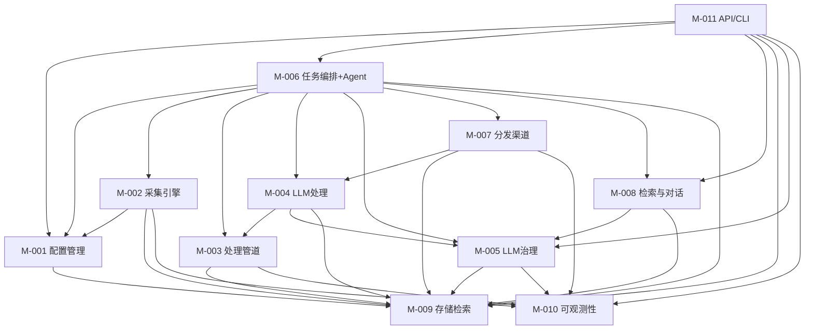

# Architecture 分卷 -- 模块划分: IntelliSource
<!-- required_sections: ["## 2. 模块划分"] -->
<!-- volume_type: modules -->
<!-- id: arch-intellisource-v1-modules | author: architect | status: approved -->
<!-- deps: prd-intellisource-v1 | consumers: tech-lead, developer, devops -->
<!-- volume: modules | split-from: arch-intellisource-v1 -->

[NAV]

- §2 模块划分 → M-001..M-011
[/NAV]

## 2. 模块划分

### M-001: 配置管理模块 (config)

- **职责**: 管理信息源的声明式配置，提供配置的 CRUD、校验、热加载和版本管理能力
- **映射功能**: F-001（信息源声明式配置）
- **对外接口**: API-001, API-002, API-003, API-004, API-005
- **依赖模块**: M-009（配置持久化存储）
- **内部关键组件**:
  - `SourceConfig` — 信源配置 Pydantic 模型，定义 YAML/JSON 配置结构
  - `ConfigLoader` — 配置文件加载器，支持 YAML/JSON 格式解析
  - `ConfigValidator` — 配置校验器，格式校验失败时拒绝加载并输出错误信息（AC-003）
  - `ConfigWatcher` — 文件变更监听器（基于 watchfiles），实现热加载（AC-002）
  - `ConfigVersionManager` — 配置版本管理，支持回退到历史版本（AC-004）
  - 配置项包含 `embedding_dimension`（默认 1536），切换 embedding 模型时需调整此值并执行数据库迁移

### M-002: 采集引擎模块 (collector)

- **职责**: 提供插件化的采集架构，从多种信息源类型采集内容，统一输出标准化数据模型
- **映射功能**: F-002（插件化采集引擎）, F-003（采集频率自适应与资源隔离）
- **对外接口**: 无直接对外 API（由 M-006 任务编排调度）
- **依赖模块**: M-001（获取信源配置）, M-009（存储采集结果）, M-010（日志/指标上报）
- **内部关键组件**:
  - `BaseCollector` — 采集器抽象基类，定义统一接口（AC-005），内置 HTTP 条件请求支持（ETag/If-Modified-Since），子类可复用以减少未变化源的计算开销
  - `CollectorRegistry` — 采集器注册中心，支持自动发现注册和手动注册两种模式
  - `SourceAutoDiscovery` — 数据源自发现加载器，启动时扫描 `collector/sources/` 目录，自动发现并注册实现了 `BaseCollector` 接口的子包（借鉴 RSSHub namespace 路由发现模式）。新增数据源只需在 `sources/` 下创建子包并实现标准接口，无需修改注册代码
  - `RSSCollector` — RSS/Atom 采集适配器（AC-006）
  - `APICollector` — 通用 API 采集适配器（AC-006）
  - `WebCollector` — 网页爬虫采集适配器（AC-006）
  - `AdaptiveScheduler` — 频率自适应调度器（AC-009），算法：最小间隔保护（默认 120s）→ 空转指数退避（连续无新内容时 interval × backoff_factor，默认 1.5）→ 新内容恢复（interval × recovery_factor，默认 0.5）→ 基于 E-001 `avg_update_interval` 历史学习动态调整基准间隔
  - `RateLimiter` — 请求速率限制器，基于 Redis 令牌桶算法，按信源独立配置（AC-011）
  - `ProxyManager` — HTTP 代理管理器，按信源配置独立代理（AC-010）

### M-003: 处理管道模块 (pipeline)

- **职责**: 提供可编排的内容处理管道框架，支持处理器的动态组合、条件分支和上下文传递
- **映射功能**: F-004（可编排处理管道）
- **对外接口**: 无直接对外 API（由 M-006 任务编排调度）
- **依赖模块**: M-009（读写处理结果）, M-010（日志/指标上报）
- **内部关键组件**:
  - `PipelineEngine` — 管道执行引擎，支持中间件链模式（借鉴 RSSHub/Hono 中间件管道），每个处理器可实现前处理-调用下一个-后处理的洋葱模型，同时兼容传统线性编排（AC-013）
  - `MiddlewareChain` — 中间件链执行器，支持 `process(ctx, next)` 洋葱模型，处理器可在调用 next 前后执行前处理/后处理逻辑，支持在 PipelineConfig YAML 的 steps 中声明中间件组合
  - `BaseProcessor` — 处理器抽象基类，定义统一接口（AC-015）
  - `PipelineContext` — 管道上下文对象，支持处理器间数据传递（AC-016）
  - `ConditionEvaluator` — 条件评估器，支持条件跳过和分支（AC-014）
  - `BatchProcessor` — 批处理模式适配器（AC-017）
  - 内置处理器: `HTMLParser`, `ContentDedup`（指纹去重）, `KeywordTagger`, `FormatConverter`

### M-004: 原子化处理工具模块 (pipeline.processors.tools)

> **[Sprint 6 变更]** 原 "LLM 智能处理模块" 重构为纯原子操作工具。LLM 调用逻辑移至 M-006 Agent 编排层，处理器不再直接调用 LLMGateway。

- **职责**: 提供底层原子化的内容处理操作（不含 LLM 调用），作为工具暴露给 LLM 和智能体。包括正则提取、指纹生成、向量搜索、TF-IDF 关键词、截断摘要、关键词打标、敏感词过滤等
- **映射功能**: F-005（结构化提取/语义去重/聚类）, F-006（摘要/打标）
- **对外接口**: 无直接对外 API（通过 M-006 AgentToolRegistry 注册为 Agent 工具）
- **依赖模块**: M-009（向量检索/存储）。**不再依赖 M-005（LLM 网关）**
- **内部关键组件**:
  - `regex_extract()` — 正则提取结构化数据（AC-018 降级路径）
  - `fingerprint_generate()` — SHA-256 内容指纹生成（AC-022）
  - `vector_search_similar()` — 向量相似度搜索（AC-019 原子操作）
  - `fingerprint_dedup()` — 指纹比对去重（AC-019 降级路径）
  - `find_nearest_cluster()` — 最近聚类搜索（AC-020 原子操作）
  - `tfidf_keywords()` — TF-IDF 关键词提取（AC-020 降级路径）
  - `truncate_summary()` — 截断式摘要生成（AC-023 降级路径）
  - `keyword_tag()` — 关键词匹配打标（AC-024 降级路径）
  - `ContentFilter` — 敏感词过滤与合规检查（AC-025），纯字符串匹配
  - `truncate_for_push()` — 推送内容截断优化
  - LLM 增强处理（结构化提取、语义去重判定、聚类主题生成、摘要生成、语义打标）由 M-006 Agent 编排层通过 `llm_complete` 元工具按需调用

### M-005: LLM 服务治理模块 (llm.gateway)

> **[Sprint 6 变更]** 新增 PromptBuilder（统一提示词组装与 token 截断）、LLMCache（Redis 结果缓存）、ModelProfile（模型参数配置）。

- **职责**: 提供统一的 LLM 调用接口，管理多模型提供商，实现重试、熔断、降级和成本监控。Sprint 6 新增提示词管理、token 截断和结果缓存能力
- **映射功能**: F-007（LLM 服务治理）
- **对外接口**: API-017（LLM 用量统计）
- **依赖模块**: M-009（调用日志持久化）, M-010（指标上报）
- **内部关键组件**:
  - `LLMGateway` — 统一 LLM 调用接口，基于 litellm 封装，屏蔽提供商差异（AC-028）。Sprint 6 增强: 支持 max_input_tokens 参数自动截断、可选 LLMCache 集成、模型参数 profile 默认值
  - `PromptBuilder` — **[新增]** 统一提示词组装器（借鉴 OpenCode §3.5），加载 .txt 模板 → 变量替换 → 内容 token 截断 → 构建 messages 列表
  - `LLMCache` — **[新增]** Redis LLM 结果缓存（借鉴 OpenCode §3.3），key = fingerprint + call_type + prompt_version，TTL 24h，仅缓存 success 结果
  - `ModelProfile` — **[新增]** 模型参数配置（借鉴 OpenCode §3.4），按模型 ID 配置 temperature/max_tokens/context_window
  - `CircuitBreaker` — 熔断器实现（AC-029），连续失败 5 次触发，60s 恢复探测
  - `FallbackManager` — 降级管理器，LLM 失败时自动切换（AC-030，<500ms）
  - `PriorityQueue` — 优先级队列，隔离用户交互请求和后台处理请求（AC-032）
  - `CostTracker` — 成本追踪器，记录 Token 消耗/延迟/IO 长度，支持聚合统计（AC-033）
  - 模型路由通过 YAML 配置文件 (`config/llm_models.yaml`) 声明 task_type → model 映射 + profiles 区段声明模型默认参数
  - `SchemaEnforcer` — JSON Mode / Function Calling 输出格式强制器（AC-031）

### M-006: 任务编排与 Agent 调度模块 (scheduler + agent)

> **[Sprint 6 变更]** Agent 成为 LLM 编排层。所有 LLM 处理（提取、去重、聚类、摘要、打标）由 Agent 通过 `llm_complete` 元工具按需调用，不再由 M-004 处理器内部调用。新增 system_prompt 管道配置和处理编排提示词。

- **职责**: 统一管理定时任务和即时查询的调度与执行。Celery 负责触发层（定时/手动/消息触发），AgentRunner 负责执行层，通过管道配置文件（Pipeline Config）定义任务行为边界。双模式执行：定时任务采用 strict 模式按配置步骤直接调用原子工具函数（零 LLM 开销），即时查询和内容处理采用 flexible 模式由 LLM Agent Loop 自主编排原子工具 + LLM 调用。**Agent 是系统中唯一发起 LLM 调用的编排层**
- **映射功能**: F-008（任务编排与调度）, F-011（即时检索的 Agent 调度部分）
- **对外接口**: API-006, API-007, API-008, API-009
- **依赖模块**: M-001（获取调度配置）, M-002（触发采集）, M-003（触发处理）, M-004（原子化处理工具）, M-005（LLM 网关 + PromptBuilder + LLMCache，flexible 模式使用）, M-007（触发分发）, M-008（检索工具）, M-009（任务状态持久化）
- **内部关键组件**:
  - `AgentRunner` — 双模式执行引擎（AC-066, AC-067）：strict 模式按管道配置顺序直接调用原子工具函数；flexible 模式运行 LLM Agent Loop，LLM 自主编排原子工具调用 + 通过 `llm_complete` 元工具发起 LLM 处理
  - `PipelineConfig` — 管道配置加载器，解析 YAML 管道配置文件（tools_allowed/denied, steps, mode, max_steps, **system_prompt**）
  - `AgentToolRegistry` — Agent 工具注册中心，注册 M-004 原子工具 + M-002/M-003/M-007/M-008 功能 + `llm_complete` 元工具
  - `llm_complete` — **[新增]** LLM 调用元工具，包装 M-005 LLMGateway + PromptBuilder，由 Agent 在 flexible 模式中按需调用
  - `CeleryTasks` — Celery 任务定义，触发 AgentRunner 执行对应管道
  - `TaskStateMachine` — 统一任务状态机：pending → running → success/failed，支持 pause/resume/timeout（AC-038）
  - `SchedulerManager` — 定时调度管理器，支持 Celery Beat 定时触发（AC-039）
  - `IdempotencyGuard` — 幂等保护器，基于内容指纹 + 推送记录 + Redis 分布式锁（AC-037）

### M-007: 分发渠道模块 (distributor)

- **职责**: 将处理后的内容通过多渠道（微信公众号/企业微信/邮件）推送给订阅用户
- **映射功能**: F-009（多渠道分发）
- **对外接口**: API-020（微信回调）, API-021（企业微信回调）, API-022（订阅列表）, API-023（创建订阅）, API-024（更新订阅）, API-025（删除订阅）
- **依赖模块**: M-004（获取处理后内容）, M-009（推送记录持久化）, M-010（推送指标上报）
- **内部关键组件**:
  - `BaseDistributor` — 分发器抽象基类，定义统一分发接口（预留扩展点）
  - `WeChatDistributor` — 微信公众号推送实现（AC-040）
  - `WeWorkDistributor` — 企业微信推送实现（AC-041）
  - `EmailDistributor` — 邮件推送实现，HTML 格式（AC-042）
  - `SubscriptionMatcher` — 订阅规则匹配引擎，支持高级关键词语法（`+`必选词、`!`排除词、`/pattern/`正则匹配）及学科标签匹配（AC-043），结合 ContentScorer 的权重评分进行推送排序和阈值过滤（AC-043a）
  - `ContentScorer` — 内容权重评分器，综合计算内容权重分（源可信度 × 时间衰减 × 关键词匹配度），用于推送排序和 min_score 阈值过滤
  - `DeliveryTracker` — 推送去重与历史记录（AC-044, AC-045）
  - `FrequencyController` — 推送频率控制与免打扰时段（AC-046）
  - `WebhookHandler` — 微信/企业微信消息回调处理（接收用户消息指令）

### M-008: 检索与对话模块 (search)

- **职责**: 提供混合检索引擎和对话会话管理能力，作为 Agent 工具供 M-006 AgentRunner 调用。意图理解和结果摘要由 AgentRunner 的 flexible 模式中 LLM 自主完成，不再作为独立组件
- **映射功能**: F-011（消息指令式即时检索）, F-012（混合检索部分）
- **对外接口**: API-012（混合检索）, API-013（即时问答）
- **依赖模块**: M-009（向量/全文检索）, M-005（LLM 上下文压缩）
- **内部关键组件**:
  - `HybridSearchEngine` — 混合检索引擎，关键词 + 向量语义联合查询（AC-051），注册为 Agent 工具供 AgentRunner 调用
  - `ChatSessionManager` — 对话会话管理器（AC-053），管理多轮对话上下文，通过 LLM compaction 压缩历史对话（超出 token 限制时自动摘要），替代固定轮次限制

### M-009: 存储与检索模块 (storage)

- **职责**: 管理结构化数据和向量数据的持久化存储，提供统一的数据访问层和混合检索能力
- **映射功能**: F-012（存储与混合检索）
- **对外接口**: API-014（内容列表）, API-015（内容详情）, API-016（聚类列表）
- **依赖模块**: 无（基础设施模块）
- **内部关键组件**:
  - `DatabaseManager` — 数据库连接池管理（SQLAlchemy AsyncSession）
  - `SourceRepository` — 信源数据访问层
  - `ContentRepository` — 内容数据访问层（AC-054）
  - `TaskRepository` — 任务数据访问层
  - `PushRepository` — 推送记录数据访问层
  - `ChatSessionRepository` — 对话会话数据访问层（E-011 CRUD、超时清理）
  - `VectorStore` — pgvector 向量存储与检索（AC-055）
  - `HybridIndex` — 混合索引，结合 PostgreSQL 全文检索 + pgvector 向量检索（AC-056）

### M-010: 可观测性模块 (observability)

- **职责**: 提供结构化日志、指标监控和分布式链路追踪基础设施
- **映射功能**: F-013（可观测性）
- **对外接口**: API-018（健康检查）, API-019（系统指标）
- **依赖模块**: 无（基础设施模块）
- **内部关键组件**:
  - `StructuredLogger` — structlog 配置，所有日志包含任务标识/处理阶段/耗时（AC-057）
  - `MetricsCollector` — 指标收集器，采集成功率/延迟/队列长度/LLM Token 用量（AC-058）
  - `TracingMiddleware` — OpenTelemetry 中间件，生成全链路 Trace ID（AC-059）
  - `HealthChecker` — 健康检查端点，检测数据库/Redis/外部服务可用性（AC-060）
  - `AlertManager` — 告警管理器，关键指标异常时触发告警（AC-060）

### M-011: API 与 CLI 模块 (api + cli)

- **职责**: 提供 RESTful API 和命令行工具，作为系统的统一外部接口层
- **映射功能**: F-014（RESTful API 与 CLI）
- **对外接口**: 所有 API-001 至 API-025（路由层，工作流相关 API 已移除）
- **依赖模块**: M-001 至 M-010（路由到各业务模块）
- **内部关键组件**:
  - `APIRouter` — FastAPI 路由注册，按资源组织路由（AC-061, AC-062）
  - `AuthMiddleware` — API Key 认证中间件
  - `RequestLogger` — 请求日志中间件
  - `TracingMiddleware` — 请求链路追踪中间件
  - `CLIApp` — typer CLI 应用，封装常用 API 操作（AC-064）
  - FastAPI 自动生成 OpenAPI/Swagger 文档（AC-065）

---

### 模块依赖关系图

**说明**: 依赖关系为有向无环图（DAG），M-009（存储）和 M-010（可观测性）为底层基础设施模块，无外部依赖。M-006 作为 Agent 调度中心，依赖范围最广（M-001~M-009），通过管道配置和 Agent 工具注册统一编排各模块。
