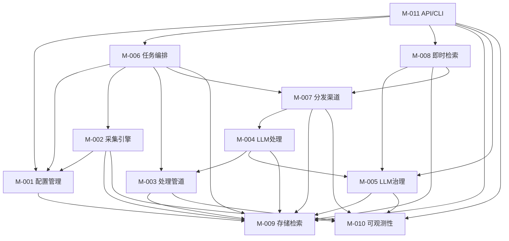

# Architecture 分卷 -- 模块划分: IntelliSource
<!-- required_sections: ["## 2. 模块划分"] -->
<!-- volume_type: modules -->
<!-- id: arch-intellisource-v1-modules | author: architect | status: draft -->
<!-- deps: prd-intellisource-v1 | consumers: tech-lead, developer, devops -->
<!-- volume: modules | split-from: arch-intellisource-v1 -->

[NAV]

- §2 模块划分 → M-001..M-011
[/NAV]

## 2. 模块划分

### M-001: 配置管理模块 (config)

- **职责**: 管理信息源的声明式配置，提供配置的 CRUD、校验、热加载和版本管理能力
- **映射功能**: F-001（信息源声明式配置）
- **对外接口**: API-001, API-002, API-003, API-004, API-005
- **依赖模块**: M-009（配置持久化存储）
- **内部关键组件**:
  - `SourceConfig` — 信源配置 Pydantic 模型，定义 YAML/JSON 配置结构
  - `ConfigLoader` — 配置文件加载器，支持 YAML/JSON 格式解析
  - `ConfigValidator` — 配置校验器，格式校验失败时拒绝加载并输出错误信息（AC-003）
  - `ConfigWatcher` — 文件变更监听器（基于 watchfiles），实现热加载（AC-002）
  - `ConfigVersionManager` — 配置版本管理，支持回退到历史版本（AC-004）
  - 配置项包含 `embedding_dimension`（默认 1536），切换 embedding 模型时需调整此值并执行数据库迁移

### M-002: 采集引擎模块 (collector)

- **职责**: 提供插件化的采集架构，从多种信息源类型采集内容，统一输出标准化数据模型
- **映射功能**: F-002（插件化采集引擎）, F-003（采集频率自适应与资源隔离）
- **对外接口**: 无直接对外 API（由 M-006 任务编排调度）
- **依赖模块**: M-001（获取信源配置）, M-009（存储采集结果）, M-010（日志/指标上报）
- **内部关键组件**:
  - `BaseCollector` — 采集器抽象基类，定义统一接口（AC-005）
  - `CollectorRegistry` — 采集器注册中心，支持插件化注册新采集器
  - `RSSCollector` — RSS/Atom 采集适配器（AC-006）
  - `APICollector` — 通用 API 采集适配器（AC-006）
  - `WebCollector` — 网页爬虫采集适配器（AC-006）
  - `AdaptiveScheduler` — 频率自适应调度器，根据历史更新频率动态调整采集间隔（AC-009）
  - `RateLimiter` — 请求速率限制器，基于 Redis 令牌桶算法，按信源独立配置（AC-011）
  - `ProxyManager` — HTTP 代理管理器，按信源配置独立代理（AC-010）

### M-003: 处理管道模块 (pipeline)

- **职责**: 提供可编排的内容处理管道框架，支持处理器的动态组合、条件分支和上下文传递
- **映射功能**: F-004（可编排处理管道）
- **对外接口**: 无直接对外 API（由 M-006 任务编排调度）
- **依赖模块**: M-009（读写处理结果）, M-010（日志/指标上报）
- **内部关键组件**:
  - `PipelineEngine` — 管道执行引擎，按配置编排处理器顺序（AC-013）
  - `BaseProcessor` — 处理器抽象基类，定义统一接口（AC-015）
  - `PipelineContext` — 管道上下文对象，支持处理器间数据传递（AC-016）
  - `ConditionEvaluator` — 条件评估器，支持条件跳过和分支（AC-014）
  - `BatchProcessor` — 批处理模式适配器（AC-017）
  - 内置处理器: `HTMLParser`, `ContentDedup`（指纹去重）, `KeywordTagger`, `FormatConverter`

### M-004: LLM 智能处理模块 (llm.processors)

- **职责**: 基于 LLM 实现结构化提取、语义去重、聚类、摘要、打标和情感分析等高级内容处理
- **映射功能**: F-005（结构化提取/语义去重/聚类）, F-006（摘要/打标/分析）, F-010（推送内容优化）
- **对外接口**: 无直接对外 API（作为 M-003 管道处理器运行）
- **依赖模块**: M-003（注册为管道处理器）, M-005（LLM 调用网关）, M-009（向量检索/存储）
- **内部关键组件**:
  - `LLMExtractor` — LLM 结构化提取处理器，按 JSON Schema 提取数据（AC-018）
  - `SemanticDedup` — 语义去重处理器，向量检索 + LLM 判定（AC-019）
  - `ContentClusterer` — 内容聚类处理器，同主题多源内容分组（AC-020）
  - `DigestGenerator` — 综合简报生成器，多篇文档聚合摘要（AC-023）
  - `SemanticTagger` — 语义打标处理器（AC-024）
  - `SentimentAnalyzer` — 情感分析处理器（AC-025）
  - `ContentFilter` — 敏感词过滤与合规检查（AC-026）
  - `PushOptimizer` — 推送内容重排序与引导语生成（AC-047, AC-048）
  - `FingerprintGenerator` — 内容指纹生成器（AC-022）
  - 每个 LLM 处理器均实现降级逻辑（AC-021, AC-027, AC-049），降级映射见 arch#§5.3

### M-005: LLM 服务治理模块 (llm.gateway)

- **职责**: 提供统一的 LLM 调用接口，管理多模型提供商，实现重试、熔断、降级和成本监控
- **映射功能**: F-007（LLM 服务治理）
- **对外接口**: API-017（LLM 用量统计）
- **依赖模块**: M-009（调用日志持久化）, M-010（指标上报）
- **内部关键组件**:
  - `LLMGateway` — 统一 LLM 调用接口，基于 litellm 封装，屏蔽提供商差异（AC-028）
  - `CircuitBreaker` — 熔断器实现（AC-029），连续失败 5 次触发，60s 恢复探测
  - `FallbackManager` — 降级管理器，LLM 失败时自动切换（AC-030，<500ms）
  - `PriorityQueue` — 优先级队列，隔离用户交互请求和后台处理请求（AC-032）
  - `CostTracker` — 成本追踪器，记录 Token 消耗/延迟/IO 长度，支持聚合统计（AC-033）
  - `SchemaEnforcer` — JSON Mode / Function Calling 输出格式强制器（AC-031）

### M-006: 任务编排模块 (scheduler)

- **职责**: 编排采集-处理-存储-分发的原子任务链，提供定时调度、并发执行和任务状态管理
- **映射功能**: F-008（任务编排与调度）
- **对外接口**: API-006, API-007, API-008, API-009, API-010, API-011, API-026, API-027, API-028, API-029
- **依赖模块**: M-001（获取调度配置）, M-002（触发采集）, M-003（触发处理）, M-007（触发分发）, M-009（任务状态持久化）
- **内部关键组件**:
  - `TaskChainBuilder` — 任务链构建器，串联采集→处理→存储→分发（AC-034）
  - `CeleryTasks` — Celery 任务定义，封装各阶段执行逻辑
  - `TaskStateMachine` — 统一任务状态机：pending → running → success/failed，支持 pause/resume/timeout（AC-038）
  - `SchedulerManager` — 定时调度管理器，支持 Celery Beat 定时触发（AC-039）
  - `WorkflowEngine` — 工作流引擎，支持自定义采集-处理-分发组合（AC-063）
  - `IdempotencyGuard` — 幂等保护器，基于内容指纹 + 推送记录 + Redis 分布式锁（AC-037）

### M-007: 分发渠道模块 (distributor)

- **职责**: 将处理后的内容通过多渠道（微信公众号/企业微信/邮件）推送给订阅用户
- **映射功能**: F-009（多渠道分发）
- **对外接口**: API-020（微信回调）, API-021（企业微信回调）, API-022（订阅列表）, API-023（创建订阅）, API-024（更新订阅）, API-025（删除订阅）
- **依赖模块**: M-004（获取处理后内容/推送优化）, M-009（推送记录持久化）, M-010（推送指标上报）
- **内部关键组件**:
  - `BaseDistributor` — 分发器抽象基类，定义统一分发接口（预留扩展点）
  - `WeChatDistributor` — 微信公众号推送实现（AC-040）
  - `WeWorkDistributor` — 企业微信推送实现（AC-041）
  - `EmailDistributor` — 邮件推送实现，HTML 格式（AC-042）
  - `SubscriptionMatcher` — 订阅规则匹配引擎，基于关键词/学科标签匹配（AC-043）
  - `DeliveryTracker` — 推送去重与历史记录（AC-044, AC-045）
  - `FrequencyController` — 推送频率控制与免打扰时段（AC-046）
  - `WebhookHandler` — 微信/企业微信消息回调处理（接收用户消息指令）

### M-008: 即时检索模块 (search)

- **职责**: 处理用户通过消息渠道发送的即时检索指令，理解意图并返回相关摘要
- **映射功能**: F-011（消息指令式即时检索）
- **对外接口**: API-012（混合检索）, API-013（即时问答）
- **依赖模块**: M-005（LLM 意图理解与摘要）, M-009（混合检索）, M-007（接收用户消息/回调返回结果）
- **内部关键组件**:
  - `IntentParser` — 意图理解器，调用 LLM 解析自然语言检索指令（AC-050）
  - `HybridSearchEngine` — 混合检索引擎，关键词 + 向量语义联合查询（AC-051）
  - `SearchSummarizer` — 检索结果摘要器，LLM 生成结果摘要（含意图摘要）后异步回调（AC-052）
  - `ChatSessionManager` — 多轮对话管理器，基于 token 预算保持上下文（AC-053），集成 ContextCompressor 实现渐进式压缩
  - `ContextCompressor` — 上下文压缩器，实现意图分离、token 预算滑动窗口、异步摘要压缩三层策略（AC-053）

### M-009: 存储与检索模块 (storage)

- **职责**: 管理结构化数据和向量数据的持久化存储，提供统一的数据访问层和混合检索能力
- **映射功能**: F-012（存储与混合检索）
- **对外接口**: API-014（内容列表）, API-015（内容详情）, API-016（聚类列表）
- **依赖模块**: 无（基础设施模块）
- **内部关键组件**:
  - `DatabaseManager` — 数据库连接池管理（SQLAlchemy AsyncSession）
  - `SourceRepository` — 信源数据访问层
  - `ContentRepository` — 内容数据访问层（AC-054）
  - `TaskRepository` — 任务数据访问层
  - `PushRepository` — 推送记录数据访问层
  - `VectorStore` — pgvector 向量存储与检索（AC-055）
  - `HybridIndex` — 混合索引，结合 PostgreSQL 全文检索 + pgvector 向量检索（AC-056）

### M-010: 可观测性模块 (observability)

- **职责**: 提供结构化日志、指标监控和分布式链路追踪基础设施
- **映射功能**: F-013（可观测性）
- **对外接口**: API-018（健康检查）, API-019（系统指标）
- **依赖模块**: 无（基础设施模块）
- **内部关键组件**:
  - `StructuredLogger` — structlog 配置，所有日志包含任务标识/处理阶段/耗时（AC-057）
  - `MetricsCollector` — 指标收集器，采集成功率/延迟/队列长度/LLM Token 用量（AC-058）
  - `TracingMiddleware` — OpenTelemetry 中间件，生成全链路 Trace ID（AC-059）
  - `HealthChecker` — 健康检查端点，检测数据库/Redis/外部服务可用性（AC-060）
  - `AlertManager` — 告警管理器，关键指标异常时触发告警（AC-060）

### M-011: API 与 CLI 模块 (api + cli)

- **职责**: 提供 RESTful API 和命令行工具，作为系统的统一外部接口层
- **映射功能**: F-014（RESTful API 与 CLI）
- **对外接口**: 所有 API-001 至 API-029（路由层）
- **依赖模块**: M-001 至 M-010（路由到各业务模块）
- **内部关键组件**:
  - `APIRouter` — FastAPI 路由注册，按资源组织路由（AC-061, AC-062, AC-063）
  - `AuthMiddleware` — API Key 认证中间件
  - `RequestLogger` — 请求日志中间件
  - `TracingMiddleware` — 请求链路追踪中间件
  - `CLIApp` — typer CLI 应用，封装常用 API 操作（AC-064）
  - FastAPI 自动生成 OpenAPI/Swagger 文档（AC-065）

---

### 模块依赖关系图

**说明**: 依赖关系为有向无环图（DAG），M-009（存储）和 M-010（可观测性）为底层基础设施模块，无外部依赖。
