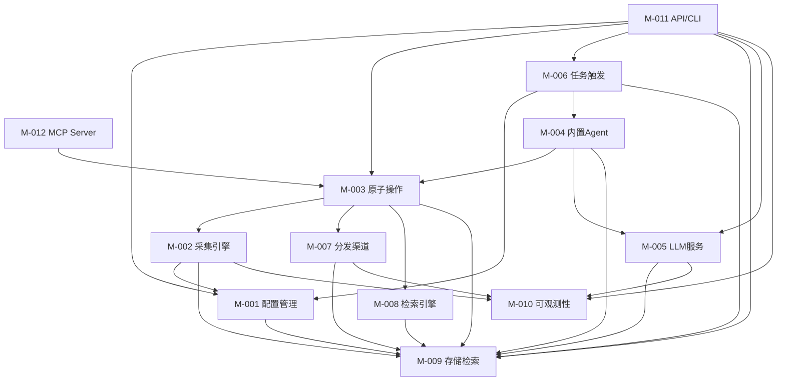

# Architecture 分卷 -- 模块划分: IntelliSource
<!-- required_sections: ["## 2. 模块划分"] -->
<!-- volume_type: modules -->
<!-- id: arch-intellisource-v1-modules | author: architect | status: draft -->
<!-- deps: prd-intellisource-v1 | consumers: tech-lead, developer, devops -->
<!-- volume: modules | split-from: arch-intellisource-v1 -->

[NAV]

- §2 模块划分 → M-001..M-012
[/NAV]

## 2. 模块划分

### M-001: 配置管理模块 (config)

- **职责**: 管理信息源的声明式配置，提供配置的 CRUD、校验、热加载和版本管理能力
- **映射功能**: F-001（信息源声明式配置）
- **对外接口**: API-001, API-002, API-003, API-004, API-005
- **依赖模块**: M-009（配置持久化存储）
- **内部关键组件**:
  - `SourceConfig` — 信源配置 Pydantic 模型，定义 YAML/JSON 配置结构
  - `ConfigLoader` — 配置文件加载器，支持 YAML/JSON 格式解析
  - `ConfigValidator` — 配置校验器，格式校验失败时拒绝加载并输出错误信息（AC-003）
  - `ConfigWatcher` — 文件变更监听器（基于 watchfiles），实现热加载（AC-002）
  - `ConfigVersionManager` — 配置版本管理，支持回退到历史版本（AC-004）
  - 配置项包含 `embedding_dimension`（默认 1536），切换 embedding 模型时需调整此值并执行数据库迁移

### M-002: 采集引擎模块 (collector)

- **职责**: 提供插件化的采集架构，从多种信息源类型采集内容，统一输出标准化数据模型
- **映射功能**: F-002（插件化采集引擎）, F-003（采集频率自适应与资源隔离）
- **对外接口**: 无直接对外 API（通过原子操作 `collect`、`parse` 暴露能力）
- **依赖模块**: M-001（获取信源配置）, M-009（存储采集结果）, M-010（日志/指标上报）
- **内部关键组件**:
  - `BaseCollector` — 采集器抽象基类，定义统一接口（AC-005）
  - `CollectorRegistry` — 采集器注册中心，支持插件化注册新采集器
  - `RSSCollector` — RSS/Atom 采集适配器（AC-006）
  - `APICollector` — 通用 API 采集适配器（AC-006）
  - `WebCollector` — 网页爬虫采集适配器（AC-006）
  - `AdaptiveScheduler` — 频率自适应调度器，根据历史更新频率动态调整采集间隔（AC-009）
  - `RateLimiter` — 请求速率限制器，基于 Redis 令牌桶算法，按信源独立配置（AC-011）
  - `ProxyManager` — HTTP 代理管理器，按信源配置独立代理（AC-010）

### M-003: 原子操作与工具注册模块 (tools)

- **职责**: 定义 ToolSpec 统一协议，将系统各模块能力封装为原子操作并注册到工具中心，供内置 Agent 和外部 Agent 调用
- **映射功能**: F-004（原子化处理操作与工具注册）
- **对外接口**: API-030（原子操作统一端点）
- **依赖模块**: M-002（采集能力）, M-007（分发能力）, M-008（检索能力）, M-009（存储能力）
- **内部关键组件**:
  - `ToolSpec` — 原子操作统一描述协议：name/description/parameters(JSON Schema)/returns(JSON Schema)/idempotent/side_effects（AC-013）
  - `ToolRegistry` — 工具注册中心，所有原子操作启动时自动注册，供 Agent/MCP/API 层消费（AC-015）
  - 采集类原子操作: `collect`（执行采集）, `parse`（HTML 解析+清洗）
  - 处理类原子操作: `fingerprint`（生成内容指纹）, `dedup_by_fingerprint`（指纹去重）, `find_similar`（向量相似度查找）, `tag_content`（打标签）, `set_sentiment`（设置情感标签）
  - 存储类原子操作: `store_processed`（存储处理后内容，embedding/summary/tags 等由调用方传入）, `store_embedding`（单独存入向量）
  - 检索类原子操作: `search_fulltext`（关键词全文检索）, `search_vector`（向量语义检索）, `search_hybrid`（混合检索）
  - 聚类类原子操作: `cluster_create`（创建聚类）, `cluster_assign`（分配内容到聚类）
  - 分发类原子操作: `match_subscriptions`（匹配订阅规则）, `push`（推送到渠道，内置去重）, `get_push_history`（查询推送记录）
  - **设计原则**: 所有原子操作不内置 LLM 调用；输入输出均有 JSON Schema 校验；幂等操作标记 `idempotent=true`（AC-016, AC-017）

### M-004: 内置编排 Agent 模块 (agent)

- **职责**: 提供 LLM 驱动的内置编排 Agent，根据触发信号自动规划并调用原子操作完成业务流程；管理多轮对话会话
- **映射功能**: F-005（内置编排 Agent）, F-008（工作流与 Playbook）, F-010（推送优化）, F-011（即时检索）
- **对外接口**: API-013（即时问答，Agent 处理检索+摘要）
- **依赖模块**: M-003（调用原子操作）, M-005（LLM 调用）, M-006（接收触发信号）, M-009（会话持久化）
- **内部关键组件**:
  - `BuiltinAgent` — Agent 主循环，以 ReAct/Plan-Execute 模式运行（AC-018）:
    1. 接收触发信号（定时/手动/消息）
    2. 匹配 Playbook 模板（优先走确定性路径）
    3. 通过 function calling 调用 M-003 原子操作
    4. LLM 进行语义决策（去重判定、聚类归属、摘要生成等）（AC-020）
    5. 记录执行日志到 E-013 AgentExecutionLog
  - `PlaybookLibrary` — 预定义 Playbook 集合（AC-019, AC-035）:
    - `scheduled_collect`: 定时采集 → parse → fingerprint dedup → [LLM: embedding+去重+打标+摘要+聚类] → store → match → push
    - `manual_collect`: 指定信源采集，流程同上
    - `user_search`: 接收用户消息 → [LLM: 意图理解] → search_hybrid → [LLM: 结果摘要] → 回调返回
  - `PlaybookFallback` — LLM 不可用时的确定性降级执行器（AC-021）: 跳过所有 LLM 步骤，仅执行确定性原子操作
  - `ChatSessionManager` — 多轮对话管理器，保持最近 5 轮上下文（AC-053），存储在 E-011

### M-005: LLM 服务管理模块 (llm)

- **职责**: 提供统一的 LLM 调用接口供内置 Agent 使用，管理多模型提供商，实现重试、熔断和成本监控
- **映射功能**: F-006（LLM 服务管理）
- **对外接口**: API-017（LLM 用量统计）
- **依赖模块**: M-009（调用日志持久化）, M-010（指标上报）
- **内部关键组件**:
  - `LLMGateway` — 统一 LLM 调用接口，基于 litellm 封装，屏蔽提供商差异（AC-023）
  - `CircuitBreaker` — 熔断器实现（AC-024），连续失败 5 次触发，60s 恢复探测
  - `CostTracker` — 成本追踪器，记录 Token 消耗/延迟/IO 长度，支持聚合统计（AC-026）
  - `ContentFilter` — 敏感词过滤，LLM 调用前后双重检查（AC-027）
  - `SchemaEnforcer` — JSON Mode / Function Calling 输出格式强制器（AC-025）
- **说明**: 仅服务内置 Agent（M-004）的 LLM 调用。外部 Agent 使用自己的 LLM 能力，直接调用 M-003 原子操作，不经过此模块

### M-006: 任务触发与状态管理模块 (scheduler)

- **职责**: 管理任务的触发（定时/手动/消息）、状态追踪和工作流定义，将触发信号传递给内置 Agent 或直接执行 Playbook
- **映射功能**: F-007（任务触发与状态管理）
- **对外接口**: API-006, API-007, API-008, API-009, API-010, API-011, API-026, API-027, API-028, API-029
- **依赖模块**: M-001（获取调度配置）, M-004（触发 Agent 执行）, M-009（任务状态持久化）
- **内部关键组件**:
  - `TriggerManager` — 触发管理器，接收定时信号/API 手动触发/Webhook 消息，创建 TaskChain 并分发给 M-004 Agent（AC-028）
  - `CeleryTasks` — Celery 任务定义，封装 Agent 调用和 Playbook 执行
  - `TaskStateMachine` — 统一任务状态机：pending → running → success/failed，支持 pause/resume/timeout（AC-032）
  - `WorkflowManager` — 工作流定义的 CRUD 管理，支持 Cron 定时执行（AC-034, AC-036）
  - `IdempotencyGuard` — 幂等保护器，基于内容指纹 + 推送记录 + Redis 分布式锁（AC-031）
  - `PlaybookRunner` — Playbook 确定性执行器（AC-037），直接按步骤序列调用原子操作，不经过 LLM；作为 Agent 降级的兜底方案

### M-007: 分发渠道模块 (distributor)

- **职责**: 将处理后的内容通过多渠道（微信公众号/企业微信/邮件）推送给订阅用户
- **映射功能**: F-009（多渠道分发）
- **对外接口**: API-020（微信回调）, API-021（企业微信回调）, API-022（订阅列表）, API-023（创建订阅）, API-024（更新订阅）, API-025（删除订阅）
- **依赖模块**: M-009（推送记录持久化）, M-010（推送指标上报）
- **内部关键组件**:
  - `BaseDistributor` — 分发器抽象基类，定义统一分发接口（预留扩展点）
  - `WeChatDistributor` — 微信公众号推送实现（AC-040）
  - `WeWorkDistributor` — 企业微信推送实现（AC-041）
  - `EmailDistributor` — 邮件推送实现，HTML 格式（AC-042）
  - `SubscriptionMatcher` — 订阅规则匹配引擎，基于关键词/学科标签匹配（AC-043）
  - `DeliveryTracker` — 推送去重与历史记录（AC-044, AC-045）
  - `FrequencyController` — 推送频率控制与免打扰时段（AC-046）
  - `WebhookHandler` — 微信/企业微信消息回调处理，接收用户消息指令后传递给 M-006 触发 Agent

### M-008: 检索引擎模块 (search)

- **职责**: 提供混合检索能力（关键词全文检索 + 向量语义检索），封装为原子操作供 Agent 和外部系统调用
- **映射功能**: F-012（存储与混合检索，检索部分）
- **对外接口**: API-012（混合检索）
- **依赖模块**: M-009（底层存储与向量检索）
- **内部关键组件**:
  - `HybridSearchEngine` — 混合检索引擎，关键词 + 向量语义联合查询（AC-051）
  - 注册为 M-003 原子操作: `search_fulltext`、`search_vector`、`search_hybrid`
- **说明**: 意图理解和结果摘要不在此模块，由内置 Agent (M-004) 或外部 Agent 负责 LLM 调用

### M-009: 存储与检索模块 (storage)

- **职责**: 管理结构化数据和向量数据的持久化存储，提供统一的数据访问层
- **映射功能**: F-012（存储与混合检索，存储部分）
- **对外接口**: API-014（内容列表）, API-015（内容详情）, API-016（聚类列表）
- **依赖模块**: 无（基础设施模块）
- **内部关键组件**:
  - `DatabaseManager` — 数据库连接池管理（SQLAlchemy AsyncSession）
  - `SourceRepository` — 信源数据访问层
  - `ContentRepository` — 内容数据访问层（AC-054）
  - `TaskRepository` — 任务数据访问层
  - `PushRepository` — 推送记录数据访问层
  - `VectorStore` — pgvector 向量存储与检索（AC-055）
  - `HybridIndex` — 混合索引，结合 PostgreSQL 全文检索 + pgvector 向量检索（AC-056）

### M-010: 可观测性模块 (observability)

- **职责**: 提供结构化日志、指标监控和分布式链路追踪基础设施
- **映射功能**: F-013（可观测性）
- **对外接口**: API-018（健康检查）, API-019（系统指标）
- **依赖模块**: 无（基础设施模块）
- **内部关键组件**:
  - `StructuredLogger` — structlog 配置，所有日志包含任务标识/处理阶段/耗时（AC-057）
  - `MetricsCollector` — 指标收集器，采集成功率/延迟/队列长度/LLM Token 用量（AC-058）
  - `TracingMiddleware` — OpenTelemetry 中间件，生成全链路 Trace ID（AC-059）
  - `HealthChecker` — 健康检查端点，检测数据库/Redis/外部服务可用性（AC-060）
  - `AlertManager` — 告警管理器，关键指标异常时触发告警（AC-060）

### M-011: API 与 CLI 模块 (api + cli)

- **职责**: 提供 RESTful API 和命令行工具，作为系统的统一外部接口层；同时为 M-003 原子操作自动生成 API 端点
- **映射功能**: F-014（RESTful API 与 CLI）
- **对外接口**: 所有 API-001 至 API-030（路由层）
- **依赖模块**: M-001 至 M-010（路由到各业务模块）, M-003（原子操作端点自动生成）
- **内部关键组件**:
  - `APIRouter` — FastAPI 路由注册，按资源组织路由（AC-061, AC-062, AC-063）
  - `ToolsRouter` — 从 M-003 ToolRegistry 自动为每个原子操作生成 POST /api/v1/tools/{tool_name} 端点
  - `AuthMiddleware` — API Key 认证中间件
  - `RequestLogger` — 请求日志中间件
  - `TracingMiddleware` — 请求链路追踪中间件
  - `CLIApp` — typer CLI 应用，封装常用 API 操作（AC-064）
  - FastAPI 自动生成 OpenAPI/Swagger 文档（AC-065）

### M-012: MCP Server 模块 (mcp)

- **职责**: 通过 MCP (Model Context Protocol) 暴露系统原子操作，供外部 AI Agent（如 Claude Desktop、自建 Agent）发现和调用
- **映射功能**: F-015（原子操作外部暴露）
- **对外接口**: MCP 协议端点（stdio / SSE 传输）
- **依赖模块**: M-003（ToolRegistry，获取所有原子操作定义）
- **内部关键组件**:
  - `MCPServer` — MCP Server 实例，从 M-003 ToolRegistry 自动生成 Tool 定义（AC-067）
  - 自动映射: ToolSpec.name → MCP tool name, ToolSpec.parameters → MCP input_schema（AC-066）
  - 共享 M-011 的认证和可观测性基础设施（AC-070）
- **说明**: MCP Server 与 FastAPI API 是同一套原子操作的两种暴露方式。MCP 面向 AI Agent 的 tool_use 调用模式，API 面向传统 HTTP 客户端

---

### 模块依赖关系图

**说明**: 依赖关系为有向无环图（DAG）。M-003（原子操作）是系统的核心枢纽，上游被 M-004（内置 Agent）、M-011（API）、M-012（MCP）调用，下游依赖 M-002/M-007/M-008/M-009 的具体实现。M-009（存储）和 M-010（可观测性）为底层基础设施模块。
