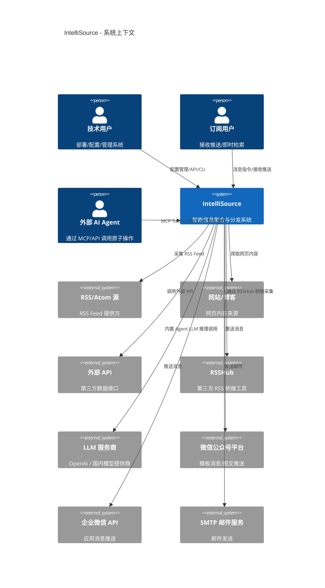

# Architecture: IntelliSource
<!-- required_sections: ["## 1. 架构概览", "## 2. 模块划分", "## 3. 接口契约", "## 4. 数据模型"] -->
<!-- id: arch-intellisource-v1 | author: architect | status: approved -->
<!-- deps: prd-intellisource-v1 | consumers: tech-lead, developer, devops -->
<!-- volume: main -->

[NAV]

- §1 架构概览 → §1.1 项目类型, §1.2 架构风格, §1.3 系统上下文图, §1.4 技术栈
- §2 模块划分 → 详见分卷 arch-intellisource-v1-modules
- §3 接口契约 → 详见分卷 arch-intellisource-v1-api
- §4 数据模型 → 详见分卷 arch-intellisource-v1-data
- §5 非功能架构 → §5.1 性能, §5.2 安全, §5.3 错误处理
- §6 目录结构
- §7 开发约定 → §7.1 命名, §7.2 代码风格, §7.3 Git约定
[/NAV]

## 1. 架构概览

### 1.1 项目类型

- **类型**: backend-only
- **说明**: IntelliSource 为后端服务系统，通过 RESTful API + CLI 对外提供管理接口，通过消息渠道（微信/企业微信/邮件）进行内容分发。v1 不提供 Web 管理界面（prd#§4），orchestrator 据此跳过 UI 设计阶段。

### 1.2 架构风格

- **风格**: 模块化单体 (Modular Monolith) + Agent 编排 + 原子操作层 + 双协议暴露
- **选型理由**:
  1. **团队规模匹配**: 个人/小团队（<=10人）自部署场景，微服务的运维复杂度不合理（prd#§4）
  2. **部署简便**: 单进程 + Celery Worker 的部署模型适配 Docker Compose 一键部署需求（prd#§3.3）
  3. **Agent + 原子操作分层**: 底层操作（采集/解析/去重/存储/检索/推送）封装为确定性原子工具（不内置 LLM），顶层由内置 LLM Agent 或外部 Agent 编排调用。既保证独立运行能力，又支持外部智能体集成
  4. **双模式运行**: Mode A — 内置 Agent 自主编排（独立部署用户）；Mode B — 外部 Agent 通过 MCP/API 直接调用原子操作（AI 集成场景）
  5. **确定性兜底**: 内置 Agent 附带 Playbook（预定义步骤序列），LLM 不可用时自动降级到确定性流程
- **调研依据**: 参考 TrendRadar（5 万+ Stars）的"管道内嵌 LLM"模式，IntelliSource 将 LLM 提升到编排层而非操作层，使底层操作具备通用工具属性。MCP (Model Context Protocol) 是 Anthropic 主导的开放标准，已被 Claude Desktop 等主流 AI 客户端支持。

### 1.3 系统上下文图



### 1.4 技术栈

| 层次 | 技术 | 版本 | 选型理由 | 调研来源 |
|------|------|------|----------|----------|
| 编程语言 | Python | 3.11+ | 用户确认；生态丰富，LLM/数据处理库完备 | 用户选型 |
| Web 框架 | FastAPI | 0.115+ | 用户确认；原生异步、自动 OpenAPI 文档生成（prd#§2 F-014 AC-065） | 用户选型 |
| 任务队列 | Celery | 5.4+ | 用户确认；成熟的分布式任务队列，支持定时调度/优先级队列/任务链 | 用户选型 |
| 消息代理 | Redis | 7.x | Celery Broker + 结果后端 + 缓存 + 分布式锁，一组件多用 | 用户选型（随 Celery） |
| 关系型数据库 | PostgreSQL | 16+ | 功能完备的 RDBMS，支持 JSONB 存储灵活配置数据；与 pgvector 共用实例降低运维成本 | 业界标准选型 |
| 向量数据库 | pgvector (PostgreSQL 扩展) | 0.7+ | 无需额外服务，与 PostgreSQL 共实例；<100 万文档场景性能充足（prd#§4）；SQL 查询统一 | [向量数据库对比调研](#技术调研) |
| ORM | SQLAlchemy | 2.0+ | Python 生态标准 ORM，支持异步（AsyncSession）和 pgvector 类型 | 业界标准选型 |
| 数据库迁移 | Alembic | 1.13+ | SQLAlchemy 配套迁移工具 | 业界标准选型 |
| HTTP 客户端 | httpx | 0.27+ | 原生异步支持，API 兼容性好 | 业界标准选型 |
| HTML 解析 | BeautifulSoup4 + lxml | 最新稳定版 | 网页爬取与 HTML 解析 | 业界标准选型 |
| RSS 解析 | feedparser | 6.x | RSS/Atom Feed 解析标准库 | 业界标准选型 |
| LLM 客户端 | litellm | 最新稳定版 | 统一多模型提供商调用接口，支持 OpenAI/Claude/国内模型 | 开源社区推荐 |
| 数据校验 | Pydantic | 2.x | FastAPI 原生集成，用于请求/响应/配置校验 | FastAPI 生态 |
| 日志 | structlog | 最新稳定版 | 结构化日志输出，满足可观测性需求（prd#§2 F-013） | 业界标准选型 |
| 配置管理 | pydantic-settings + watchfiles | 最新稳定版 | 环境变量/配置文件管理 + 文件变更监听（热加载） | FastAPI 生态 |
| CLI | typer | 最新稳定版 | 基于类型注解的 CLI 框架，与 FastAPI 风格一致 | FastAPI 生态 |
| 容器化 | Docker + Docker Compose | 最新稳定版 | 一键部署，满足自部署需求（prd#§3.3） | 用户需求 |
| 中文分词 | zhparser (PostgreSQL 扩展) | 最新稳定版 | PostgreSQL 全文检索中文分词支持，E-004 全文检索索引 `to_tsvector('chinese', ...)` 依赖此扩展；Docker 部署时需使用包含 zhparser 的 PostgreSQL 镜像 | [PostgreSQL 中文全文检索方案](https://github.com/amutu/zhparser) |
| MCP 服务端 | mcp (Python SDK) | 最新稳定版 | Model Context Protocol 官方 SDK，暴露原子操作供外部 AI Agent 调用（prd#§2 F-015） | Anthropic 开源 |
| 链路追踪 | OpenTelemetry | 最新稳定版 | 开放标准，支持分布式链路追踪（prd#§2 F-013 AC-059） | 业界标准选型 |

**技术调研**: 向量数据库选型对比

| 维度 | pgvector | Qdrant | ChromaDB |
|------|----------|--------|----------|
| 部署复杂度 | 低（PostgreSQL 扩展） | 中（独立服务） | 低（嵌入式/独立） |
| 运维成本 | 与 PostgreSQL 共享 | 额外服务运维 | 低但生产稳定性一般 |
| <1M 向量性能 | 充足 | 优秀 | 充足 |
| SQL 统一查询 | 支持 | 不支持 | 不支持 |
| 事务一致性 | 与业务数据同事务 | 需自行保证 | 需自行保证 |
| 生态成熟度 | 高 | 中高 | 中 |

**推荐**: pgvector。理由：(1) 无额外基础设施，降低自部署复杂度；(2) <100 万文档规模性能充足；(3) 向量与结构化数据同库同事务，简化数据一致性管理。

## 2. 模块划分
>
> 详见分卷: [arch-intellisource-v1-modules](arch-intellisource-v1-modules.md)

**模块交叉引用目录**:

| 模块 ID | 模块名称 | 映射功能 |
|---------|---------|---------|
| M-001 | 配置管理模块 | F-001 |
| M-002 | 采集引擎模块 | F-002, F-003 |
| M-003 | 原子操作与工具注册模块 | F-004 |
| M-004 | 内置编排 Agent 模块 | F-005, F-008, F-010, F-011 |
| M-005 | LLM 服务管理模块 | F-006 |
| M-006 | 任务触发与状态管理模块 | F-007 |
| M-007 | 分发渠道模块 | F-009 |
| M-008 | 检索引擎模块 | F-012 (混合检索原子操作) |
| M-009 | 存储与检索模块 | F-012 |
| M-010 | 可观测性模块 | F-013 |
| M-011 | API 与 CLI 模块 | F-014 |
| M-012 | MCP Server 模块 | F-015 |

**功能覆盖验证**: 全部 15 个功能点（F-001 至 F-015）均已映射到至少一个模块，无遗漏。

## 3. 接口契约
>
> 详见分卷: [arch-intellisource-v1-api](arch-intellisource-v1-api.md)

**接口交叉引用目录**:

| 接口 ID | 接口名称 | 所属模块 | 方法 | 路径 |
|---------|---------|---------|------|------|
| API-001 | 获取信源列表 | M-001 | GET | /api/v1/sources |
| API-002 | 创建信源 | M-001 | POST | /api/v1/sources |
| API-003 | 更新信源 | M-001 | PATCH | /api/v1/sources/{id} |
| API-004 | 删除信源 | M-001 | DELETE | /api/v1/sources/{id} |
| API-005 | 重载配置 | M-001 | POST | /api/v1/sources/reload |
| API-006 | 获取任务列表 | M-006 | GET | /api/v1/tasks |
| API-007 | 触发采集任务 | M-006 | POST | /api/v1/tasks/collect |
| API-008 | 查询任务状态 | M-006 | GET | /api/v1/tasks/{id} |
| API-009 | 暂停/恢复任务 | M-006 | PATCH | /api/v1/tasks/{id} |
| API-010 | 创建工作流 | M-006 | POST | /api/v1/workflows |
| API-011 | 执行工作流 | M-006 | POST | /api/v1/workflows/{id}/run |
| API-012 | 混合检索 | M-008 | POST | /api/v1/search |
| API-013 | 即时问答 | M-004 | POST | /api/v1/search/chat |
| API-014 | 获取内容列表 | M-009 | GET | /api/v1/contents |
| API-015 | 获取内容详情 | M-009 | GET | /api/v1/contents/{id} |
| API-016 | 获取聚类列表 | M-009 | GET | /api/v1/clusters |
| API-017 | LLM 用量统计 | M-005 | GET | /api/v1/llm/stats |
| API-018 | 系统健康检查 | M-010 | GET | /api/v1/health |
| API-019 | 系统指标 | M-010 | GET | /api/v1/metrics |
| API-020 | 微信消息回调 | M-007 | POST | /api/v1/webhooks/wechat |
| API-021 | 企业微信消息回调 | M-007 | POST | /api/v1/webhooks/wework |
| API-022 | 获取订阅规则列表 | M-007 | GET | /api/v1/subscriptions |
| API-023 | 创建订阅规则 | M-007 | POST | /api/v1/subscriptions |
| API-024 | 更新订阅规则 | M-007 | PATCH | /api/v1/subscriptions/{id} |
| API-025 | 删除订阅规则 | M-007 | DELETE | /api/v1/subscriptions/{id} |
| API-026 | 获取工作流列表 | M-006 | GET | /api/v1/workflows |
| API-027 | 获取工作流详情 | M-006 | GET | /api/v1/workflows/{id} |
| API-028 | 更新工作流 | M-006 | PATCH | /api/v1/workflows/{id} |
| API-029 | 删除工作流 | M-006 | DELETE | /api/v1/workflows/{id} |
| API-030 | 调用原子操作 | M-003 | POST | /api/v1/tools/{tool_name} |

## 4. 数据模型
>
> 详见分卷: [arch-intellisource-v1-data](arch-intellisource-v1-data.md)

**实体交叉引用目录**:

| 实体 ID | 实体名 | 关联模块 |
|---------|--------|---------|
| E-001 | Source (信息源) | M-001 |
| E-002 | CollectTask (采集任务) | M-002, M-006 |
| E-003 | RawContent (原始内容) | M-002, M-003 |
| E-004 | ProcessedContent (处理后内容) | M-003, M-009 |
| E-005 | ContentCluster (内容聚类) | M-003, M-009 |
| E-006 | Digest (综合简报) | M-003 |
| E-007 | LLMCallLog (LLM 调用日志) | M-005 |
| E-008 | TaskChain (任务链) | M-006 |
| E-009 | Subscription (订阅规则) | M-007 |
| E-010 | PushRecord (推送记录) | M-007 |
| E-011 | ChatSession (对话会话) | M-004 |
| E-012 | Workflow (工作流定义) | M-006 |
| E-013 | AgentExecutionLog (Agent执行日志) | M-004 |

## 5. 非功能架构

### 5.1 性能方案

**缓存策略**:

- Redis 作为统一缓存层
- 信源配置缓存：热加载后写入 Redis，TTL 与配置刷新周期一致，避免每次请求读取数据库
- LLM 调用结果缓存：相同内容指纹 + 相同处理类型的 LLM 调用结果缓存 24h，减少重复调用
- 检索结果缓存：高频查询关键词缓存 5min（短 TTL，保证时效性）

**异步处理**:

- 采集-处理-存储-分发全链路通过 Celery 任务链异步执行（prd#§2 F-008）
- FastAPI 路由层使用 async/await 处理 API 请求，不阻塞工作线程
- LLM 调用使用异步 HTTP 客户端（httpx AsyncClient），支持并发调用
- 用户即时检索请求异步回调（prd#§2 F-011 AC-052）

**分页方案**:

- 列表类 API 统一使用游标分页（cursor-based pagination），避免深分页性能问题
- 默认每页 20 条，最大 100 条
- 响应包含 `next_cursor` 和 `has_more` 字段

**并发控制**:

- 单节点并发采集任务数 >= 20（prd#§3.1），通过 Celery worker concurrency 配置
- 按信源配置独立的请求速率限制，使用 Redis 令牌桶算法实现（prd#§2 F-003 AC-011）
- 分布式锁（Redis）防止同一信源的重复采集（prd#§2 F-008 AC-037）

### 5.2 安全方案

**认证机制**:

- v1 采用 API Key 认证（prd#§3.2）
- API Key 通过环境变量或加密配置文件配置
- FastAPI 依赖注入统一验证 `X-API-Key` 请求头
- 内部 Webhook 回调端点（微信/企业微信）使用平台签名验证，不使用 API Key

**敏感配置管理**:

- LLM API 密钥、数据库密码等敏感信息通过环境变量注入（prd#§3.2）
- 配置文件中敏感字段支持 `${ENV_VAR}` 占位符语法，运行时从环境变量解析
- Docker 部署时通过 `.env` 文件或 Docker Secrets 管理

**输入校验策略**:

- 所有接受文件路径/文件名参数的 API 实施白名单校验，禁止路径遍历字符（`..`、`/`、`\`）
- API-005 重载配置接口仅接受文件名（不含路径），从预定义配置目录加载，白名单由 M-001 配置管理模块维护
- 所有用户输入经 Pydantic 模型校验后方可进入业务逻辑层

**数据安全**:

- 采集内容仅存储在本地 PostgreSQL，不上传至外部服务（prd#§3.2）
- LLM 调用时仅发送必要的文本片段，不发送用户身份信息
- 敏感词过滤在 LLM 调用前后双重检查（prd#§2 F-006 AC-026）

### 5.3 错误处理

**错误码体系**:

```
错误码格式: IS-{模块缩写}-{3位数字}
示例:
  IS-SRC-001: 信源配置格式错误
  IS-COL-001: 采集超时
  IS-LLM-001: LLM 调用失败
  IS-DST-001: 推送渠道不可用
```

**统一错误响应格式**:

```json
{
  "error": {
    "code": "IS-SRC-001",
    "message": "信源配置格式校验失败",
    "detail": "字段 'url' 不是有效的 URL 格式",
    "trace_id": "abc123"
  }
}
```

**重试策略**:

| 场景 | 重试次数 | 退避策略 | 降级方案 |
|------|---------|---------|---------|
| 采集失败 | 3 次 | 指数退避（1s, 2s, 4s） | 记录错误，跳过本次，下次调度重试 |
| LLM 调用失败（内置 Agent） | 2 次 | 指数退避（0.5s, 1s） | 切换备用模型 → Agent 降级到 Playbook 确定性流程 |
| 推送失败 | 3 次 | 固定间隔（5s） | 记录失败，下次批次重试 |
| 数据库操作失败 | 2 次 | 固定间隔（0.5s） | 抛出异常，任务标记为 failed |

**熔断机制** (prd#§2 F-006 AC-024):

- LLM 服务调用采用熔断器模式（仅影响内置 Agent 的 LLM 调用）
- 连续失败 5 次触发熔断（Open 状态），停止调用 60s
- 60s 后进入半开状态（Half-Open），允许 1 次试探调用
- 试探成功则关闭熔断（Closed），失败则继续 Open
- 熔断期间内置 Agent 自动降级到 Playbook 确定性流程（prd#§2 F-005 AC-021）

**Agent 降级策略** (prd#§2 F-005 AC-021):

- 核心原则：LLM 智能在编排层（Agent），不在操作层（原子工具）。LLM 不可用时，Agent 降级到 Playbook 确定性流程
- Playbook 降级切换时间 < 500ms
- Playbook 模式下原子操作的行为：

  | 原子操作 | Playbook 模式行为（无 LLM） |
  |---------|---------|
  | collect + parse | 不变（本身不依赖 LLM） |
  | dedup_by_fingerprint | 不变（SHA-256 指纹匹配） |
  | find_similar | 不变（向量检索，但 embedding 需由 Playbook 用预计算模型生成或跳过） |
  | store_processed | 存储时 summary/tags/sentiment 字段为空，后续 Agent 恢复后补充 |
  | match_subscriptions + push | 不变（规则匹配 + 渠道推送） |
  | search_hybrid | 降级为纯关键词检索模式（跳过向量检索） |

## 6. 目录结构

```text
intellisource/
├── src/
│   └── intellisource/
│       ├── __init__.py
│       ├── main.py                    # FastAPI 应用入口
│       ├── config/                    # M-001 配置管理
│       │   ├── __init__.py
│       │   ├── models.py             # 配置数据模型 (Pydantic)
│       │   ├── loader.py             # YAML/JSON 配置加载与热加载
│       │   └── validator.py          # 配置校验逻辑
│       ├── collector/                 # M-002 采集引擎
│       │   ├── __init__.py
│       │   ├── base.py               # 采集器抽象基类
│       │   ├── registry.py           # 采集器注册中心
│       │   ├── adapters/             # 内置采集适配器
│       │   │   ├── rss.py
│       │   │   ├── web.py
│       │   │   └── api.py
│       │   ├── rate_limiter.py       # 速率限制
│       │   └── adaptive.py           # 频率自适应
│       ├── tools/                     # M-003 原子操作与工具注册
│       │   ├── __init__.py
│       │   ├── registry.py           # ToolSpec 注册中心
│       │   ├── base.py               # ToolSpec 基类定义
│       │   ├── collect.py            # 采集类原子操作 (collect, parse)
│       │   ├── process.py            # 处理类原子操作 (fingerprint, dedup_*, tag, set_sentiment)
│       │   ├── store.py              # 存储类原子操作 (store_processed, store_embedding)
│       │   ├── search.py             # 检索类原子操作 (search_fulltext, search_vector, search_hybrid)
│       │   ├── cluster.py            # 聚类类原子操作 (cluster_create, cluster_assign)
│       │   └── distribute.py         # 分发类原子操作 (match_subscriptions, push)
│       ├── agent/                     # M-004 内置编排 Agent
│       │   ├── __init__.py
│       │   ├── orchestrator.py       # Agent 主循环 (ReAct/Plan-Execute)
│       │   ├── playbooks.py          # 预定义 Playbook (scheduled_collect, manual_collect, user_search)
│       │   └── session.py            # 多轮对话会话管理
│       ├── llm/                       # M-005 LLM 服务管理
│       │   ├── __init__.py
│       │   ├── gateway.py            # LLM 统一网关 (litellm 封装)
│       │   ├── circuit_breaker.py    # 熔断器
│       │   ├── cost_tracker.py       # 成本追踪
│       │   └── filter.py             # 敏感词过滤
│       ├── scheduler/                 # M-006 任务触发与状态管理
│       │   ├── __init__.py
│       │   ├── tasks.py              # Celery 任务定义 (触发 Agent 执行)
│       │   ├── state_machine.py      # 任务状态机
│       │   ├── workflow.py           # 工作流定义管理
│       │   └── playbook_runner.py    # Playbook 确定性执行器 (降级用)
│       ├── distributor/               # M-007 分发渠道
│       │   ├── __init__.py
│       │   ├── base.py               # 分发器抽象基类
│       │   ├── matcher.py            # 订阅规则匹配
│       │   ├── channels/             # 渠道实现
│       │   │   ├── wechat.py
│       │   │   ├── wework.py
│       │   │   └── email.py
│       │   └── webhooks.py           # 消息回调处理
│       ├── search/                    # M-008 检索引擎
│       │   ├── __init__.py
│       │   └── hybrid.py             # 混合检索引擎 (原子操作实现)
│       ├── storage/                   # M-009 存储与检索
│       │   ├── __init__.py
│       │   ├── database.py           # 数据库连接管理
│       │   ├── models.py             # SQLAlchemy ORM 模型
│       │   ├── repositories/         # 数据访问层
│       │   │   ├── source.py
│       │   │   ├── content.py
│       │   │   ├── task.py
│       │   │   ├── subscription.py
│       │   │   └── push.py
│       │   └── vector.py             # pgvector 向量操作
│       ├── observability/             # M-010 可观测性
│       │   ├── __init__.py
│       │   ├── logging.py            # structlog 配置
│       │   ├── metrics.py            # 指标收集
│       │   └── tracing.py            # OpenTelemetry 链路追踪
│       ├── api/                       # M-011 API 路由层
│       │   ├── __init__.py
│       │   ├── deps.py               # FastAPI 依赖注入
│       │   ├── middleware.py          # 中间件（认证/日志/追踪）
│       │   └── routers/              # 路由定义
│       │       ├── sources.py
│       │       ├── tasks.py
│       │       ├── workflows.py
│       │       ├── search.py
│       │       ├── contents.py
│       │       ├── subscriptions.py
│       │       ├── llm.py
│       │       ├── tools.py          # 原子操作 API 端点 (从 ToolSpec 自动生成)
│       │       └── system.py
│       ├── mcp/                       # M-012 MCP Server
│       │   ├── __init__.py
│       │   └── server.py             # MCP Server (从 ToolSpec 自动生成工具定义)
│       └── cli/                       # M-011 CLI 工具
│           ├── __init__.py
│           └── main.py               # typer CLI 入口
├── tests/
│   ├── unit/                          # 按模块组织单元测试
│   ├── integration/                   # 集成测试
│   └── conftest.py
├── config/
│   ├── sources.example.yaml          # 信源配置示例
│   └── settings.example.toml         # 系统配置示例
├── docker/
│   ├── Dockerfile
│   └── docker-compose.yml
├── alembic/                           # 数据库迁移
│   ├── alembic.ini
│   └── versions/
├── pyproject.toml
└── README.md
```

## 7. 开发约定

### 7.1 命名规范

| 类别 | 规范 | 示例 |
|------|------|------|
| Python 模块/文件 | snake_case | `rate_limiter.py` |
| Python 类 | PascalCase | `RSSCollector` |
| Python 函数/变量 | snake_case | `collect_feed()` |
| Python 常量 | UPPER_SNAKE_CASE | `MAX_RETRY_COUNT` |
| API 路径 | kebab-case 复数名词 | `/api/v1/sources` |
| 数据库表 | snake_case 复数 | `processed_contents` |
| 数据库字段 | snake_case | `created_at` |
| 配置文件键 | snake_case | `collect_interval` |
| 环境变量 | UPPER_SNAKE_CASE，`IS_` 前缀 | `IS_DATABASE_URL` |

### 7.2 代码风格

- **格式化**: Ruff (替代 Black + isort + flake8)
- **类型检查**: mypy (strict mode)
- **测试框架**: pytest + pytest-asyncio
- **代码覆盖**: pytest-cov，目标覆盖率 >= 80%
- **Pre-commit hooks**: ruff check + ruff format + mypy

### 7.3 Git 约定

- **分支策略**: GitHub Flow（main + feature branches）
  - `main`: 稳定主分支，保护分支
  - `feat/{feature-name}`: 功能分支
  - `fix/{bug-description}`: 修复分支
  - `chore/{task}`: 工程化任务
- **Commit 格式**: Conventional Commits

  ```
  <type>(<scope>): <description>

  type: feat | fix | refactor | test | docs | chore | ci
  scope: collector | tools | agent | llm | scheduler | distributor | search | storage | api | mcp | cli | config | observability
  ```

- **PR 规范**: 每个 PR 关联一个任务 ID，通过 CI 检查后合并
