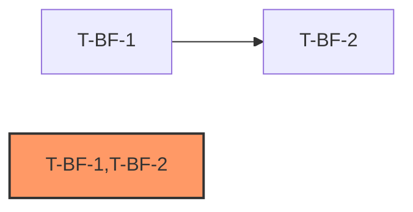

# Development Plan: IntelliSource — Sprint 10 (Embedding Backfill)

> **Sprint 主题**: 补齐 `ProcessedContent.embedding` NULL 空洞，消除存量与增量两条漏洞路径。Part A（批量回填）提供 Celery 任务 + API 端点 + CLI 命令的完整三层链路；Part B（内联回填）修复 `process.py` 的 `existing_processed is not None` 短路分支，杜绝未来重处理时再次漏掉回填。
>
> **前置**: main 分支已合并 PR #105（R-EMB 修复：`_embed.py` encoding_format + dict 取值双 bug 闭环），`LLMGateway.embed()` 真实路径已验证（20/20 写入 1024 维）。
>
> **后置**: 全部任务 approved 后，建议补跑 TEI 真起栈 smoke（含 backfill 端到端验证），然后更新 pre-deploy 走查检查清单。

[NAV]
- §2 依赖图
- §3 任务卡详细
  - T-BF-1 ContentRepository 扩展 + backfill_embeddings Celery 任务
  - T-BF-2 API 端点 + 响应 Schema + CLI 命令
  - T-BF-3 process.py 内联回填修复
- §4 风险项
[/NAV]

## 2. 依赖图

**关键路径**: T-BF-1 → T-BF-2（权重 L(3) + M(2) = 5）

**并行批次**:
- 批次 1（无前置，可并行）: T-BF-1、T-BF-3
- 批次 2（依赖 T-BF-1）: T-BF-2

**关键约束**: T-BF-3 与 T-BF-1 完全独立，可以与批次 1 并行开工；T-BF-2 的 API + CLI 层依赖 T-BF-1 的 Celery 任务名称常量存在，必须串行。

## 3. 任务卡详细

---

### T-BF-1: ContentRepository 扩展 + backfill_embeddings Celery 任务

- **目标**: 在 `ContentRepository` 新增 `list_missing_embeddings(batch_size, offset)` 分页查询方法（WHERE embedding IS NULL），然后实现 `backfill_embeddings` Celery 任务——分批迭代 NULL 行，对每条记录用 `body_text`（空则 fallback 到 `title`）调 `LLMGateway.embed(text)`，embed 成功则 update embedding 列；embed 返回 `None` 时跳过该行（保持 NULL，记录日志并计数），不 crash；幂等（重复调用只碰 embedding IS NULL 的行，已回填行不受影响）。Celery 任务通过 worker 侧 deps_bundle 获取 `LLMGateway` 与 `session_factory`，不在任务函数内硬构造新单例。

- **task_kind**: feature
- **tdd_mode**: standard（预估 LOC ~200；涉及外部 IO：litellm→TEI embed；跨 M-005/M-006/M-009 三个 arch 模块）
- **tdd_refactor**: auto
- **security_sensitive**: false
- **expected_tool_budget**: ~100

- **模块**: M-009（ContentRepository — `arch-intellisource-v1-modules#§2.M-009`）、M-005（LLMGateway.embed — `arch-intellisource-v1-modules#§2.M-005`）、M-006（Celery 任务定义 — `arch-intellisource-v1-modules#§2.M-006`）
- **接口**: 内部 — `ContentRepository.list_missing_embeddings`；`backfill_embeddings` Celery 任务（在 T-BF-2 中由 API 端点调用）
- **复杂度**: L（content.py 新增查询方法 ~30 + tasks.py backfill 任务 ~80 + 测试 ~90）

- **依赖**: 无

- **tdd_acceptance**:
  - [ ] AC-1 [ARCH#§M.M-009]: Given `ContentRepository` 连接到含 5 条 ProcessedContent 记录的测试 DB（其中 3 条 embedding IS NULL，2 条 embedding 非 NULL），When 调用 `await repo.list_missing_embeddings(batch_size=2, offset=0)`，Then 返回 `list[ProcessedContent]`，长度为 2，且返回列表中每条记录的 `embedding` 字段均为 `None`。
  - [ ] AC-2: Given 同上，When 调用 `await repo.list_missing_embeddings(batch_size=10, offset=2)`，Then 返回长度为 1（第 3 条 NULL 行），offset 超出时返回空列表 `[]`。
  - [ ] AC-3: Given worker 侧 deps_bundle 含 `llm_gateway`（embed 返回 `list[float]` 长度 1024 的 mock）和 `session_factory`，且 DB 中存在 3 条 embedding IS NULL 的 ProcessedContent 行，When 调用 `backfill_embeddings(batch_size=10)`，Then embed mock 被调用 3 次，调用参数为各条记录的 `body_text`（非空时）或 `title`（body_text 空时）；DB 中 3 条记录的 embedding 列均已更新为 mock 返回值（`list[float]`，1024 维）；已有 embedding 非 NULL 的行不被 embed 调用触及（幂等）。
  - [ ] AC-4: Given embed mock 对某条记录返回 `None`，When `backfill_embeddings` 处理该行，Then 该行的 embedding 列保持 `None`（不更新）；任务不 crash，不 raise；日志中含 skip 计数或 skip 记录（通过 structlog caplog 验证，至少含 `"skipped"` 或 `"embed_failed"` 关键字）；其他行正常回填不受影响。
  - [ ] AC-5 [生产路径 AC]: `backfill_embeddings` 函数以 `@celery_app.task(name="backfill_embeddings")` 注册（或等价装饰器），字面注册点在 `src/intellisource/scheduler/tasks.py`；integration 测试中通过 `celery_app.tasks["backfill_embeddings"]`（或 `"backfill_embeddings" in celery_app.tasks.keys()` 包含性断言）验证任务已注册到 Celery 任务注册表；仅 `tests/` 内构造调用不满足此 AC。（`backfill_embeddings.name == "backfill_embeddings"` 属性断言不满足此 AC，仅作辅助断言可选添加。）
  - [ ] AC-6: Given `body_text` 为空字符串 `""` 且 `title` 非空，When 调用 embed，Then 入参为 `title` 的值，不调用 `embed("")`（因 `LLMGateway.embed` 在空白文本时返回 `None`，传空字符串等价无效调用）。通过 `mock.call_args_list` 断言每次调用的 `text` 参数精确值；AC-3 覆盖调用次数（`call_count == 3`），AC-6 覆盖 fallback 逻辑的参数精确匹配。
  - [ ] AC-7 [OPTIONAL]: Given embed 返回 `list[float]` 但 `len(embedding) != 1024`（`EMBEDDING_DIM`），When `backfill_embeddings` 处理该行，Then 跳过 update 并记录 warn 日志（含维度不匹配信息），不 crash，不 raise；其他维度正确的行正常回填不受影响。

- **deliverables**:
  - [ ] `src/intellisource/storage/repositories/content.py`（新增 `list_missing_embeddings(batch_size: int, offset: int = 0) -> list[ProcessedContent]` 方法）
  - [ ] `src/intellisource/scheduler/tasks.py`（新增 `backfill_embeddings` Celery 任务函数）
  - [ ] `tests/unit/storage/test_content_repository_list_missing_embeddings.py`（新建，单元测试 AC-1/AC-2）
  - [ ] `tests/unit/scheduler/test_backfill_embeddings_task.py`（新建，单元测试 AC-3/AC-4/AC-5/AC-6，mock embed 返回真实 `list[float]` 形状）

- **context_load**:
  - `arch-intellisource-v1-modules#§2.M-005`
  - `arch-intellisource-v1-modules#§2.M-006`
  - `arch-intellisource-v1-modules#§2.M-009`
  - `arch-intellisource-v1-data#§4.E-004`（ProcessedContent 实体定义，含 `embedding` 字段）

- **notes**:
  - 含外部 TEI IO（embed 真实路径），单元测试必须 mock `LLMGateway.embed` 为返回 `list[float]`（长度 1024）或 `None`；mock 形状必须忠实（不得返回 `True`/`1`/dict）。sprint/prod 发布前需真起栈走查兜底（参考 R-EMB 教训）。
  - `list_missing_embeddings` 的分页实现推荐 `LIMIT batch_size OFFSET offset` SQL，确保对超大表不加载全部 NULL 行到内存。

---

### T-BF-2: API 端点 + 响应 Schema + CLI 命令

- **目标**: 新增 `POST /api/v1/content/backfill-embeddings` 端点（入队 `backfill_embeddings` Celery 任务，返回 202 + `{"status": "accepted", "task_id": "<celery-task-id>"}` 响应）；新增 Pydantic 响应 Schema `BackfillEmbeddingsResponse`；新建 CLI 命令组 `content`（若不存在）并挂载 `backfill-embeddings` 子命令（纯 HTTP 客户端，POST 上述端点并打印响应）；在 `src/intellisource/cli/main.py` 中注册 content 命令组。本任务不实现同步计算，仅负责触发面。

- **task_kind**: feature
- **tdd_mode**: standard（预估 LOC ~160；跨 M-006/M-011 两个 arch 模块；新增公开 API 契约 + CLI 接线涉及生产路由注册）
- **tdd_refactor**: auto
- **security_sensitive**: false
- **expected_tool_budget**: ~90

- **模块**: M-011（API 路由 + CLI — `arch-intellisource-v1-modules#§2.M-011`）、M-006（Celery send_task — `arch-intellisource-v1-modules#§2.M-006`）
- **接口**: 新公开 API 契约 `POST /api/v1/content/backfill-embeddings`（本任务内联契约定义，见 arch-sync 说明）
- **复杂度**: M（router ~40 + schema ~15 + CLI commands/content.py ~40 + main.py 注册 ~5 + 测试 ~60）

- **依赖**: T-BF-1（`backfill_embeddings` Celery 任务名称必须存在才能 send_task）

- **tdd_acceptance**:
  - [ ] AC-1 [生产路径 AC]: `POST /api/v1/content/backfill-embeddings` 路由在 `src/intellisource/api/routers/contents.py`（或新建的 `src/intellisource/api/routers/content_admin.py`）中以 `@router.post("/content/backfill-embeddings", status_code=202)` 字面注册，并在 `src/intellisource/api/routers/__init__.py` 或 `src/intellisource/main.py` 的 `app.include_router(...)` 处挂载；仅测试内构造不满足此 AC。
  - [ ] AC-2: Given FastAPI 测试客户端，`X-API-Key` 通过验证，`app.state.celery_app` 已被替换为 mock 对象（`app.state.celery_app = mock_celery`），When `POST /api/v1/content/backfill-embeddings`（body 可为空 JSON `{}`），Then 响应 HTTP status = 202，响应体 JSON 含字段 `status == "accepted"` 且 `task_id` 为非空字符串；`mock_celery.send_task`（或 `send_task_with_trace` 以 `celery_instance=app.state.celery_app` 调用）被触发，调用参数含 `"backfill_embeddings"` 名称。端点内部须遵循现有模式：`celery_instance = getattr(request.app.state, "celery_app", None)`，不得裸导入模块级 `celery_app` 常量直接调用。
  - [ ] AC-3: Given `app.state.celery_app` 被替换为 mock 对象（`app.state.celery_app = mock_celery`），When `POST /api/v1/content/backfill-embeddings`，Then `mock_celery` 接收到的任务名称参数字面等于 `"backfill_embeddings"`；响应体 `task_id` 字段等于 mock 返回的 `.id` 属性值。（mock 注入点为 `app.state.celery_app`，而非 patch 模块级常量 `intellisource.scheduler.celery_app.celery_app`。）
  - [ ] AC-4 [生产路径 AC]: CLI 命令 `intellisource content backfill-embeddings` 对应的 Typer 命令函数在 `src/intellisource/cli/commands/content.py` 中以 `@content_app.command("backfill-embeddings")` 注册；`content_app` 通过 `app.add_typer(content.content_app, name="content")` 字面挂载到 `src/intellisource/cli/main.py`。
  - [ ] AC-5: Given CLI 测试（`CliRunner`），API mock 返回 `{"status": "accepted", "task_id": "test-uuid"}`，When 调用 `intellisource content backfill-embeddings`，Then 进程退出码为 0，stdout 含 `"accepted"` 或 `"task_id"` 字样（通过 `emit` 标准化输出）；使用 `_client.post("/api/v1/content/backfill-embeddings", {})` 调用 API（不含本地 LLMGateway 依赖）。
  - [ ] AC-6: `BackfillEmbeddingsResponse` Pydantic model 含 `status: str` 和 `task_id: str` 字段，FastAPI 端点的 `response_model` 指向该 schema。

- **deliverables**:
  - [ ] `src/intellisource/api/routers/contents.py`（在现有 content 路由文件中新增 `POST /api/v1/content/backfill-embeddings` 端点；若评估职责混入不可接受，可改为新建 `src/intellisource/api/routers/content_admin.py` 并 `include_router` 挂载，implementer 选定后同步更新此 deliverable 实际路径）
  - [ ] `src/intellisource/api/schemas.py` 或同等 schema 文件（新增 `BackfillEmbeddingsResponse` Pydantic model）
  - [ ] `src/intellisource/cli/commands/content.py`（新建，含 `content_app = typer.Typer()` 和 `backfill-embeddings` 子命令）
  - [ ] `src/intellisource/cli/main.py`（新增 `app.add_typer(content.content_app, name="content")` 注册行）
  - [ ] `tests/unit/api/test_backfill_embeddings_endpoint.py`（新建，单元测试 AC-1/AC-2/AC-3）
  - [ ] `tests/unit/cli/test_content_backfill_command.py`（新建，单元测试 AC-4/AC-5）

- **context_load**:
  - `arch-intellisource-v1-modules#§2.M-011`
  - `arch-intellisource-v1-modules#§2.M-006`
  - `arch-intellisource-v1-api#§3.API-007`（采集任务触发端点，作为同类 202-accepted 端点的命名与响应结构参考）
  - `dev-plan-intellisource-v1-s10#§3.T-BF-1`（Celery 任务名称契约）

- **arch-sync 说明**:
  `POST /api/v1/content/backfill-embeddings` 是项目新增的公开 API 契约，当前 arch 文档（`arch-intellisource-v1-api`）中无此端点的契约条目。**推荐在本任务 deliverables 内内联契约**（不要求先提交 arch amendment、再开工）：实现后由 implementer 或 tech-lead 在 PR 描述中记录 API 契约摘要，**T-BF-2 PR 合并后由 tech-lead 提交 arch-amendment 补录该端点契约**，编号取 arch 当时的下一可用值（`[ASSUMPTION]` 待 arch amendment 时确认；注意 API-026~API-029 已在 `arch-intellisource-v1-api` 中声明为删除编号，不可复用），以 pre-deploy review 为硬性截止（两者以先到者为准）。理由：该端点语义简单（单动作 + 固定响应），内联契约不会导致下游 API/CLI 消费者对文档的误读；而强制先走 arch amendment 流程会造成不必要的等待。**追踪**: 此 arch-amendment 补录项登记进 BACKLOG（见 backfill 条目跟进项），防止无限期推迟；test-report / deploy-spec 引用 arch API 范围时应注意该 backfill 端点当前仅在 dev-plan 内联定义。若项目决策在 arch review 前冻结 API，可提前单独提交 arch-amendment。

- **notes**:
  - CLI 参照 `source.py` 模式：`_client.post(...)` + `emit(resp.json(), json_output=json_output)`；无本地 gateway 依赖。
  - 如果现有 `api/routers/contents.py` 已经是多路由聚合文件，评估是否新建 `content_admin.py` 再 include_router 避免职责混入。

---

### T-BF-3: process.py 内联回填修复

- **目标**: 修复 `src/intellisource/agent/tools/executes/process.py` 中 `existing_processed is not None` 分支（约 line 112-113）——当前该分支只有一行赋值，无任何 embedding 逻辑；fix 需要在此分支内**新增** `embedding_val = ctx.get("embedding")` 读取，当 `isinstance(embedding_val, list)` 为真且 `existing_processed.embedding is None` 时，调用 `await repo.update(existing_processed.id, embedding=embedding_val)` 回填；否则（ctx 无有效 embedding 或 existing_processed.embedding 已非 None）不调用 update，直接返回 `existing_processed`，不 crash。已存在 embedding 的记录不被修改（幂等）。

- **task_kind**: fix
- **tdd_mode**: light（预估 LOC ~45；单文件改动；M-009 ContentRepository 已有 `update()` 方法，无需新增；逻辑分支清晰）
- **tdd_refactor**: skip（单点 bug 修复，GREEN 后无需结构性重构）
- **security_sensitive**: false

- **模块**: M-006（agent/tools — `arch-intellisource-v1-modules#§2.M-006`）、M-009（ContentRepository.update — `arch-intellisource-v1-modules#§2.M-009`）
- **接口**: 内部 — `process.py` 的 `existing_processed is not None` 分支
- **复杂度**: S（process.py 改动 ~20 + 测试 ~25）

- **依赖**: 无（与 T-BF-1 完全独立，可并行）

- **tdd_acceptance**:
  - [ ] AC-1: Given `process.py` 的 `existing_processed is not None` 分支（约 line 112-113），`ctx` 字典含键 `"embedding"` 且值为 `list[float]`（长度 1024，即 `isinstance(ctx.get("embedding"), list)` 为真），且 `existing_processed.embedding is None`，When 分支执行，Then `ContentRepository.update` 被调用，调用参数含 `existing_processed.id` 和 `embedding=ctx.get("embedding")` 的实际 `list[float]` 值；返回值为已更新的 ProcessedContent 对象（或 `existing_processed`，依 `update` 语义）。
  - [ ] AC-2: Given 同上但 `existing_processed.embedding` 非 None（已有值），When 分支执行，Then `ContentRepository.update` **不被调用**（幂等保护），直接返回 `existing_processed`（不修改）。
  - [ ] AC-3: Given `existing_processed.embedding is None` 但 `ctx.get("embedding")` 返回 `None` 或不存在 `"embedding"` 键（即 `isinstance(ctx.get("embedding"), list)` 为假），When 分支执行，Then `ContentRepository.update` 不被调用；函数不 raise；正常返回 `existing_processed`（embedding 保持 None 不变）。
  - [ ] AC-4: 回归测试——原有「已处理记录命中缓存直接返回」行为不受影响：Given `existing_processed.embedding` 非 None，When 分支执行，Then 返回值与改动前一致（不调用 update，直接返回 `existing_processed`）。

- **deliverables**:
  - [ ] `src/intellisource/agent/tools/executes/process.py`（修改 `existing_processed is not None` 分支，新增条件回填逻辑）
  - [ ] `tests/unit/agent/tools/test_process_inline_backfill.py`（新建，单元测试 AC-1/AC-2/AC-3/AC-4）

- **context_load**:
  - `arch-intellisource-v1-modules#§2.M-006`
  - `arch-intellisource-v1-modules#§2.M-009`
  - `arch-intellisource-v1-data#§4.E-004`（ProcessedContent 实体，含 `embedding` 字段定义）

- **notes**:
  - `ContentRepository.update(id, **kwargs)` 继承自 `BaseRepository`，已存在，无需新增方法（确认签名：`update(id: UUID, **kwargs) -> ModelT | None`）。
  - fix 目标是在 `existing_processed is not None` 分支（约 line 112-113）内新增 `embedding_val = ctx.get("embedding")` 读取逻辑；该读取在现有代码中仅存在于 `else` 分支（约 line 115-118，变量名 `embedding_val`/`embedding_arg`），fix 后两分支均需处理 embedding 回填。
  - mock 测试中 `ctx.get("embedding")` 应返回 `list[float]`（1024 维）或 `None`/缺省，不得用 `True`/`1` 代替（R-EMB 教训）。
  - `tests/unit/agent/tools/` 目录需新建，并放置空 `__init__.py`，确保 pytest 模块发现正常。

## 4. 风险项

### R-BF-1: worker 侧 gateway 获取路径未经本次任务验证（MEDIUM）

T-BF-1 的 `backfill_embeddings` 任务需要从 worker 侧 deps_bundle 取 `llm_gateway`。若 `boot.py:worker_init_handler` 在装配时未将 gateway 正确注入（参见 T-095 已闭环的 composition root 路径），任务运行时会 `AttributeError`。

**缓解**: T-BF-1 的 AC-5 要求 integration 测试验证任务可通过 `celery_app.tasks` 取到，RED 阶段需额外确认 worker deps 装配路径中 `llm_gateway` 非 None（在 `tests/unit/scheduler/test_backfill_embeddings_task.py` 中通过 mock `_get_deps_bundle()` 或等价装配函数注入）。

### R-BF-2: embed 向量维度不一致（LOW）

若 TEI 配置变更导致 embed 返回维度不为 1024，`Vector(1024)` 列 pgvector CHECK 约束会在 UPDATE 时报错，导致 backfill 任务 crash（非 None-skip 分支）。

**缓解**: None-skip 仅处理 `embed() == None` 的情况，维度不符属于 pgvector 层面报错，建议在 backfill 任务 update 前加 `len(embedding) == EMBEDDING_DIM` 校验，维度不符时降级为 skip + 告警日志。实现可在 GREEN 阶段根据 implementer 判断决定是否纳入（非强制 AC）。

### R-BF-3: 大表 NULL 扫描性能（LOW）

`WHERE embedding IS NULL` 在 ProcessedContent 无该列索引时走全表扫描。数据量小时（< 10 万行）无感知，但生产大表可能超时。

**缓解**: 确认 Alembic migration 在 `embedding` 列或 `(embedding IS NULL)` 上有合适索引（现有 HNSW 索引不覆盖 NULL）；batch 分页读取（AC-1 的 `batch_size` 参数）可防止单次内存溢出，但不能加速扫描。若需添加 partial index，可作为 Alembic migration 附件提交（T-BF-1 deliverables 中可选）。
