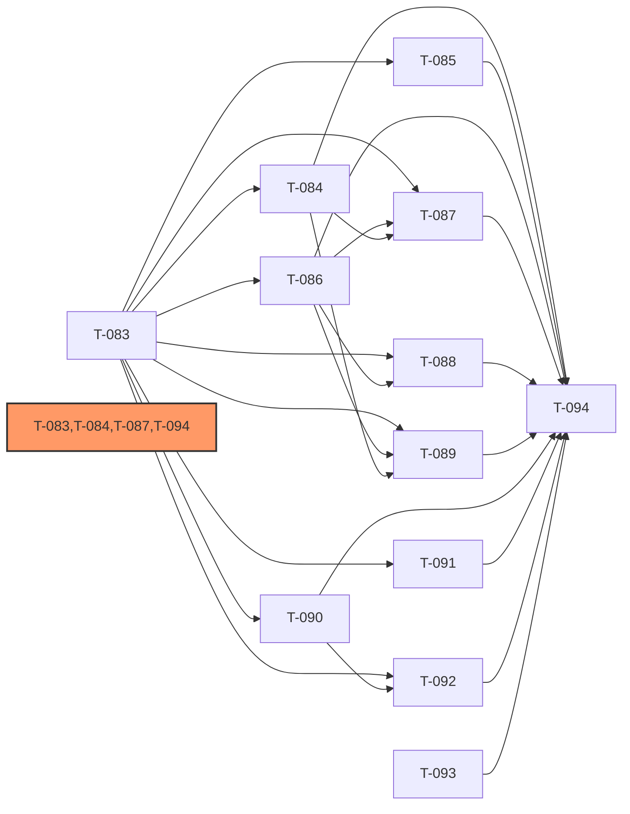

# Development Plan: IntelliSource — Sprint 8r (Pre-Deploy P0 阻断项修复)

> **Sprint 主题**: pre-deploy P0 阻断项修复 — compositional wire-up + 缺失方法补齐 + 持久化接驳 + 时区/编码合规
> **前置依赖**: Sprint 7r 已全部完成（T-080~T-082 = done）；pre_deploy_checkpoint 源码深度审计识别出 Top-10 NO-GO 阻断项 + 5 项新发现
> **后置**: 全部 T-083~T-094 完成后，重新进入 pre_deploy_checkpoint GO/NO-GO 评估
> **注意**: `docs/dev-plan/dev-plan-intellisource-v1-s8.md`（T-064~T-079 OpenCode P2 改进）已重新定位为 post-deploy P2 backlog，与本 sprint-8r 解耦，两批互不干扰
> **Sprint 目标**: 完成后 8 个 P0 功能（F-001/002/004/005/007/008/009/012）的 43 个 AC 不再有 broken 项；partial 项收敛到可接受范围（implemented + partial ≥ 90%）

[NAV]
- §2 依赖图
- §3 任务卡详细
  - T-083 应用组合根与 Celery 链路真实初始化（B-01 + B-12 基础层）
  - T-084 PipelineEngine 中间件接入与流式/批处理分路（B-03）
  - T-085 HybridSearchEngine 真实查询接驳 + chat 方法补全（B-02）
  - T-086 LLMGateway chat 方法 + JSON Mode / Function Calling（B-06 + B-11）
  - T-087 F-005 LLM 智能处理链路接驳（B-04）
  - T-088 CircuitBreaker + PriorityQueue 接驳 LLMGateway（B-05）
  - T-089 Agent 工具 6 个 execute stub 真实实现（B-08）
  - T-090 三渠道 PushRecord 持久化 + 统一 dedup hook（B-07）
  - T-091 ConfigWatcher 热加载 + reload API 真实实现（B-09）
  - T-092 Celery task_routes 配置 + boot.py worker_init 修复 + 幂等三组件串入（B-12 + B-13）
  - T-093 quiet_hours 时区修复 + scorer/matcher 关键词解析器统一 + ReDoS 防护（B-10 + B-14 + B-15）
  - T-094 Sprint-8r 集成测试与冷启动验证
- §4 风险项
[/NAV]

## 2. 依赖图

**关键路径**: T-083 → T-084 → T-087 → T-094（权重合计 = L(3) + M(2) + L(3) + M(2) = 10）

**并行批次**:
- 批次 1（无前置）: T-083、T-093
- 批次 2（依赖 T-083）: T-084、T-085、T-086、T-090、T-091
- 批次 3（依赖 T-084/T-086/T-090）: T-087、T-088、T-089、T-092
- 批次 4（收口）: T-094

## 3. 任务卡详细

### T-083: 应用组合根与 Celery 链路真实初始化（B-01 + B-12 基础层）

- **目标**: 建立应用组合根 — 新建 `scheduler/celery_app.py` 提供 module-level `celery_app` singleton；新建 `agent/factory.py` 提供 `build_agent_runner()` 工厂函数；`main.py:init_celery()` 升级为真实初始化并挂载到 `app.state`；`scheduler/tasks.py` 的 `CeleryTasks.run_pipeline` 用 `@celery_app.task` 装饰器暴露为 named task；`/tasks/collect` 端点改为真实调用 `send_task`。此任务是其他所有任务的 wire-up 基础。
- **task_kind**: feature
- **tdd_mode**: standard（预估 LOC > 250；跨 M-006/M-011/M-005 三个 arch 模块；是全链路组合根）
- **tdd_refactor**: required（引入工厂模式 + module-level singleton，跨模块抽象，GREEN 后强制 REFACTOR）
- **security_sensitive**: false
- **模块**: M-006（scheduler + agent）、M-011（API 入口）、M-005（LLMGateway 依赖注入）
- **接口**: API-006（任务触发 `/tasks/collect`）
- **复杂度**: L（预估 LOC ~300：celery_app.py ~40 + factory.py ~80 + main.py 修改 ~60 + tasks.py 装饰器接驳 ~50 + tasks router 修改 ~30 + 测试 ~80）
- **status**: done（GREEN 完成 — RED 28/28 PASS + 全量回归 1919 passed/0 failed；REFACTOR (required) + code-review 推迟到 sprint-8r 下次会话与批次 2-4 一并执行）
- **依赖**: 无（应用组合根，最高优先级，最先执行）
- **expected_tool_budget**: ~100

- **tdd_acceptance**:
  - [ ] AC-1: `src/intellisource/scheduler/celery_app.py` 存在 module-level `celery_app = Celery("intellisource", broker=settings.CELERY_BROKER_URL, backend=settings.CELERY_RESULT_BACKEND)`，broker/backend 从配置对象读取，零硬编码字符串
  - [ ] AC-2: `src/intellisource/agent/factory.py` 存在 `build_agent_runner(session_factory, llm_gateway) -> AgentRunner`，内部构造 `AgentToolRegistry`、调用 `register_defaults`、`register_atomic_tools`，返回可用的 `AgentRunner` 实例
  - [ ] AC-3: `main.py` lifespan startup 调用升级后的 `init_celery()`，将 `celery_app` 实例挂载到 `app.state.celery_app`；shutdown 时优雅关闭（`celery_app.close()` 或等价操作）
  - [ ] AC-4: `scheduler/tasks.py` 的 `CeleryTasks.run_pipeline` 被 `@celery_app.task(name="run_pipeline", bind=True)` 装饰器标记，可通过 `celery_app.tasks["run_pipeline"]` 查找到
  - [ ] AC-5: `api/routers/tasks.py` 的 `/tasks/collect` 改为通过 `request.app.state.celery_app.send_task("run_pipeline", kwargs={...})` 触发，返回 task_id；不再仅写 DB 行
  - [ ] AC-6: 单元测试 — mock `celery_app.send_task`，断言 `/tasks/collect` POST 后 `send_task` 被调用一次且 kwargs 包含 source_id
  - [ ] AC-7: 单元测试 — `build_agent_runner` 返回的 `AgentRunner` 实例包含注册后的工具 registry（至少 3 个工具）
  - [ ] AC-8: 集成冷启动测试（与 T-094 协调）— FastAPI lifespan 完成后，`app.state.celery_app` 非 None 且 `send_task` 不抛出 `AttributeError`

- **deliverables**:
  - [ ] `src/intellisource/scheduler/celery_app.py`（新建）— module-level `celery_app` singleton，broker/backend 从配置读取
  - [ ] `src/intellisource/agent/factory.py`（新建）— `build_agent_runner(session_factory, llm_gateway) -> AgentRunner` 工厂函数
  - [ ] `src/intellisource/main.py` — `init_celery()` 真实初始化 + lifespan startup/shutdown 挂载 + `app.state.celery_app`
  - [ ] `src/intellisource/scheduler/tasks.py` — `CeleryTasks.run_pipeline` 加 `@celery_app.task` 装饰器，从 `celery_app.py` 导入
  - [ ] `src/intellisource/api/routers/tasks.py` — `/tasks/collect` 改为 `send_task` 调用
  - [ ] `tests/unit/scheduler/test_celery_app.py`（新建）— celery_app 初始化、task 注册测试
  - [ ] `tests/unit/agent/test_factory.py`（新建）— `build_agent_runner` 工厂函数测试
  - [ ] `tests/unit/api/test_tasks_router.py`（修改）— 补充 `send_task` mock 断言

- **affected_files**:
  - `src/intellisource/scheduler/celery_app.py`（新建）
  - `src/intellisource/agent/factory.py`（新建）
  - `src/intellisource/main.py`
  - `src/intellisource/scheduler/tasks.py`
  - `src/intellisource/api/routers/tasks.py`
  - `tests/unit/scheduler/test_celery_app.py`（新建）
  - `tests/unit/agent/test_factory.py`（新建）
  - `tests/unit/api/test_tasks_router.py`

- **context_load**:
  - `arch-intellisource-v1#§2.M-006`（scheduler + agent 架构，CeleryTasks / AgentRunner / AgentToolRegistry 定义）
  - `arch-intellisource-v1#§2.M-011`（API 路由层，deps.py 依赖注入约定）
  - `arch-intellisource-v1#§2.M-005`（LLMGateway 接口，build_agent_runner 需要注入 LLMGateway 实例）
  - `arch-intellisource-v1#§6`（目录结构：scheduler/ + agent/ 路径约定）

- **risk**:
  - `celery_app` module-level singleton 在测试中可能造成 import 副作用；需在 conftest 中 mock broker 连接
  - `build_agent_runner` 工厂参数签名需与 T-089（Agent 工具接驳）保持一致，避免后续修改；tech-lead 已在 T-089 中要求参数通过 ToolDeps 注入

- **mitigation**:
  - `celery_app.conf.broker_connection_retry_on_startup = False` 防止测试环境无 Redis 时启动阻塞
  - `factory.py` 参数设计为关键字参数，允许 T-089 等后续任务通过依赖注入扩展，无需修改函数签名

---

### T-084: PipelineEngine 中间件接入与流式/批处理分路（B-03）

- **目标**: 将 `MiddlewareChain` 接入 `PipelineEngine` 的 before/after 钩子；将 `ConditionalProcessor` 接入调度路径；新增 `AsyncPipelineEngine` 或在 PipelineEngine 提供 async generator 路径以区分流式/批处理；在 `agent/factory.py` 或 `scheduler/tasks.py` 提供至少一个生产入口实例化并使用 PipelineEngine；填充 `content-process.yaml steps` 为真实处理器序列。
- **task_kind**: feature
- **tdd_mode**: standard（预估 LOC ~220；跨 M-003/M-006 两个 arch 模块；引入 async generator 路径属新设计）
- **tdd_refactor**: required（中间件洋葱模型 + 异步路径为跨模块抽象，GREEN 后强制 REFACTOR）
- **security_sensitive**: false
- **模块**: M-003（处理管道）、M-006（任务编排调度）
- **接口**: 内部接口 — `PipelineEngine.execute(ctx)` / `PipelineEngine.execute_stream(ctx) async generator`
- **复杂度**: M（预估 LOC ~220）
- **status**: todo
- **依赖**: T-083（应用组合根，提供 `build_agent_runner` 中 PipelineEngine 实例化入口）

- **tdd_acceptance**:
  - [ ] AC-1: `PipelineEngine.execute(ctx)` 执行时，`MiddlewareChain` 中注册的 before 钩子在处理器执行前调用，after 钩子在处理器执行后调用；洋葱模型正确嵌套（不仅是线性追加）
  - [ ] AC-2: `ConditionEvaluator` 条件为 False 时，对应处理器被跳过（AC-014）；条件为 True 时正常执行；测试两个分支
  - [ ] AC-3: `PipelineEngine` 提供 `execute_stream(ctx) -> AsyncIterator[PipelineContext]` 方法，每处理完一个处理器 yield 一次中间上下文；`execute(ctx)` 保留原批处理语义（等待全部完成后返回）
  - [ ] AC-4: `config/pipelines/content-process.yaml` 的 `steps` 字段填充至少 3 个真实处理器（如 `HTMLParser`、`ContentDedup`、`KeywordTagger`），`mode` 字段设为 `batch`
  - [ ] AC-5: `agent/factory.py` 的 `build_agent_runner` 内部（或通过 `scheduler/tasks.py` 调用路径）实例化 `PipelineEngine` 并加载 `content-process.yaml`；全仓 grep `PipelineEngine(` 至少命中 1 个 src/ 内调用点
  - [ ] AC-6: 单元测试 — 构造包含 2 个处理器 + 1 个中间件的 PipelineEngine，断言 before/after 各被调用一次；条件跳过测试断言被跳过处理器的 `process()` 未被调用

- **deliverables**:
  - [ ] `src/intellisource/pipeline/engine.py` — 接入 `MiddlewareChain` before/after 钩子；新增 `execute_stream()` async generator 路径；`ConditionalProcessor` 接入调度
  - [ ] `src/intellisource/pipeline/middleware.py` — 确认 `MiddlewareChain` 接口与 engine 钩子协议一致（如有改动则修改）
  - [ ] `src/intellisource/agent/factory.py`（修改，协调 T-083）— 在工厂函数中实例化 PipelineEngine 并注册到 AgentRunner
  - [ ] `config/pipelines/content-process.yaml` — 填充 `steps` 为真实处理器序列（HTMLParser → ContentDedup → KeywordTagger）
  - [ ] `tests/unit/pipeline/test_engine_middleware.py`（新建）— 中间件洋葱模型 + 条件分支 + 流式/批处理路径测试

- **affected_files**:
  - `src/intellisource/pipeline/engine.py`
  - `src/intellisource/pipeline/middleware.py`
  - `src/intellisource/agent/factory.py`
  - `config/pipelines/content-process.yaml`
  - `tests/unit/pipeline/test_engine_middleware.py`（新建）

- **context_load**:
  - `arch-intellisource-v1#§2.M-003`（处理管道架构：PipelineEngine / MiddlewareChain / ConditionEvaluator / BatchProcessor）
  - `arch-intellisource-v1#§2.M-006`（任务编排调度：PipelineConfig 加载，AgentRunner 调用 PipelineEngine）
  - `arch-intellisource-v1#§6`（目录结构：pipeline/ 路径约定）

- **risk**:
  - `MiddlewareChain` 的洋葱模型需要 `next` callable 语义，与现有 `PipelineEngine` 的 `for processor in processors` 线性循环不兼容；需重构 engine 的调度循环
  - `execute_stream` 引入 AsyncIterator 需要调用方适配；`CeleryTasks.run_pipeline` 需要决定是用 batch 还是 stream 路径

- **mitigation**:
  - engine.py 重构时保留原 `execute()` 接口语义不变（向下兼容），`execute_stream()` 为新增方法；测试同时覆盖两条路径
  - `content-process.yaml` 的 `mode: batch` 字段决定默认路径，`CeleryTasks` 读取此字段选择调用 `execute()` 或 `execute_stream()`

---

### T-085: HybridSearchEngine 真实查询接驳 + chat 方法补全（B-02）

- **目标**: 修复 `HybridSearchEngine.search()` 改为真实调用 `HybridIndex.hybrid_search(query, query_vector, ...)`；新增 `HybridSearchEngine.chat()` 方法（或将 `api/routers/search.py:69` 的调用对齐实际方法名）；融合权重字段作用到底层调用。
- **task_kind**: fix
- **tdd_mode**: standard（预估 LOC ~160；跨 M-008/M-009 两个 arch 模块）
- **tdd_refactor**: skip（bug 修复 + 缺失方法补全，无需大规模重构）
- **security_sensitive**: false
- **模块**: M-008（检索与对话）、M-009（存储 — HybridIndex 位于 storage/vector.py）
- **接口**: API-012（混合检索 `/api/v1/search`）、API-013（即时问答 `/api/v1/search/chat`）
- **复杂度**: M（预估 LOC ~160）
- **status**: todo
- **依赖**: T-083（应用组合根提供 session_factory 注入路径，HybridSearchEngine 需要 DB session）

- **tdd_acceptance**:
  - [ ] AC-1: `HybridSearchEngine.search(query, query_vector, **kwargs)` 真实调用 `HybridIndex.hybrid_search()`，不再包含无参数无 SQL 的 `session.execute()`；测试用 mock session 断言 `hybrid_search` 被调用一次且 query/query_vector 参数被传递
  - [ ] AC-2: `HybridSearchEngine` 存在 `chat(messages, session_id=None, **kwargs)` 方法（或 search 路由调用改为匹配实际方法名）；`/api/v1/search/chat` 不再抛出 `AttributeError`
  - [ ] AC-3: 融合权重（如 `keyword_weight` / `vector_weight`）从调用方参数传入，作用于 `HybridIndex.hybrid_search()` 调用；测试断言权重参数被传递到底层
  - [ ] AC-4: 单元测试 — mock HybridIndex，调用 `HybridSearchEngine.search("test query", query_vector=[...])` 断言返回非空结果列表（无 TypeError / AttributeError）
  - [ ] AC-5: 单元测试 — mock HybridIndex，调用 `HybridSearchEngine.chat([{"role":"user","content":"..."}])` 断言返回字典含 `reply` 字段（无 AttributeError）

- **deliverables**:
  - [ ] `src/intellisource/search/hybrid.py` — `search()` 真实调用 `HybridIndex.hybrid_search()`；新增 `chat()` 方法；融合权重传递
  - [ ] `src/intellisource/api/routers/search.py` — 确认调用方法名与 `HybridSearchEngine` 实际方法一致（如有不一致则修改 router）
  - [ ] `tests/unit/search/test_hybrid_engine.py`（新建或修改）— 覆盖 AC-1 / AC-2 / AC-3 / AC-4 / AC-5

- **affected_files**:
  - `src/intellisource/search/hybrid.py`
  - `src/intellisource/api/routers/search.py`
  - `tests/unit/search/test_hybrid_engine.py`（新建或修改）

- **context_load**:
  - `arch-intellisource-v1#§2.M-008`（检索与对话：HybridSearchEngine / ChatSessionManager）
  - `arch-intellisource-v1#§2.M-009`（存储：VectorStore / HybridIndex，hybrid_search 接口已就绪）
  - `arch-intellisource-v1#§6`（目录结构：search/ 与 storage/vector.py 路径）

- **risk**:
  - `HybridIndex.hybrid_search()` 签名需要确认（storage/vector.py:105-156 已就绪），若签名与预期不符需小幅调整调用方；不修改 HybridIndex 内部实现
  - `chat()` 方法语义需与 `ChatSessionManager` 协作（会话历史管理）；若 T-085 范围只补全方法不引入 ChatSessionManager，需在方法 docstring 标 `[ASSUMPTION]: stateless chat，后续 T-094 验收补全`

- **mitigation**:
  - 先读 `storage/vector.py` 确认 `HybridIndex.hybrid_search` 实际签名，再写 `search()` 实现；参数对齐后运行单元测试验证
  - `chat()` 初版可无状态（每次调用独立），满足 AC-2 消除 AttributeError 的基础要求；有状态会话可作为 T-094 集成测试覆盖的扩展

---

### T-086: LLMGateway chat 方法 + JSON Mode / Function Calling（B-06 + B-11）

- **目标**: `LLMGateway` 新增 `chat(messages, tools=None, **kwargs)` 方法，封装 messages-style 调用并支持 tools 参数透传 litellm；`complete()` 和 `chat()` 均接受 `response_format={"type":"json_object"}` 参数并透传 litellm；`SchemaEnforcer` 退为兜底层（先 JSON Mode → 失败 → SchemaEnforcer 重试）。
- **task_kind**: feature
- **tdd_mode**: standard（预估 LOC ~180；security_sensitive=true 涉及 LLM 输出格式强制和错误降级；跨 M-005/M-006 两个 arch 模块）
- **tdd_refactor**: auto
- **security_sensitive**: true（LLM 调用参数透传涉及输出格式强制与 JSON 注入防护语义）
- **模块**: M-005（LLM 服务治理）、M-006（Agent 调度层使用 chat 方法）
- **接口**: API-017（LLM 用量统计，chat 方法需一并纳入统计）
- **复杂度**: M（预估 LOC ~180）
- **status**: todo
- **依赖**: T-083（应用组合根，LLMGateway 实例由 factory.py 注入 AgentRunner）

- **tdd_acceptance**:
  - [ ] AC-1: `LLMGateway.chat(messages=[...], tools=None)` 方法存在，调用 litellm 的 messages-style API；测试用 mock litellm 断言 `messages` 参数被传递
  - [ ] AC-2: `LLMGateway.chat(messages=[...], tools=[{...}])` 时，`tools` 参数透传给 litellm（Function Calling）；测试断言 litellm 调用包含 `tools` kwarg
  - [ ] AC-3: `LLMGateway.complete(prompt, response_format={"type":"json_object"})` 时，`response_format` 透传给 litellm；`LLMGateway.chat(messages, response_format={"type":"json_object"})` 同理；测试断言 litellm call_kwargs 包含 `response_format`
  - [ ] AC-4: LLM 返回非合法 JSON 时，`SchemaEnforcer` 进行二次提取（兜底），失败后抛出 `LLMOutputError`；测试 mock litellm 返回 `"invalid json"` 后 SchemaEnforcer 被调用一次
  - [ ] AC-5: `CostTracker` 对 `chat()` 调用同样记录 token 消耗，统计维度包含 `call_type=chat`；测试断言 `CostTracker.record()` 被调用
  - [ ] AC-6: 全仓 grep `response_format|tool_choice|tools=` 在 `src/intellisource/llm/` 至少命中 2 处（JSON Mode + Function Calling 参数组装）

- **deliverables**:
  - [ ] `src/intellisource/llm/gateway.py` — 新增 `chat(messages, tools=None, response_format=None, **kwargs)` 方法；`complete()` 和 `chat()` 均支持 `response_format` 透传；`SchemaEnforcer` 接入兜底流程
  - [ ] `tests/unit/llm/test_gateway_chat.py`（新建）— 覆盖 AC-1 / AC-2 / AC-3 / AC-4 / AC-5

- **affected_files**:
  - `src/intellisource/llm/gateway.py`
  - `tests/unit/llm/test_gateway_chat.py`（新建）

- **context_load**:
  - `arch-intellisource-v1#§2.M-005`（LLM 服务治理：LLMGateway / SchemaEnforcer / CostTracker / RetryPolicy）
  - `arch-intellisource-v1#§2.M-006`（任务编排：runner.py 调用 `self._llm_gateway.chat(messages=..., tools=...)`，签名需对齐）

- **risk**:
  - litellm 不同提供商对 `tools` / `response_format` 支持程度不一；需在 `chat()` 内捕获 `litellm.exceptions.NotSupportedError` 并降级为不带 tools 的调用
  - `SchemaEnforcer` 兜底可能增加延迟；需要在 `RetryPolicy` 的 max_attempts 之外单独计入 SchemaEnforcer 的重试次数，避免叠加过长
  - **[prompt injection 边界声明]** `LLMGateway.chat(messages=...)` 的 `messages` 入参由内部调用方（AgentRunner / PromptBuilder）构造，不直接包含未经清理的用户原文；prompt injection 防护责任由 PromptBuilder 上游处理。若未来有调用方直接将用户输入拼入 messages，需在该调用方层做长度上限（`MAX_USER_CONTENT_LENGTH`）和注入模式过滤，不在 LLMGateway 层处理

- **mitigation**:
  - `tools` 参数类型标注为 `Optional[list[dict]]`，传入前做 schema 预验证，拒绝无效格式
  - SchemaEnforcer 兜底仅执行一次（不递归重试），失败则抛出异常交由 FallbackManager 处理

---

### T-087: F-005 LLM 智能处理链路接驳（B-04）

- **目标**: 补全 VectorStore 缺失方法；将 `_llm_complete_execute` 改为真实调用 LLMGateway；新建 LLM 结构化提取处理器接入管道（含 SchemaEnforcer + FallbackManager 降级链路）；建立 ContentCluster 写入路径；`ProcessedContent.structured_data` 在结构化提取后实际写入。
- **task_kind**: feature
- **tdd_mode**: standard（预估 LOC ~280；跨 M-004/M-005/M-006/M-009 四个 arch 模块；含 LLM 输出格式处理与 DB 写入）
- **tdd_refactor**: auto
- **security_sensitive**: false
- **模块**: M-004（原子处理工具）、M-005（LLM 网关）、M-006（Agent 调度）、M-009（存储）
- **接口**: 内部接口 — `VectorStore.search_similar()` / `VectorStore.find_nearest_cluster()` / 结构化提取处理器
- **复杂度**: L（预估 LOC ~280）
- **status**: todo
- **依赖**: T-083（应用组合根）、T-084（PipelineEngine 接入，提供管道注册点）、T-086（LLMGateway.chat 方法，`_llm_complete_execute` 需要调用它）

- **tdd_acceptance**:
  - [ ] AC-1: `VectorStore.search_similar(query_vector, threshold, top_k)` 方法存在且可调用；测试 mock session，断言调用后返回 `threshold` 过滤后的结果列表（相似度 < threshold 的条目不在结果中）
  - [ ] AC-2: `VectorStore.find_nearest_cluster(embedding, threshold)` 方法存在且可调用；测试 mock session，断言返回最近聚类或 None（无聚类时）
  - [ ] AC-3: `pipeline/processors/tools.py` 的 `vector_search_similar()` 调用 `VectorStore.search_similar()`（而非不存在的方法），`find_nearest_cluster()` 同理；全仓 grep `AttributeError` 在对应调用点零命中
  - [ ] AC-4: `agent/tools.py` 的 `_llm_complete_execute` 真实调用 `LLMGateway.chat()` 或 `LLMGateway.complete()`（通过 ToolDeps 注入的 gateway 实例），不再返回 placeholder；测试 mock LLMGateway，断言 `complete()`/`chat()` 被调用一次
  - [ ] AC-5: 新建结构化提取处理器（`llm/processors/extractor.py` 或 `pipeline/processors/llm_extractor.py`），接入管道后解析 LLMGateway 返回结果 → SchemaEnforcer 校验 → 失败时 FallbackManager 降级到 `regex_extract()`；`ProcessedContent.structured_data` 在成功提取后写入
  - [ ] AC-6: `ContentCluster` 在聚类处理器中至少有一个 `create_cluster()` 调用路径（`ClusterRepository.create(cluster)` 或等价写入），全仓 grep `ContentCluster(` 在 src/ 不再仅命中类定义

- **deliverables**:
  - [ ] `src/intellisource/storage/vector.py` — 新增 `VectorStore.search_similar(query_vector, threshold, top_k)` 与 `find_nearest_cluster(embedding, threshold)` 方法
  - [ ] `src/intellisource/pipeline/processors/tools.py` — 修正 `vector_search_similar` / `find_nearest_cluster` 对 VectorStore 的调用（改用实际存在的方法）
  - [ ] `src/intellisource/agent/tools.py` — `_llm_complete_execute` 真实调用 LLMGateway（通过 ToolDeps 注入）
  - [ ] `src/intellisource/llm/processors/extractor.py`（修改）— 确认 SchemaEnforcer 接入 + FallbackManager 降级 + structured_data 写入逻辑
  - [ ] `src/intellisource/storage/repositories/cluster.py`（修改）— 确认 `create_cluster()` 调用路径存在
  - [ ] `tests/unit/storage/test_vector_store_methods.py`（新建）— `search_similar` / `find_nearest_cluster` 单元测试
  - [ ] `tests/unit/agent/test_llm_complete_execute.py`（新建）— `_llm_complete_execute` 真实调用路径测试
  - [ ] `tests/unit/pipeline/test_llm_extractor.py`（新建）— 结构化提取处理器 + 降级链路测试

- **affected_files**:
  - `src/intellisource/storage/vector.py`
  - `src/intellisource/pipeline/processors/tools.py`
  - `src/intellisource/agent/tools.py`
  - `src/intellisource/llm/processors/extractor.py`
  - `src/intellisource/storage/repositories/cluster.py`
  - `tests/unit/storage/test_vector_store_methods.py`（新建）
  - `tests/unit/agent/test_llm_complete_execute.py`（新建）
  - `tests/unit/pipeline/test_llm_extractor.py`（新建）

- **context_load**:
  - `arch-intellisource-v1#§2.M-004`（原子处理工具：vector_search_similar / find_nearest_cluster 定义）
  - `arch-intellisource-v1#§2.M-005`（LLM 服务治理：SchemaEnforcer / FallbackManager / LLMGateway）
  - `arch-intellisource-v1#§2.M-009`（存储：VectorStore / ContentRepository / ClusterRepository）
  - `arch-intellisource-v1#§2.M-006`（Agent 调度：AgentToolRegistry / _llm_complete_execute 上下文）

- **risk**:
  - 跨 4 个 arch 模块，LOC 估算较大；若实现过程中发现单卡过重，可拆分为"VectorStore 补全"（M-009 单模块）和"LLM 链路接驳"两张子卡，当前统一以控制依赖图复杂度
  - `ProcessedContent.structured_data` 字段类型为 JSONB，写入时需序列化为 dict；若字段在 ORM 中定义为 JSON 类型（而非 JSONB），需确认 SQLAlchemy 映射正确

- **mitigation**:
  - 实现前先用 grep 确认 `storage/models.py` 中 `ProcessedContent.structured_data` 的字段类型；如为 JSON 则直接赋值 dict，SQLAlchemy 2.0 自动序列化
  - T-087 执行时参照 T-086 的 LLMGateway.chat 签名（已完成），确保 ToolDeps 注入的 gateway 实例类型一致

---

### T-088: CircuitBreaker + PriorityQueue 接驳 LLMGateway（B-05）

- **目标**: `LLMGateway` 构造器接入 `CircuitBreaker` 实例；`_call_with_retry` 路径加入 `allow_request()` + `record_failure()` / `record_success()` 调用；`PriorityQueue` 由 LLMGateway 在 background vs interactive 区分入队；提供 queue 消费 worker；`api/routers/llm.py` 提供管理端点查看队列长度与熔断状态。
- **task_kind**: feature
- **tdd_mode**: standard（预估 LOC ~140；跨 M-005/M-011 两个 arch 模块，触发跨模块升档规则）
- **tdd_refactor**: skip（接驳已有组件，非引入新设计模式）
- **security_sensitive**: false
- **模块**: M-005（LLM 服务治理）、M-011（API 路由 — 状态端点）
- **接口**: API-017（LLM 管理端点，扩展熔断/队列状态查询）
- **复杂度**: S（预估 LOC ~140，但算法简单，主要是接驳调用链）
- **status**: todo
- **依赖**: T-083（应用组合根）、T-086（LLMGateway.chat 方法，接驳需要在 chat/complete 路径上挂 CircuitBreaker 检查）

- **tdd_acceptance**:
  - [ ] AC-1: `LLMGateway.__init__(circuit_breaker=None)` 接受 `CircuitBreaker` 实例（可选，向下兼容）；测试实例化时传入 mock CircuitBreaker
  - [ ] AC-2: `_call_with_retry` 路径上在发出 LLM 调用前调用 `circuit_breaker.allow_request()`；熔断开启时抛出 `CircuitOpenError`（或等价异常）不发出实际 LLM 请求；测试 mock `allow_request()` 返回 False 时断言 litellm 未被调用
  - [ ] AC-3: LLM 调用成功时调用 `circuit_breaker.record_success()`；捕获到异常时调用 `circuit_breaker.record_failure()`；测试两条路径
  - [ ] AC-4: `PriorityQueue.enqueue(task, priority)` 被 LLMGateway 调用 — interactive 请求（task_type="search" 或调用方显式标注）走高优先级队列，background 请求走低优先级队列；至少一个 worker 协程消费队列并调用 `_call_with_retry`；测试 mock enqueue 断言 interactive 调用优先级高于 background
  - [ ] AC-5: `GET /api/v1/llm/status` 端点返回 `{"circuit_state": "CLOSED|OPEN|HALF_OPEN", "queue_lengths": {"interactive": N, "background": N}}`；测试 mock 状态返回 200 + 正确结构

- **deliverables**:
  - [ ] `src/intellisource/llm/gateway.py`（修改，协调 T-086）— `__init__` 接入 `CircuitBreaker`；`_call_with_retry` 加入熔断检查 + 成功/失败记录；接入 `PriorityQueue` 入队逻辑
  - [ ] `src/intellisource/api/routers/llm.py`（修改）— 新增 `GET /llm/status` 端点返回熔断状态 + 队列长度
  - [ ] `tests/unit/llm/test_circuit_breaker_wiring.py`（新建）— AC-1 / AC-2 / AC-3 / AC-4 / AC-5 测试

- **affected_files**:
  - `src/intellisource/llm/gateway.py`
  - `src/intellisource/api/routers/llm.py`
  - `tests/unit/llm/test_circuit_breaker_wiring.py`（新建）

- **context_load**:
  - `arch-intellisource-v1#§2.M-005`（LLM 服务治理：CircuitBreaker / PriorityQueue / FallbackManager / CostTracker）
  - `arch-intellisource-v1#§2.M-011`（API 路由：routers/llm.py 扩展）

- **risk**:
  - `CircuitBreaker` 的 Redis 持久化（`llm/circuit_breaker.py` 已实现）在测试环境无 Redis 时需 mock；测试需隔离 Redis 依赖
  - `PriorityQueue` 的 asyncio.Queue 与 Celery worker 线程模型可能不直接兼容；需确认 LLMGateway 在 Celery worker 进程内运行时 event loop 是否可用

- **mitigation**:
  - `CircuitBreaker.__init__(redis_client=None)` 支持 None 时退化为纯内存状态（测试专用），不依赖实际 Redis 连接
  - `PriorityQueue` 消费 worker 用 asyncio task 实现，在 Celery worker 的 `async` 上下文中运行（Celery 4.x+ 支持 asyncio 任务）

---

### T-089: Agent 工具 6 个 execute stub 真实实现（B-08）

- **目标**: 将 `agent/tools.py` 中 6 个 `_*_execute` placeholder（collect / process / distribute / search / get_content_detail / summarize_for_user）改为真实调用对应模块，依赖通过 ToolDeps 注入。
- **task_kind**: feature
- **tdd_mode**: standard（预估 LOC ~200；跨 M-002/M-003/M-007/M-008/M-009 五个 arch 模块调用；含复杂依赖注入）
- **tdd_refactor**: auto
- **security_sensitive**: false
- **模块**: M-006（agent/tools.py）、M-002（采集器触发）、M-003（管道触发）、M-007（分发触发）、M-008（检索调用）、M-009（内容详情）
- **接口**: 内部接口 — `AgentToolRegistry` 注册的工具函数
- **复杂度**: M（预估 LOC ~200）
- **status**: todo
- **依赖**: T-083（应用组合根，ToolDeps 依赖注入路径由 factory.py 建立）、T-084（PipelineEngine 接入，process 工具调用 PipelineEngine）、T-086（LLMGateway.chat，summarize_for_user 工具调用 LLMGateway）

- **tdd_acceptance**:
  - [ ] AC-1: `_collect_execute(source_id, ...)` 真实触发 `CollectorRegistry.get(source_type).collect()` 或通过 Celery task 异步触发采集；不再返回 `{"status":"ok",...}` placeholder
  - [ ] AC-2: `_process_execute(content_id, ...)` 真实触发 `PipelineEngine.execute(ctx)` 或 `execute_stream(ctx)`（通过 ToolDeps 注入的 engine 实例）；测试 mock PipelineEngine，断言 `execute()` 被调用
  - [ ] AC-3: `_distribute_execute(content_id, subscription_id, ...)` 真实触发 `DistributorBase.distribute()` 或对应渠道分发器；测试 mock distributor，断言 `distribute()` 被调用
  - [ ] AC-4: `_search_execute(query, ...)` 真实调用 `HybridSearchEngine.search(query, query_vector, ...)`；测试 mock engine，断言 `search()` 被调用且 query 参数正确
  - [ ] AC-5: `_get_content_detail_execute(content_id, ...)` 真实调用 `ContentRepository.get_by_id(content_id)`；测试 mock repository，断言返回 content 字典
  - [ ] AC-6: `_summarize_for_user_execute(content_id, ...)` 真实调用 `LLMGateway.complete()` 或 `LLMGateway.chat()` 生成摘要；测试 mock gateway，断言调用且 prompt 包含 content
  - [ ] AC-7: 所有 6 个工具通过 `ToolDeps` 注入依赖（而非硬编码导入全局实例）；`AgentRunner.run()` 在调用工具时传入 ToolDeps

- **deliverables**:
  - [ ] `src/intellisource/agent/tools.py` — 6 个 `_*_execute` 函数改为真实调用，参数通过 ToolDeps 注入
  - [ ] `src/intellisource/agent/runner.py`（修改）— 确认 `run()` 调用工具时传入 ToolDeps（含 session_factory / llm_gateway / pipeline_engine / search_engine / collector_registry / distributor 等依赖）
  - [ ] `tests/unit/agent/test_tools_execute.py`（新建）— 6 个工具的真实调用路径测试（各含 mock 依赖）

- **affected_files**:
  - `src/intellisource/agent/tools.py`
  - `src/intellisource/agent/runner.py`
  - `tests/unit/agent/test_tools_execute.py`（新建）

- **context_load**:
  - `arch-intellisource-v1#§2.M-006`（Agent 调度：AgentToolRegistry / AgentRunner / llm_complete 元工具）
  - `arch-intellisource-v1#§2.M-002`（采集引擎：CollectorRegistry 触发采集接口）
  - `arch-intellisource-v1#§2.M-007`（分发渠道：BaseDistributor.distribute 接口）
  - `arch-intellisource-v1#§2.M-008`（检索：HybridSearchEngine.search 接口）
  - `arch-intellisource-v1#§2.M-009`（存储：ContentRepository.get_by_id）

- **risk**:
  - 5 个 arch 模块调用点分散，ToolDeps 容器需要在 factory.py 中统一组装；若 factory.py 接口未在 T-083 中完整定义，T-089 可能需要扩展 factory.py（允许）
  - `_collect_execute` 触发采集是同步还是异步（Celery delay vs. direct call）需在实现时决策；建议先 Celery delay 保持与 B-01 修复一致

- **mitigation**:
  - ToolDeps 设计为可 mock 的 dataclass，测试时传入 mock 实例，不依赖真实 DB/Redis
  - 实现前先确认 `agent/runner.py` 的工具调用点签名（是否已预留 deps 参数），若无则在本任务中补充

---

### T-090: 三渠道 PushRecord 持久化 + 统一 dedup hook（B-07）

- **目标**: 三个渠道（WeChatDistributor / WeWorkDistributor / EmailDistributor）改为通过 `PushRepository` 在发送前查重 + 发送后写入 `PushRecord`（success/failed + retry_count + error_message）；删除 Redis dedup key 与 in-process set；`distributor/base.py` 提取统一 dedup hook 避免三渠道重复实现。
- **task_kind**: fix
- **tdd_mode**: standard（预估 LOC ~180；跨 M-007/M-009 两个 arch 模块；DB 写入路径）
- **tdd_refactor**: auto（base.py 提取统一 hook 属跨文件抽象，GREEN 后视 code-review 结果决定是否 REFACTOR）
- **security_sensitive**: true（PushRecord 持久化涉及 PII 字段存储与 error_message 日志脱敏；recipient_id 哈希策略与脱敏 helper 为安全合规防护）
- **模块**: M-007（分发渠道）、M-009（存储 — PushRepository）
- **接口**: 无直接 API 变更（内部行为修复）
- **复杂度**: M（预估 LOC ~180）
- **status**: todo
- **依赖**: T-083（应用组合根，PushRepository 实例通过依赖注入传入 distributor）

- **tdd_acceptance**:
  - [ ] AC-1: `distributor/base.py` 新增 `check_dedup(subscription_id, content_id, channel) -> bool` 与 `record_push(subscription_id, content_id, channel, status, retry_count, error_message)` 统一 hook 方法；调用 `PushRepository.exists()` 与 `PushRepository.create()`
  - [ ] AC-2: `WeChatDistributor` 在发送前调用 `check_dedup()`，已推送则跳过；发送后调用 `record_push(success)` 或 `record_push(failed, error_message=...)`；测试 mock PushRepository，断言 `exists()` 和 `create()` 各被调用一次
  - [ ] AC-3: `WeWorkDistributor` 同 AC-2；已删除 Redis dedup key 逻辑（`redis.exists("push:dedup:...")` 不再出现在 distributor 代码中）
  - [ ] AC-4: `EmailDistributor` 同 AC-2；已删除 in-process `self._sent_keys` set 逻辑
  - [ ] AC-5: `PushRecord` 的 `retry_count` 和 `error_message` 字段在发送失败时被正确写入；测试 mock distributor 失败路径，断言 `PushRepository.create(record)` 中 `retry_count ≥ 1` 且 `error_message` 非空
  - [ ] AC-6: `UniqueConstraint(subscription_id, content_id, channel)` 仍然有效（不被新逻辑绕过）；测试同一 (subscription_id, content_id, channel) 第二次调用 `check_dedup()` 返回 True（已存在）
  - [ ] AC-7: `PushRecord` 表中接收方标识仅存储 `subscription_id`（关联键）；若必须存储渠道级 recipient 标识（如微信 OpenID），存储前对原始联系方式（手机号/邮箱）做 SHA-256 哈希，不明文落库
  - [ ] AC-8: `record_push()` 写入 `error_message` 前调用 PII 脱敏 helper（邮箱 `user@domain` → `u***@domain`，手机号保留前 3 后 4 位中间替换为 `****`），脱敏 helper 实现于 `src/intellisource/distributor/pii.py`；单元测试覆盖脱敏函数的邮箱和手机号两种格式

- **deliverables**:
  - [ ] `src/intellisource/distributor/base.py` — 新增 `check_dedup()` 与 `record_push()` 统一 hook 方法（含 PII 脱敏调用）
  - [ ] `src/intellisource/distributor/pii.py`（新建）— PII 脱敏 helper：`mask_email(email) -> str`、`mask_phone(phone) -> str`
  - [ ] `src/intellisource/distributor/channels/wechat.py` — 改为使用 base.py hook；删除 Redis dedup 逻辑
  - [ ] `src/intellisource/distributor/channels/wework.py` — 改为使用 base.py hook；删除 Redis dedup 逻辑
  - [ ] `src/intellisource/distributor/channels/email.py` — 改为使用 base.py hook；删除 in-process set
  - [ ] `tests/unit/distributor/test_push_dedup.py`（新建）— AC-1 至 AC-6 测试（mock PushRepository）
  - [ ] `tests/unit/distributor/test_pii_masking.py`（新建）— AC-8 脱敏函数单元测试（邮箱 + 手机号格式）

- **affected_files**:
  - `src/intellisource/distributor/base.py`
  - `src/intellisource/distributor/pii.py`（新建）
  - `src/intellisource/distributor/channels/wechat.py`
  - `src/intellisource/distributor/channels/wework.py`
  - `src/intellisource/distributor/channels/email.py`
  - `tests/unit/distributor/test_push_dedup.py`（新建）
  - `tests/unit/distributor/test_pii_masking.py`（新建）

- **context_load**:
  - `arch-intellisource-v1#§2.M-007`（分发渠道：BaseDistributor / DeliveryTracker / 三渠道实现）
  - `arch-intellisource-v1#§2.M-009`（存储：PushRepository / PushRecord 模型）

- **risk**:
  - 删除 Redis dedup 逻辑后，若 PushRepository DB 查询延迟较高，高并发下可能出现重复推送窗口；`PushRecord` 的 `UniqueConstraint` 是最终防线，需确认数据库层唯一约束在并发 INSERT 时抛出正确异常
  - 三渠道代码风格不一致，base.py hook 的接口设计需要同时适配三者；若某渠道的推送是异步的（如 Celery task），record_push 需要在 task 完成后调用

- **mitigation**:
  - `record_push()` 捕获 `UniqueViolationError` 并静默忽略（幂等性保证），不向上抛出
  - `check_dedup()` + `record_push()` 作为 `BaseDistributor` 的 protected 方法，子类只需调用，不需要重新实现去重逻辑

---

### T-091: ConfigWatcher 热加载 + reload API 真实实现（B-09）

- **目标**: `main.py` lifespan 在 startup 时实例化 `ConfigWatcher` 并启动后台 asyncio task；shutdown 时优雅取消；`sources.py` 的 `reload_source_configs` 改为真实调用 `ConfigLoader.load_file()` + sync_to_db；端到端覆盖文件改动后配置真实生效。
- **task_kind**: fix
- **tdd_mode**: standard（预估 LOC ~160；security_sensitive=true — 配置热加载路径涉及文件系统权限与配置校验防护）
- **tdd_refactor**: skip（修复已有组件接驳，不引入新设计模式）
- **security_sensitive**: true（配置加载路径：恶意配置文件可注入非法参数；需在 ConfigValidator 校验后才写入 DB）
- **模块**: M-001（配置管理 — ConfigWatcher / ConfigLoader）、M-011（API 路由 — reload 端点）
- **接口**: API-005（reload source configs — `/api/v1/sources/reload`）
- **复杂度**: M（预估 LOC ~160）
- **status**: todo
- **依赖**: T-083（应用组合根，lifespan 中 ConfigWatcher 实例化需要 settings 对象）

- **tdd_acceptance**:
  - [ ] AC-1: `main.py` lifespan startup 实例化 `ConfigWatcher(config_dir=settings.SOURCE_CONFIG_DIR, callback=on_config_change)`，并通过 `asyncio.create_task()` 启动后台监听任务；shutdown 时调用 `watcher.stop()` 并 await task 取消
  - [ ] AC-2: `ConfigWatcher` 的 `callback` 在文件变动时被调用，`on_config_change()` 调用 `ConfigLoader.load_file()` + `ConfigValidator.validate()` + `SourceRepository.upsert()`；测试用 mock watchfiles 触发变动事件，断言 `SourceRepository.upsert()` 被调用
  - [ ] AC-3: `api/routers/sources.py` 的 `reload_source_configs()` 真实调用 `ConfigLoader.load_source_configs()` + `ConfigValidator.validate()` + `SourceRepository.bulk_upsert()`，返回 `{"loaded_count": N, "errors": [...]}`（N 可以为 0 但必须是真实扫描结果，不再硬编码）
  - [ ] AC-4: `ConfigValidator.validate()` 校验失败时，`reload_source_configs()` 将错误计入 `errors` 列表并跳过该配置文件（不抛出未捕获异常）；测试 mock validator 抛出 `ValidationError`，断言 `errors` 列表非空
  - [ ] AC-5: 单元测试 — `reload_source_configs()` 调用后 `SourceRepository.bulk_upsert()` 被调用（mock ConfigLoader 返回 1 个配置对象，mock SourceRepository 断言 upsert 调用次数 = 1）
  - [ ] AC-6: 单元测试 — lifespan startup 后 `app.state` 包含 `config_watcher` 属性且非 None
  - [ ] AC-7: `ConfigLoader.load_file()` 内部必须使用 `yaml.safe_load()`（或 `yaml.load(..., Loader=yaml.SafeLoader)`）解析 YAML 文件；禁止使用 `yaml.load()` 不带显式 `Loader=yaml.SafeLoader`、`yaml.full_load()` 或 `yaml.unsafe_load()`；验收时执行 `grep -nE "yaml\.(load|full_load|unsafe_load)\(" src/intellisource/config/` 确认无命中（除明确使用 `Loader=yaml.SafeLoader` 参数的情形）

- **deliverables**:
  - [ ] `src/intellisource/main.py`（修改，协调 T-083）— lifespan startup 实例化 ConfigWatcher + 启动后台 task；shutdown 优雅取消
  - [ ] `src/intellisource/api/routers/sources.py` — `reload_source_configs()` 真实实现（ConfigLoader + ConfigValidator + SourceRepository）
  - [ ] `tests/unit/config/test_config_watcher_wiring.py`（新建）— AC-1 / AC-2 / AC-6 测试（mock watchfiles + mock SourceRepository）
  - [ ] `tests/unit/api/test_sources_reload.py`（新建）— AC-3 / AC-4 / AC-5 测试（mock ConfigLoader + mock SourceRepository）

- **affected_files**:
  - `src/intellisource/main.py`
  - `src/intellisource/api/routers/sources.py`
  - `tests/unit/config/test_config_watcher_wiring.py`（新建）
  - `tests/unit/api/test_sources_reload.py`（新建）

- **context_load**:
  - `arch-intellisource-v1#§2.M-001`（配置管理：ConfigWatcher / ConfigLoader / ConfigValidator / SourceConfig）
  - `arch-intellisource-v1#§2.M-011`（API 路由：sources.py reload 端点）

- **risk**:
  - `ConfigWatcher` 基于 watchfiles.awatch（inotify/FSEvents）；测试环境 mock 文件变动事件需要模拟 watchfiles 异步迭代器，可能需要 `AsyncMock`
  - `reload_source_configs()` 的幂等性：同一文件多次加载需要幂等（upsert not insert）；`SourceRepository.bulk_upsert()` 必须是 upsert 语义

- **mitigation**:
  - `ConfigWatcher` 暴露 `emit_change(path)` test-only 方法（或 `watchfiles.awatch` 通过 mock patch 注入），供单元测试触发回调而不依赖真实文件系统事件
  - `bulk_upsert()` 使用 PostgreSQL `ON CONFLICT DO UPDATE` 语义；测试中 mock SourceRepository 即可，不依赖真实 DB

---

### T-092: Celery task_routes 配置 + boot.py worker_init 修复 + 幂等三组件串入（B-12 + B-13）

- **目标**: 在 `celery_app.py` 中调用 `celery_app.conf.update(task_routes=..., task_queues=...)`；修复 `boot.py` 的 `worker_process_init` signal handler 参数依赖问题（改为从 module-level singleton 取 agent_runner）；在采集入口实例化并串入 `IdempotencyGuard` + `FingerprintChecker`；与 T-090 协调 `PushDeduplicator` 接驳。
- **task_kind**: fix
- **tdd_mode**: standard（预估 LOC ~180；跨 M-006/M-009 两个 arch 模块；幂等组件串入涉及分布式锁语义）
- **tdd_refactor**: skip（修复已有组件接驳）
- **security_sensitive**: false
- **模块**: M-006（scheduler — Celery 配置 + boot.py + 幂等保护）、M-009（存储 — 指纹检查 DB 查询）
- **接口**: 内部接口 — Celery task routing；IdempotencyGuard / FingerprintChecker API
- **复杂度**: M（预估 LOC ~180）
- **status**: todo
- **依赖**: T-083（应用组合根，`celery_app.py` 已建立）、T-090（PushDeduplicator 与 PushRepository 接驳已完成）

- **tdd_acceptance**:
  - [ ] AC-1: `celery_app.conf` 包含 `task_routes` 和 `task_queues` 配置；`PRIORITY_QUEUES` 和 `TRIGGER_TYPE_QUEUES` 中定义的任务路由实际生效；测试 mock celery_app.conf，断言 `task_routes` 字典非空且包含 `run_pipeline` 的路由配置
  - [ ] AC-2: `boot.py` 的 `worker_process_init` signal handler 不再接受 `agent_runner` / `pipeline_config` 作为必填 kwargs；改为从 `agent/factory.py` 的 module-level singleton（或 lazy init 函数）获取；测试直接调用 handler（不传 kwargs）不抛 TypeError
  - [ ] AC-3: 采集入口（`CeleryTasks.run_pipeline` 或 `agent/runner.py` 的 strict 模式前置）在采集前调用 `IdempotencyGuard.acquire_lock(task_id)` + `FingerprintChecker.check(fingerprint)`；测试 mock 两个组件，断言在 pipeline 执行前各被调用一次
  - [ ] AC-4: `IdempotencyGuard` 获取锁失败时（已有相同 task_id 在执行），返回早退信号而非抛出异常；测试 mock `acquire_lock()` 返回 False，断言管道未执行
  - [ ] AC-5: `FingerprintChecker.check(fingerprint)` 已存在时（内容指纹重复），采集步骤跳过 DB 写入；测试 mock `check()` 返回 True（已存在），断言 ContentRepository.create 未被调用

- **deliverables**:
  - [ ] `src/intellisource/scheduler/celery_app.py`（修改，协调 T-083）— 调用 `celery_app.conf.update(task_routes=PRIORITY_QUEUES, task_queues=...)`
  - [ ] `src/intellisource/scheduler/boot.py` — `worker_process_init` handler 改为 lazy init singleton，不接受 kwargs
  - [ ] `src/intellisource/scheduler/tasks.py`（修改）— `run_pipeline` 前置接入 `IdempotencyGuard` + `FingerprintChecker`
  - [ ] `tests/unit/scheduler/test_celery_routes.py`（新建）— AC-1 / AC-2 测试
  - [ ] `tests/unit/scheduler/test_idempotency_wiring.py`（新建）— AC-3 / AC-4 / AC-5 测试

- **affected_files**:
  - `src/intellisource/scheduler/celery_app.py`
  - `src/intellisource/scheduler/boot.py`
  - `src/intellisource/scheduler/tasks.py`
  - `tests/unit/scheduler/test_celery_routes.py`（新建）
  - `tests/unit/scheduler/test_idempotency_wiring.py`（新建）

- **context_load**:
  - `arch-intellisource-v1#§2.M-006`（任务编排：CeleryTasks / IdempotencyGuard / FingerprintChecker / SchedulerManager）
  - `arch-intellisource-v1#§2.M-009`（存储：FingerprintChecker 使用 ContentRepository 指纹查询）

- **risk**:
  - 本任务独立完整实现 Celery worker 初始化逻辑，无需依赖外部 P2 任务
  - `IdempotencyGuard` 的 Redis SET NX EX 在测试环境无 Redis 时需 mock；分布式锁语义需要在单元测试中严格验证 acquire/release 顺序

- **mitigation**:
  - `IdempotencyGuard.__init__(redis_client)` 接受 mock redis_client，测试注入 `MagicMock` 控制 `set()` 返回值
  - `boot.py` lazy init：`_agent_runner = None; def get_agent_runner(): global _agent_runner; if _agent_runner is None: _agent_runner = build_agent_runner(...)`

---

### T-093: quiet_hours 时区修复 + scorer/matcher 关键词解析器统一 + ReDoS 防护（B-10 + B-14 + B-15）

- **目标**: `Subscription` 模型新增 `timezone` 字段；`_in_quiet_range` 用 `zoneinfo.ZoneInfo` 统一时区比较；`distributor/scorer.py` 的 `_keyword_match_score` 使用与 matcher 共享的关键词解析器；`/regex/` 分支添加 timeout 防 ReDoS；`Subscription` / `Source` 模型显式区分 `tags` 与 `discipline_tags`。
- **task_kind**: fix
- **tdd_mode**: standard（预估 LOC ~200；security_sensitive=true — ReDoS 防护涉及安全；跨 M-007/M-009 两个 arch 模块）
- **tdd_refactor**: auto
- **security_sensitive**: true（ReDoS：用户可投递恶意 regex 触发 catastrophic backtracking）
- **模块**: M-007（分发渠道 — matcher / scorer / frequency）、M-009（存储 — Subscription / Source 模型）
- **接口**: API-023（创建订阅，`timezone` 字段）、API-024（更新订阅）
- **复杂度**: M（预估 LOC ~200）
- **status**: done（GREEN 完成 — RED 55/55 PASS 含 5 unskipped timing 测试；test_subscription_timezone.py ARRAY 严格断言由 orchestrator 内联放宽接受 Variant pattern (PG-ARRAY / SQLite-JSON)；REFACTOR (auto) + code-review 推迟到 sprint-8r 下次会话）
- **依赖**: 无（可与批次 1 的 T-083 并行执行）

- **tdd_acceptance**:
  - [ ] AC-1: `Subscription` ORM 模型新增 `timezone: str`（默认 `"Asia/Shanghai"`）；Alembic 迁移文件新增对应 `ALTER TABLE` 迁移；测试 mock subscription 对象包含 `timezone` 字段
  - [ ] AC-2: `frequency.py` 的 `_in_quiet_range()` 使用 `zoneinfo.ZoneInfo(subscription.timezone)` 将 quiet_hours 时间与当前 UTC 时间统一转换到订阅时区后比较；跨午夜逻辑保留；测试用 `timezone="Asia/Shanghai"` 断言 UTC 00:00 对应北京时间 08:00，不在 quiet_hours 内（若 quiet_hours 为 22:00-08:00 则 UTC 00:00 北京 08:00 刚好在边界）
  - [ ] AC-3: 新建 `distributor/keyword_parser.py`（或在 matcher.py 中提取 `parse_keyword_token(kw)` 函数），返回 `(operator, value)` 元组（operator: `+|!|/regex/|plain`）；`matcher.py` 和 `scorer.py` 共用此解析器；测试解析 `"+python"` → `("+", "python")`，`"!java"` → `("!", "java")`，`"/py.*/` → `("regex", "py.*")`
  - [ ] AC-4: `scorer.py` 的 `_keyword_match_score()` 使用 `parse_keyword_token()` 计算得分：`+` 词命中权重加倍，`!` 词不参与正向评分，`/regex/` 词使用 regex 匹配；测试 `"+python"` 命中时分数高于 `"python"` 命中时（相同内容）
  - [ ] AC-5: `/regex/` 分支使用 `regex.search(pattern, text, timeout=1.0)`（第三方 `regex` 库，已在 mitigation 中列为必选依赖）；timeout 触发时捕获 **built-in `TimeoutError`**（`regex` 库 timeout 参数命中时抛 Python 内置 `TimeoutError`，无 `regex.TimeoutError` 自定义类）并记录日志，该关键词返回 False（不匹配）；测试至少包含：① mock `regex.search` 抛 `TimeoutError` 验证捕获路径返回 False；② 断言实现调用 `regex.search`（非 `re.search`）且传入 `timeout=` kwarg；③ 经典回溯 pattern `"(a+)+$"` 配合长字符串调用不阻塞 > 2s（注：`regex` 库算法对多数典型 ReDoS pattern 本就快速返回，此为回归守卫）
  - [ ] AC-6: `Subscription` 和 `Source` 模型各增加 `discipline_tags: list[str]`（ARRAY 字段，默认空列表）；`matcher.py` 的 tags 匹配区分 `tags` 和 `discipline_tags`，学科标签匹配权重高于通用标签；Alembic 迁移文件包含两个表的 `discipline_tags` 字段

- **deliverables**:
  - [ ] `src/intellisource/storage/models.py` — `Subscription` 新增 `timezone` 字段和 `discipline_tags` 字段；`Source` 新增 `discipline_tags` 字段
  - [ ] `alembic/versions/xxxx_add_timezone_and_discipline_tags.py`（新建）— Alembic 迁移：`timezone` + `discipline_tags`
  - [ ] `src/intellisource/distributor/frequency.py` — `_in_quiet_range()` 使用 `zoneinfo.ZoneInfo` 时区转换
  - [ ] `src/intellisource/distributor/keyword_parser.py`（新建）— `parse_keyword_token(kw) -> tuple[str, str]` 共用关键词解析器
  - [ ] `src/intellisource/distributor/matcher.py` — 使用 `keyword_parser.parse_keyword_token()` + ReDoS timeout 防护（`regex.search`）
  - [ ] `src/intellisource/distributor/scorer.py` — 使用 `keyword_parser.parse_keyword_token()` 替换 `kw.lower() in text` 简单匹配 + 权重差异化
  - [ ] `pyproject.toml` — 在 `[project.dependencies]` 中追加 `regex`（第三方库，ReDoS timeout 防护必选依赖）
  - [ ] `tests/unit/distributor/test_quiet_hours_tz.py`（新建）— AC-2 时区比较测试
  - [ ] `tests/unit/distributor/test_keyword_parser.py`（新建）— AC-3 / AC-4 关键词解析 + scorer 权重测试
  - [ ] `tests/unit/distributor/test_redos_protection.py`（新建）— AC-5 ReDoS timeout 测试（调用 `regex.search` 路径）

- **affected_files**:
  - `src/intellisource/storage/models.py`
  - `alembic/versions/xxxx_add_timezone_and_discipline_tags.py`（新建）
  - `src/intellisource/distributor/frequency.py`
  - `src/intellisource/distributor/keyword_parser.py`（新建）
  - `src/intellisource/distributor/matcher.py`
  - `src/intellisource/distributor/scorer.py`
  - `pyproject.toml`
  - `tests/unit/distributor/test_quiet_hours_tz.py`（新建）
  - `tests/unit/distributor/test_keyword_parser.py`（新建）
  - `tests/unit/distributor/test_redos_protection.py`（新建）

- **context_load**:
  - `arch-intellisource-v1#§2.M-007`（分发渠道：SubscriptionMatcher / ContentScorer / FrequencyController）
  - `arch-intellisource-v1#§2.M-009`（存储：Subscription / Source ORM 模型）

- **risk**:
  - Python 标准库 `re` 模块无原生 timeout 参数；需要使用第三方 `regex` 库（提供 `timeout` 参数）或 `signal.alarm`（仅 Unix）；Windows 环境下 `signal.alarm` 不可用，需优先使用 `regex` 库
  - `discipline_tags` 为 ARRAY 类型，PostgreSQL 支持，但 SQLAlchemy 映射需要 `ARRAY(String)` 类型；本地 SQLite 不支持 ARRAY，可能影响单元测试
  - Alembic 迁移的迁移文件名前缀（`xxxx`）需要在实现时替换为实际 revision hash

- **mitigation**:
  - ReDoS 防护优先使用 `regex` 库（`pypi: regex`），在 `pyproject.toml` dependencies 中添加；`regex.search(pattern, text, timeout=1.0)` 跨平台有效
  - `discipline_tags` 在 SQLite 降级时使用 JSON 类型存储（单元测试兼容）；Alembic 迁移使用 `sa.ARRAY(sa.String)` with `postgresql_using='gin'` 索引
  - 迁移文件名在实现时由 `alembic revision --autogenerate` 生成真实 hash，deliverables 中 `xxxx` 为占位符

---

### T-094: Sprint-8r 集成测试与冷启动验证

- **目标**: 以一张收口任务卡覆盖 sprint-8r 全部阻断项修复后的端到端验收：cold-start e2e、搜索 API PG 真实验证、三渠道 PushRecord 记录校验、quiet_hours 时区断言、配置热加载端到端。
- **task_kind**: feature
- **tdd_mode**: standard（预估 LOC ~220；跨 M-001/M-006/M-007/M-008/M-009 五个 arch 模块的集成覆盖）
- **tdd_refactor**: skip（集成测试收口，不引入新设计）
- **security_sensitive**: false
- **模块**: M-001（配置热加载）、M-006（Celery 冷启动）、M-007（三渠道推送记录）、M-008（搜索 API）、M-009（存储 PG 验证）
- **接口**: API-006（任务触发）、API-012（混合检索）、API-013（即时问答）
- **复杂度**: M（预估 LOC ~220）
- **status**: todo
- **依赖**: T-084、T-085、T-086、T-087、T-088、T-089、T-090、T-091、T-092、T-093（全部前序任务完成后执行）

- **tdd_acceptance**:
  - [ ] AC-1 冷启动 e2e: FastAPI TestClient 完成 lifespan startup 后，`app.state.celery_app` 非 None；`app.state.celery_app.send_task("run_pipeline", kwargs={"source_id": "test"})` 不抛出 `AttributeError` 或 `kombu.exceptions.OperationalError`（测试环境 broker 可 mock 为 `memory://`）
  - [ ] AC-2 搜索 API 真实 PG: 用 testcontainers PG 容器，向 `processed_contents` 插入带 embedding 的记录，调用 `GET /api/v1/search?query=test` 返回 HTTP 200 且 `items` 数组非空；调用 `POST /api/v1/search/chat` 返回 HTTP 200 且响应含 `reply` 字段（无 AttributeError）
  - [ ] AC-3 PushRecord 记录: mock 三个渠道各发送一条内容后，查询 `PushRepository.list(subscription_id=...)` 返回 3 条 PushRecord（各渠道一条），`status = "success"`，`retry_count = 0`
  - [ ] AC-4 quiet_hours 时区: 构造 `timezone="Asia/Shanghai"` 的订阅，UTC 14:00（北京 22:00）在 quiet_hours `22:00-08:00` 内，断言 `_in_quiet_range()` 返回 True；UTC 00:00（北京 08:00）断言返回 False
  - [ ] AC-5 配置热加载: 启动 ConfigWatcher 后，写入一个新的 sources YAML 文件，等待 watchfiles 事件（mock 或用 asyncio.sleep 短暂等待），断言 `SourceRepository.upsert()` 被调用（配置变动被检测到并处理）
  - [ ] AC-6 全量回归: `uv run pytest`（含所有已有测试 + sprint-8r 新增测试）PASS 数 ≥ 前一轮（T-082 完成后的 PASSED 数），0 FAILED

- **deliverables**:
  - [ ] `tests/integration/test_s8r_coldstart.py`（新建）— AC-1 冷启动 e2e（TestClient + memory:// broker）
  - [ ] `tests/integration/test_s8r_search_pg.py`（新建）— AC-2 搜索 API 真实 PG（复用 T-081 的 testcontainers fixture）
  - [ ] `tests/integration/test_s8r_push_record.py`（新建）— AC-3 三渠道 PushRecord 记录校验
  - [ ] `tests/integration/test_s8r_quiet_hours.py`（新建）— AC-4 quiet_hours 时区断言
  - [ ] `tests/integration/test_s8r_config_hotreload.py`（新建）— AC-5 配置热加载端到端

- **affected_files**:
  - `tests/integration/test_s8r_coldstart.py`（新建）
  - `tests/integration/test_s8r_search_pg.py`（新建）
  - `tests/integration/test_s8r_push_record.py`（新建）
  - `tests/integration/test_s8r_quiet_hours.py`（新建）
  - `tests/integration/test_s8r_config_hotreload.py`（新建）

- **context_load**:
  - `arch-intellisource-v1#§2.M-006`（Celery 冷启动：celery_app / lifespan）
  - `arch-intellisource-v1#§2.M-008`（搜索 API：HybridSearchEngine / chat 方法）
  - `arch-intellisource-v1#§2.M-007`（三渠道推送：PushRecord 记录）
  - `arch-intellisource-v1#§2.M-001`（配置热加载：ConfigWatcher）
  - `arch-intellisource-v1#§2.M-009`（PG 存储：testcontainers fixture 复用）

- **risk**:
  - AC-2 依赖 testcontainers PG（T-081 已建立 fixture）；本地无 Docker 时 graceful skip（pytest mark）；CI ubuntu-latest 完成最终验证
  - AC-1 的 `memory://` broker mock 不测试真实 Redis/RabbitMQ 连接，但足以验证 `send_task` 调用路径不抛 AttributeError；真实 broker 测试留给 CI docker-compose

- **mitigation**:
  - AC-2 用 `pytest.mark.requires_docker` + `pytest.ini` 的 `markers` 配置，本地无 Docker 时自动 skip
  - AC-1 在 pytest fixture 中设置 `CELERY_BROKER_URL=memory://` 环境变量后初始化 TestClient，隔离 Redis 依赖

---

## 4. 风险项

### R-001: 应用组合根改动影响面广（CRITICAL）
- **描述**: T-083 是其他 9 张任务卡的前置依赖，改动 `main.py` / `factory.py` / `tasks.py` / `tasks router` 涉及多个 import 链路，若接口设计不当会导致后续任务需要返工
- **缓解**: T-083 完成后先运行全量单元测试（`uv run pytest tests/unit/`）确认无回归，再解锁批次 2 任务并行执行

### R-002: testcontainers 在 CI 或本地无 Docker 时的跳过策略
- **描述**: T-094 的 AC-2 和 AC-3 依赖 testcontainers PG；若 CI 环境 Docker 配置有问题，集成测试可能全部 skip，导致验收缺口
- **缓解**: 沿用 T-081 的 CI 策略（ubuntu-latest 内置 Docker daemon）；CI workflow 中验证 `docker ps` 可用；集成测试加 `requires_docker` mark，本地 skip 但 CI 必须 PASS

### R-003: ReDoS 防护依赖第三方 `regex` 库（HIGH）
- **描述**: T-093 的 ReDoS 防护优先使用 `regex` 库的 `timeout` 参数；若 `regex` 库引入版本冲突或无法安装，需降级为 `signal.alarm`（Unix only）
- **缓解**: 在 `pyproject.toml` 中添加 `regex>=2024.0` 依赖；若安装失败，在 `distributor/keyword_parser.py` 中用 threading + Event 实现跨平台 timeout（备选方案）

### R-004: Alembic 迁移顺序与 PG 兼容性（MEDIUM）
- **描述**: T-093 新增 `timezone` 和 `discipline_tags` 字段，Alembic 迁移需要在已有 sprint-7 迁移链后追加；若迁移链有漂移（本地与 CI 不一致），`alembic upgrade head` 可能失败
- **缓解**: 实现前运行 `alembic history` 确认当前 head 版本；迁移文件用 `alembic revision --autogenerate -m "add_timezone_discipline_tags"` 生成，避免手写 DDL 错误

### R-005: `PriorityQueue` asyncio.Queue 与 Celery worker 线程模型冲突（MEDIUM）
- **描述**: T-088 的 PriorityQueue 使用 asyncio.Queue，但 Celery worker 进程可能无事件循环（取决于 worker pool 类型）；若使用 `prefork` pool，asyncio 不可用
- **缓解**: 在 `celery_app.conf` 中指定 `worker_pool = "gevent"` 或 `"eventlet"`（协程 pool）；或将 PriorityQueue 改为线程安全的 `queue.PriorityQueue`（标准库），按实现时的 worker pool 决策选择；T-088 `risk` 段已注明，implementer 决策时在 PR 描述中记录选择理由

### R-006: F-005 四模块跨度任务卡（T-087）执行风险（MEDIUM）
- **描述**: T-087 跨 M-004/M-005/M-006/M-009 四个模块，LOC 估算 ~280，接近 standard 模式建议拆分阈值
- **缓解**: T-087 实现时优先完成 VectorStore 方法补全（单模块，LOC ~60）和 `_llm_complete_execute` 修复（~30），再处理结构化提取处理器（~120）和 ContentCluster 写入（~70）；若 code-review GREEN 后发现 REFACTOR 时间过长，可将 ContentCluster 写入路径拆分为后续子卡，在 T-094 集成测试中覆盖最终 AC-6 验收
