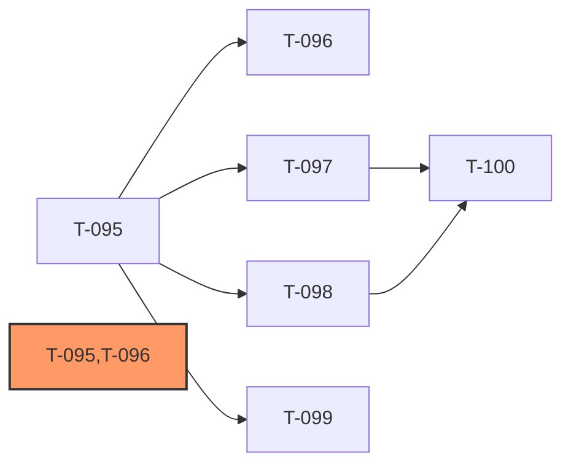

# Development Plan: IntelliSource — Sprint 9 (生产链路装配缺口闭环)

> **Sprint 主题**: 收敛 API 与 Worker 至单一组合根 (composition root)；端到端「采集→处理→存储→分发→消息检索」生产路径打通；PRD AC-063「灵活组合」由 `AgentRunner.run_flexible` + YAML tool palette 落地（不引入 workflow CRUD API，合 arch 移除 API-010/011 决策）。
> **前置依赖**: sprint-8r 批次 1-3 全部 approved（T-083 ~ T-093 = approved；T-094 集成测试可与 sprint-9 并行）；外部 code-review scan 识别 8 个 HIGH + 6 个 MEDIUM 装配缺口（详见 `docs/reviews/code/CODE-SCAN-20260522-r1.md` —— 本 sprint 立项依据）
> **后置**: 全部 T-095~T-100 完成后，重新进入 pre_deploy_checkpoint GO/NO-GO 评估
> **Sprint 目标**: 关闭 audit 全部 8 HIGH（CR-001/002/003/004/005/007/008 + CR-012）+ 4 MEDIUM（CR-006/009/010/011/013/014）；6 个 agent 工具在生产配置下不再返回 `status: degraded`；`/api/v1/search/chat` 通过 flexible mode 实现 PRD AC-063「灵活组合」

[NAV]
- §2 依赖图
- §3 任务卡详细
  - T-095 统一组合根 (composition.py) + Celery 单例统一 + Pipeline Loader + tasks API 触发契约
  - T-096 真实 Processor 映射 + _process_execute ↔ PipelineEngine 契约修复 + RawContent 结果持久化
  - T-097 CollectorRegistry 装配 + DistributorFacade 编排器 + distribute 工具真实接线
  - T-098 /search/chat 接 AgentRunner.run_flexible + Webhook 路由 + 微信/企微客服消息回调
  - T-099 Pipelines API（只读 + run）+ System health/metrics 接真实可观测性 + ConfigVersionManager 接热加载
  - T-100 Celery Beat 调度同步 + push-optimize 管道触发
- §4 风险项
[/NAV]

## 2. 依赖图

**关键路径**: T-095 → T-096 → 各下游（权重合计 = L(3) + M(2) = 5）

**并行批次**:
- 批次 1（无前置，硬阻断）: T-095
- 批次 2（依赖 T-095，可并行）: T-096、T-097、T-098、T-099
- 批次 3（收口）: T-100

**MVP 里程碑**: T-095 + T-096 + T-098 完成即可达成「Celery pipeline 不崩溃 + 6 工具非 silent degraded + `/search/chat` 真实 LLM 编排」

## 3. 任务卡详细

### T-095: 统一组合根 (composition.py) + Celery 单例统一 + PipelineLoader + tasks API 触发契约

- **目标**: 新建 `src/intellisource/composition.py` 作为 API 与 Worker 共用的组合根；提取 `LLMGateway` / `PipelineLoader` / `CollectorRegistry` / `DistributorFacade` / `HybridSearchEngine` / `WorkerComposition` 装配函数；删除 `main.init_celery()` 自建 Celery 实例，统一到 `scheduler.celery_app` 模块级单例；`scheduler/boot.py:worker_init_handler` 改为通过 `build_worker_composition()` 装配完整 ToolDeps；`scheduler/tasks.py:CeleryTasks.run_pipeline` 改用 `PipelineLoader.load()` + `PipelineConfig` 属性访问；`api/routers/tasks.py:/tasks/collect` 的 send_task kwargs 补 `pipeline_name` 与 `params` 结构。
- **task_kind**: feature
- **tdd_mode**: standard（预估 LOC ~280；跨 M-005/M-006/M-011 三个 arch 模块；引入 PipelineLoader 协议 + WorkerComposition dataclass 新抽象；删 main.init_celery 涉及 lifespan 关键路径）
- **tdd_refactor**: required（统一组合根属跨模块抽象，GREEN 后强制 REFACTOR）
- **security_sensitive**: false
- **模块**: M-006（scheduler + agent/factory）、M-005（LLMGateway 装配）、M-011（API tasks router）
- **接口**: API-006（`POST /tasks/collect` 触发契约变更）
- **复杂度**: L（composition.py ~150 + boot.py 重构 ~30 + tasks.py 重构 ~30 + tasks router ~20 + main.py 删 init_celery ~20 + factory.py kwargs 强制 ~20 + 测试 ~100）
- **status**: in_review（RED+GREEN+REFACTOR 完成 — commit 1b1fbf4 / PR #47 已合并入 main；4 新测试文件 43 tests 覆盖 12 AC；11 个 pre-existing test 文件迁移至新契约；全量回归 2342 passed / 14 skipped / 0 failed；ruff + mypy --strict clean。code-review pending — 启动于 /start-orchestrator 接续会话）
- **依赖**: 无（最高优先级，所有下游硬阻断）
- **expected_tool_budget**: ~120

- **tdd_acceptance**:
  - [ ] AC-1: `src/intellisource/composition.py` 存在以下函数：`build_llm_gateway(redis_client) -> LLMGateway`、`build_pipeline_loader() -> PipelineLoader`、`build_collector_registry() -> CollectorRegistry`、`build_distributor_facade(session_factory, redis_client) -> DistributorFacade`（T-097 实现真实分发；本任务先返回带 `distribute()` 协议的 stub）、`build_search_engine_factory() -> Callable[[AsyncSession], HybridSearchEngine]`、`build_worker_composition(*, session_factory, redis_client) -> WorkerComposition`、`build_api_composition(app, db_manager, redis_client) -> None`
  - [ ] AC-2: `class PipelineLoader` 提供 `def load(self, name: str) -> PipelineConfig`，内部委托 `intellisource.agent.tools.load_pipeline_config(name)`
  - [ ] AC-3: `class WorkerComposition` dataclass 含 `agent_runner: AgentRunner`、`pipeline_loader: PipelineLoader`、`collector_registry: CollectorRegistry`、`distributor: DistributorFacade`、`session_factory: async_sessionmaker[AsyncSession]` 字段
  - [ ] AC-4: `agent/factory.py:build_agent_runner` 改为强制 keyword-only：`session_factory / llm_gateway / collector_registry / distributor / search_engine_factory` 均为必填 kwarg，类型注解非 Optional；ToolDeps 注入完整字段
  - [ ] AC-5: `agent/factory.py:get_agent_runner()` 在未初始化时 `raise RuntimeError("AgentRunner not initialised; call build_worker_composition() or build_api_composition() first")`，不再 silent fallback 到 None 注入
  - [ ] AC-6: `scheduler/boot.py:worker_init_handler` 调用 `build_worker_composition(session_factory=factory, redis_client=_build_redis_client())`，并将 `composition.pipeline_loader` 传给 `build_celery_tasks` 第二个位置参数（不再传 None）
  - [ ] AC-7: `scheduler/tasks.py:CeleryTasks.__init__` 的 `pipeline_config` 参数类型注解改为 `PipelineLoader`；`run_pipeline` 调用 `self._pipeline_config.load(pipeline_name)` 合法返回 `PipelineConfig`；`config.mode` / `config.steps` 通过属性访问（不是 `.get(...)`）
  - [ ] AC-8: `api/routers/tasks.py:/tasks/collect` 的 `send_task("run_pipeline", kwargs={...})` 包含 `pipeline_name`（由 `SOURCE_TYPE_TO_PIPELINE` 映射，默认 `"scheduled-collect"`）与 `params: {task_id, task_chain_id, source_id, trigger_type, priority, fingerprint}`，不再扁平 kwargs
  - [ ] AC-9: `main.py` 删除 `init_celery()` 与 `shutdown_celery()`；`_lifespan` 改为 `from intellisource.scheduler.celery_app import celery_app as _module_celery_app` + `app.state.celery_app = _module_celery_app` + 顶部 `import intellisource.scheduler.tasks  # noqa: F401` 触发 task 注册
  - [ ] AC-10: 集成测试 `tests/integration/test_worker_pipeline_no_crash.py` — 触发 `worker_init_handler()` 后 `_celery_tasks_instance.run_pipeline("scheduled-collect", {"task_id": "..."})` 不抛 `AttributeError` 或 `TypeError`
  - [ ] AC-11: 集成测试 `tests/integration/test_celery_singleton_unified.py` — `app.state.celery_app is scheduler.celery_app.celery_app`（is 同一对象）
  - [ ] AC-12: 单元测试 `tests/unit/api/test_tasks_router_send_task_contract.py` — POST `/tasks/collect` 后 send_task spy 收到的 kwargs 含 `pipeline_name` + `params.task_id` + `params.source_id`

- **deliverables**:
  - [ ] `src/intellisource/composition.py`（新建）
  - [ ] `src/intellisource/agent/factory.py`（重构 — kwargs 强制，删 silent fallback）
  - [ ] `src/intellisource/scheduler/boot.py`（重构 worker_init_handler）
  - [ ] `src/intellisource/scheduler/tasks.py`（PipelineLoader 签名 + 属性访问）
  - [ ] `src/intellisource/api/routers/tasks.py`（send_task kwargs 契约）
  - [ ] `src/intellisource/main.py`（删 init_celery / 接 module-level celery_app）
  - [ ] `tests/integration/test_worker_pipeline_no_crash.py`（新建）
  - [ ] `tests/integration/test_celery_singleton_unified.py`（新建）
  - [ ] `tests/unit/api/test_tasks_router_send_task_contract.py`（新建）
  - [ ] `tests/unit/test_composition.py`（新建）

- **affected_files**:
  - `src/intellisource/composition.py`（新建）
  - `src/intellisource/agent/factory.py`
  - `src/intellisource/scheduler/boot.py`
  - `src/intellisource/scheduler/tasks.py`
  - `src/intellisource/api/routers/tasks.py`
  - `src/intellisource/main.py`
  - 测试 4 个（新建）

- **context_load**:
  - `arch-intellisource-v1#§2.M-005`、`#§2.M-006`、`#§2.M-011`
  - `dev-plan-intellisource-v1-s8r#§3.T-083`（应用组合根原始决策，本任务延续并完善）

- **risk**:
  - 删 `main.init_celery()` 后 API 进程的 task 注册依赖 `import intellisource.scheduler.tasks` 副作用；若 lifespan 顶部 import 顺序错误会导致 task 未注册
  - `PipelineConfig` 是 dataclass 不是 dict；既有调用 `.get("execution_mode")` / `.get("steps", [])` 的代码（tasks.py:152-153）需同步改为属性访问，否则 GREEN 后运行时 `AttributeError: 'PipelineConfig' object has no attribute 'get'`

- **mitigation**:
  - AC-9 显式要求 `import intellisource.scheduler.tasks  # noqa: F401`，测试 AC-11 验证 task 注册
  - tasks.py:152-153 修改纳入 AC-7 验收范围；新增 `tests/unit/scheduler/test_run_pipeline_property_access.py` 反证

---

### T-096: 真实 Processor 映射 + `_process_execute` ↔ PipelineEngine 契约修复 + RawContent 结果持久化

- **目标**: 删除 `agent/factory.py:_PassThroughProcessor` no-op 与 `_build_processors_from_config` 的 fallback 实现；新建 `PROCESSOR_REGISTRY: dict[str, type[BaseProcessor]]` 映射 YAML step 名到真实 processor 类（HTMLParser / ContentDedup / KeywordTagger 等）；修复 `agent/tools.py:_process_execute` —— 用 `tool_deps.session_factory` 取 RawContent，构造 `PipelineContext`，同步调用 `PipelineEngine.execute(ctx)`（去掉错误的 `await` 与 `content_id=` kwarg）；`scheduler/boot.py:_RawContentResultRepo.create` 改为真实持久化（更新 RawContent.status = processed 或写 ProcessedContent，依据 result 字段映射）。
- **task_kind**: fix
- **tdd_mode**: standard（预估 LOC ~200；跨 M-003/M-006/M-009 三个 arch 模块；修复 sync/async 边界 + 同时改 4 个文件）
- **tdd_refactor**: auto
- **security_sensitive**: false
- **模块**: M-003（PipelineEngine + processors）、M-006（agent/tools + factory）、M-009（ContentRepository.get_raw_by_id + RawContent 状态更新）
- **接口**: 内部接口 — `BaseProcessor` 协议、`_process_execute` 工具函数
- **复杂度**: M（factory.py 重写 _build_processors ~30 + PROCESSOR_REGISTRY ~30 + tools.py:_process_execute 重写 ~40 + boot.py:_RawContentResultRepo.create ~40 + content repo get_raw_by_id ~15 + 测试 ~80）
- **status**: planned
- **依赖**: T-095（composition 与 ToolDeps 注入路径）
- **expected_tool_budget**: ~90

- **tdd_acceptance**:
  - [ ] AC-1: 新建 `src/intellisource/pipeline/registry.py`（或扩展 `agent/factory.py`），`PROCESSOR_REGISTRY` 至少注册 `HTMLParser`、`ContentDedup`、`KeywordTagger`；查找缺失键时 `raise ValueError(f"Unknown processor: {name}")` 启动期硬失败
  - [ ] AC-2: `_build_processors_from_config(config)` 通过 `PROCESSOR_REGISTRY` 实例化每个 step 的真实 processor 类，传入 `step.get("params", {})` 作为构造参数；不再使用 `_PassThroughProcessor`
  - [ ] AC-3: 删除 `agent/factory.py` 中 `_PassThroughProcessor` 类与两处 `[ASSUMPTION] yaml step → processor class mapping deferred to T-094` 注释
  - [ ] AC-4: `agent/tools.py:_process_execute(content_id, tool_deps, **kwargs)` 重写为：用 `tool_deps.session_factory()` 取 `RawContent`（按 UUID），构造 `PipelineContext` 并 set body_html / body_text / title / fingerprint / content_id，**同步调用** `tool_deps.pipeline_engine.execute(ctx)`（无 await）；返回 `{"status": "ok", "tool": "process", "result": {...context 关键字段...}}`
  - [ ] AC-5: `storage/repositories/content.py:ContentRepository.get_raw_by_id(raw_id: UUID) -> RawContent | None` 方法存在（若已存在则复用）
  - [ ] AC-6: `scheduler/boot.py:_RawContentResultRepo.create(result)` 真实持久化：当 result 含 `content_id` 且为 dict 时，打开 session 更新对应 RawContent 行的 `status = "processed"`、`processed_at = utcnow()`；不抛异常，仍返回 result（保持调用方契约稳定）
  - [ ] AC-7: 集成测试 `tests/integration/test_process_tool_executes_real_processors.py` — 给定 fixture RawContent（HTML body），注入完整 ToolDeps 后调用 `_process_execute(content_id=<uuid>, tool_deps=deps)`，断言返回 status=ok 且 result 中 `body_text` 非空（HTMLParser 已运行）
  - [ ] AC-8: 集成测试 `tests/integration/test_raw_content_persist_on_pipeline_done.py` — Celery `run_pipeline("content-process", {"content_id": ...})` 成功后断言 DB 中 RawContent.status 已更新为 "processed"
  - [ ] AC-9: 单元测试 `tests/unit/pipeline/test_processor_registry.py` — 注册查找 + 未知名 raise ValueError

- **deliverables**:
  - [ ] `src/intellisource/pipeline/registry.py`（新建，或扩展 `agent/factory.py`）
  - [ ] `src/intellisource/agent/factory.py`（删 PassThrough + 重写 _build_processors_from_config）
  - [ ] `src/intellisource/agent/tools.py`（重写 _process_execute）
  - [ ] `src/intellisource/scheduler/boot.py`（真实持久化 _RawContentResultRepo）
  - [ ] `src/intellisource/storage/repositories/content.py`（确认/新增 get_raw_by_id）
  - [ ] `tests/integration/test_process_tool_executes_real_processors.py`（新建）
  - [ ] `tests/integration/test_raw_content_persist_on_pipeline_done.py`（新建）
  - [ ] `tests/unit/pipeline/test_processor_registry.py`（新建）

- **affected_files**:
  - 同 deliverables

- **context_load**:
  - `arch-intellisource-v1#§2.M-003`（PipelineEngine + processors）
  - `arch-intellisource-v1#§2.M-009`（存储/RawContent 状态机）

- **risk**:
  - `content-process.yaml` 中可能存在未在 PROCESSOR_REGISTRY 注册的 processor 名 → 启动期 ValueError；需在实现时同步审查 yaml 内容
  - `_RawContentResultRepo.create` 改为真实持久化可能破坏现有 mock 测试

- **mitigation**:
  - AC-1 显式要求未知名 raise，启动期硬失败优于运行期 silent skip
  - 现有依赖 no-op 行为的测试在本任务中同步适配（mock session_factory 即可）

---

### T-097: CollectorRegistry 装配 + DistributorFacade 编排器 + distribute 工具真实接线

- **目标**: 在 `composition.py:build_collector_registry()` 中注册 RSS/API/Web 三类 Collector；新建 `src/intellisource/distributor/facade.py:DistributorFacade` 编排器（订阅匹配 → 静默期/频率/去重门禁 → 渠道发送 → record_push + PII 脱敏）；从 env 构造 WeChatDistributor / WeWorkDistributor / EmailDistributor 实例并注入 facade；`composition.build_distributor_facade()` 返回真实 facade 替代 T-095 中的 stub；`_collect_execute` / `_distribute_execute` 在生产配置下返回 `status: ok`。
- **task_kind**: feature
- **tdd_mode**: standard（预估 LOC ~300；跨 M-002/M-007 + 引入 DistributorFacade 新协议；多渠道凭证 env 读取）
- **tdd_refactor**: auto
- **security_sensitive**: true（DistributorFacade 调用 PII 脱敏 helper；env 凭证读取）
- **模块**: M-002（采集 Registry）、M-007（分发 channels + facade）
- **接口**: 内部接口 — `DistributorFacade.distribute(content_id, subscription_id, **kwargs)`
- **复杂度**: L（CollectorRegistry 注册 ~40 + DistributorFacade ~120 + 三渠道 from_env ~60 + facade 注入 composition ~30 + 集成测试 ~80）
- **status**: planned
- **依赖**: T-095（composition root）
- **expected_tool_budget**: ~110

- **tdd_acceptance**:
  - [ ] AC-1: `composition.build_collector_registry()` 返回 `CollectorRegistry` 实例，已 `register("rss", RSSCollector)` / `register("api", APICollector)` / `register("web", WebCollector)`；测试断言 `registry.get("rss")` 非 None
  - [ ] AC-2: `src/intellisource/distributor/facade.py:DistributorFacade` 类含 `__init__(session_factory, matcher: SubscriptionMatcher, channels: dict[str, BaseDistributor])` 与 `async def distribute(self, *, content_id: str, subscription_id: str | None = None, **kwargs) -> dict[str, Any]` 方法
  - [ ] AC-3: `DistributorFacade.distribute` 执行流：(1) 加载 ProcessedContent → (2) SubscriptionMatcher.match → (3) quiet_hours / frequency / push dedup 门禁（复用 distributor/base.py 现有 hook） → (4) 调用对应 channel.send → (5) record_push + PII mask；返回 `{"status": "ok", "matched": N, "sent": M, "skipped": K}`
  - [ ] AC-4: `composition.build_distributor_facade(session_factory, redis_client)` 从 env 构造 `WeChatDistributor.from_env()` / `WeWorkDistributor.from_env()` / `EmailDistributor.from_env()`，注入 facade；env 缺失任一必填项时 `raise ValueError("WECHAT_APP_ID missing")` 等启动期硬失败（与 sprint-9 用户决策一致）
  - [ ] AC-5: `agent/tools.py:_distribute_execute` 在 `tool_deps.distributor` 非 None 时调用 `await tool_deps.distributor.distribute(content_id=content_id, subscription_id=subscription_id, **kwargs)`，返回 `status: ok` 与 facade 结果；不返回 `degraded`
  - [ ] AC-6: 集成测试 `tests/integration/test_collect_tool_not_degraded.py` — 用 build_worker_composition 注入完整 ToolDeps 后，调用 `_collect_execute(source_id, source_type="rss", tool_deps=deps)` 返回 `status: ok` 与非空 collected 列表（mock RSS source 数据）
  - [ ] AC-7: 集成测试 `tests/integration/test_distribute_writes_push_record.py` — `_distribute_execute` 调用后断言 DB 中至少一条 PushRecord 已写入，且 record.recipient_id 已经过 PII 脱敏（不含明文邮箱/手机号）
  - [ ] AC-8: 单元测试 `tests/unit/distributor/test_facade.py` — mock matcher 与 channels，断言 distribute 流的 5 个步骤按序调用

- **deliverables**:
  - [ ] `src/intellisource/distributor/facade.py`（新建）
  - [ ] `src/intellisource/composition.py`（扩展 build_collector_registry + build_distributor_facade 真实实现）
  - [ ] `src/intellisource/distributor/channels/wechat.py`（补 from_env classmethod；若已存在则复用）
  - [ ] `src/intellisource/distributor/channels/wework.py`（补 from_env classmethod）
  - [ ] `src/intellisource/distributor/channels/email.py`（确认 from_env，T-090 已有）
  - [ ] `tests/integration/test_collect_tool_not_degraded.py`（新建）
  - [ ] `tests/integration/test_distribute_writes_push_record.py`（新建）
  - [ ] `tests/unit/distributor/test_facade.py`（新建）

- **affected_files**:
  - 同 deliverables

- **context_load**:
  - `arch-intellisource-v1#§2.M-002`（采集 Registry）
  - `arch-intellisource-v1#§2.M-007`（分发 channels + dedup hook）

- **risk**:
  - 三渠道 from_env 凭证缺失策略需统一（用户决策：硬失败）；测试需提供 monkeypatch env fixture
  - `SubscriptionMatcher` 已存在但从未被生产路径调用，可能存在与 ProcessedContent schema 的不匹配字段

- **mitigation**:
  - 在 AC-4 显式要求 ValueError；AC-7 提供 env monkeypatch fixture 示例
  - 实现前先 Read SubscriptionMatcher.match 签名确认输入输出契约

---

### T-098: `/search/chat` 接 AgentRunner.run_flexible + Webhook 路由 + 微信/企微客服消息回调

- **目标**: 删除 `search/hybrid.py:HybridSearchEngine.chat()` 的 echo stub；`api/routers/search.py:/search/chat` 改为通过 `request.app.state.agent_runner.run_flexible(load_pipeline_config("instant-search"), user_message=..., session=...)` 落地 PRD AC-063「灵活组合」；新建 `api/routers/webhooks.py` 注册 `/api/v1/webhooks/wechat` + `/api/v1/webhooks/wework`（GET 验签 + POST 消息回调）；新建 `distributor/wechat_cs_client.py:WeChatCustomerServiceClient` 与企微镜像类（access_token 缓存 + outbound /customer/service/send）；webhook handler 解析消息 → `asyncio.create_task(_dispatch_chat_reply(...))` 异步执行 flexible 编排 → 完成后通过 CS client 向用户回填 LLM 结果；新建 `api/schemas/search.py` 显式 Pydantic ChatSearchRequest/Response。
- **task_kind**: feature
- **tdd_mode**: standard（预估 LOC ~380；新建 4 个文件 + 多渠道 outbound HTTP + access_token 管理 + 安全凭证）
- **tdd_refactor**: auto
- **security_sensitive**: true（access_token 在 Redis 缓存；签名校验；webhook 入口豁免 API Key auth）
- **模块**: M-006（AgentRunner.run_flexible）、M-007（CS client outbound）、M-008（HybridSearch）、M-011（webhooks router + chat router）
- **接口**: API-013（`POST /search/chat` 契约由 echo → flexible）+ 新增 `GET/POST /api/v1/webhooks/wechat` + `GET/POST /api/v1/webhooks/wework`
- **复杂度**: L（webhooks router ~80 + chat router 改造 ~50 + WeChat CS client ~100 + WeWork CS client ~80 + chat schema ~30 + 集成测试 ~80 + 单元测试 ~60）
- **status**: planned
- **依赖**: T-095（composition + app.state.agent_runner）
- **expected_tool_budget**: ~130

- **tdd_acceptance**:
  - [ ] AC-1: 删除 `search/hybrid.py:HybridSearchEngine.chat()` 方法及 `# [ASSUMPTION] stateless echo stub` / `# T-094 wires LLMGateway.chat()` 注释；`HybridSearchEngine` 不再含 chat 方法
  - [ ] AC-2: `api/schemas/search.py` 新建 Pydantic `ChatSearchRequest`（fields: `message: str`、`session_id: str | None`、`max_tokens_budget: int | None`、`session: dict | None`）与 `ChatSearchResponse`（`session_id, answer, sources: list[ChatSource], steps_executed, task_chain_id`）
  - [ ] AC-3: `api/routers/search.py:/search/chat` 重写：取 `request.app.state.agent_runner`，调 `load_pipeline_config("instant-search")` 加载 palette，调 `agent_runner.run_flexible(config, user_message=body.message, session=body.session or {}, max_tokens_budget=body.max_tokens_budget)`；返回 `ChatSearchResponse`；agent_runner 未初始化时返回 503
  - [ ] AC-4: 集成测试 `tests/integration/test_search_chat_uses_flexible_mode.py` — POST `/api/v1/search/chat` body=`{"message": "找最近的 RAG 论文并总结"}`，注入真实 AgentRunner（含 mock LLMGateway 返回 tool_calls=[search] → [summarize_for_user]），断言响应 `steps_executed >= 2` + `answer != body.message`
  - [ ] AC-5: 新建 `src/intellisource/api/routers/webhooks.py` 注册：`@router.get("/wechat")` URL 验签返回 echostr；`@router.post("/wechat")` 解析消息 + signature 校验 + （文本消息）`asyncio.create_task(_dispatch_chat_reply(...))` 异步执行 + 同步返回 XML ack
  - [ ] AC-6: `main.create_app()` 增加 `app.include_router(webhooks.router, prefix="/api/v1")`；OpenAPI 含 `/api/v1/webhooks/wechat` 与 `/api/v1/webhooks/wework`
  - [ ] AC-7: 新建 `src/intellisource/distributor/wechat_cs_client.py:WeChatCustomerServiceClient`，含 `from_env(redis_client)` classmethod 与 `async def send_text(openid, content)`；`IS_WECHAT_APP_ID` 或 `IS_WECHAT_APP_SECRET` env 缺失时 `from_env` 抛 ValueError（启动期硬失败，与用户决策一致）
  - [ ] AC-8: access_token 从 Redis 缓存读取（key `wechat:access_token`），TTL ≈ 7000s；过期时调用 `GET cgi-bin/token` 刷新并写回；测试 mock httpx + Redis 断言：首次调用刷新 + 第二次复用缓存
  - [ ] AC-9: `_dispatch_chat_reply(runner, cs_messenger, openid, user_text)` 异步任务：调用 `run_flexible(instant-search config, user_message=user_text)` → 提取最终文本 → `cs_messenger.send_text(openid, answer)`；测试 spy 断言 send_text 被调用 + openid 正确
  - [ ] AC-10: WeWorkCustomerServiceClient 与 WeChat 同构（企微 `cgi-bin/message/send` API + access_token 流程）；`WeWorkWebhookHandler` 补全 `handle_message` 路径
  - [ ] AC-11: 单元测试 `tests/unit/api/test_webhooks_signature.py` — 错误签名返回 403；正确签名通过
  - [ ] AC-12: 集成测试 `tests/integration/test_webhook_triggers_cs_callback.py` — POST `/api/v1/webhooks/wechat` 正确签名 + 文本消息后，spy 断言 `cs_messenger.send_text` 被调用一次

- **deliverables**:
  - [ ] `src/intellisource/search/hybrid.py`（删除 chat 方法）
  - [ ] `src/intellisource/api/schemas/search.py`（新建）
  - [ ] `src/intellisource/api/routers/search.py`（重写 /search/chat）
  - [ ] `src/intellisource/api/routers/webhooks.py`（新建）
  - [ ] `src/intellisource/distributor/wechat_cs_client.py`（新建）
  - [ ] `src/intellisource/distributor/wework_cs_client.py`（新建）
  - [ ] `src/intellisource/distributor/webhooks.py`（补全 WeWorkWebhookHandler.handle_message）
  - [ ] `src/intellisource/main.py`（注册 webhooks router + app.state 挂 cs_messenger）
  - [ ] `src/intellisource/composition.py`（扩展 build_api_composition：注入 wechat_cs_messenger / wework_cs_messenger）
  - [ ] `tests/integration/test_search_chat_uses_flexible_mode.py`（新建）
  - [ ] `tests/integration/test_webhook_triggers_cs_callback.py`（新建）
  - [ ] `tests/unit/api/test_webhooks_signature.py`（新建）
  - [ ] `tests/unit/distributor/test_wechat_cs_client.py`（新建）

- **affected_files**:
  - 同 deliverables

- **context_load**:
  - `prd-intellisource-v1#§2.F-011`（消息触发检索）、`#§2.F-014.AC-063`（灵活组合）
  - `arch-intellisource-v1#§2.M-006`（AgentRunner.run_flexible 接口）
  - `arch-intellisource-v1#§2.M-007`（webhook handler + outbound channels）

- **risk**:
  - 微信/企微 access_token 限频（5 万次/天）；Redis 缓存 TTL 设置不当会触发刷新风暴
  - flexible-mode 在 webhook 异步路径里的错误处理：LLM 失败时 send_text 也会失败 → 应捕获并降级回固定文本

- **mitigation**:
  - AC-8 显式要求 Redis 缓存策略（TTL=7000s < 实际过期 7200s）
  - `_dispatch_chat_reply` 内部 try/except：捕获 IntelliSourceError → send_text("抱歉，暂时无法处理，请稍后再试")

---

### T-099: Pipelines API（只读 + run）+ System health/metrics 接真实可观测性 + ConfigVersionManager 接热加载

- **目标**: 新建 `api/routers/pipelines.py` 提供 `GET /pipelines`（列出 `config/pipelines/*.yaml` 摘要）+ `GET /pipelines/{name}`（解析后的 PipelineConfig）+ `POST /pipelines/{name}/run`（触发 send_task）；`api/routers/system.py:/health` 与 `/metrics` 接入真实 `HealthChecker` / `MetricsCollector`；`main.on_config_change` 调用 `app.state.config_version_manager.record_version(configs)`；删除两处 `[ASSUMPTION] deferred to T-094` 注释。
- **task_kind**: feature
- **tdd_mode**: light（预估 LOC ~180；3 个独立小改动，均为轻量接线，无新协议；安全敏感度低）
- **tdd_refactor**: auto
- **security_sensitive**: false
- **模块**: M-011（API routers）、M-010（observability/health + metrics）、M-001（ConfigVersionManager）
- **接口**: 新增 API — `GET /api/v1/pipelines`、`GET /api/v1/pipelines/{name}`、`POST /api/v1/pipelines/{name}/run`
- **复杂度**: M（pipelines router ~70 + system router 改造 ~40 + ConfigVersionManager 接线 ~20 + 测试 ~50）
- **status**: planned
- **依赖**: T-095（composition 提供 health_checker / metrics_collector / config_version_manager 到 app.state）
- **expected_tool_budget**: ~70

- **tdd_acceptance**:
  - [ ] AC-1: `src/intellisource/api/routers/pipelines.py` 新建，注册 `GET /pipelines`、`GET /pipelines/{name}`、`POST /pipelines/{name}/run`；list 端点扫 `config/pipelines/*.yaml` 返回 `[{name, mode, max_steps, tools_allowed}]`
  - [ ] AC-2: `POST /pipelines/{name}/run` body=`{"params": {...}}` 调 `request.app.state.celery_app.send_task("run_pipeline", kwargs={"pipeline_name": name, "params": ...})` 返回 task_id
  - [ ] AC-3: `main.create_app()` 注册 `app.include_router(pipelines.router, prefix="/api/v1")`；CLI 集成测试 `tests/integration/test_cli_pipeline_list.py` — CLI `pipeline list` 不再 404
  - [ ] AC-4: `api/routers/system.py:/health` 调用 `request.app.state.health_checker.check_health()` 返回真实 DB/Redis/Celery 状态；`/metrics` 调用 `_format_prometheus(request.app.state.metrics_collector)` 返回 Prometheus 文本
  - [ ] AC-5: `composition.build_api_composition` 在 lifespan 中实例化 `HealthChecker(db_manager, redis_client, celery_app)` 与 `MetricsCollector.get_instance()`，挂 `app.state`
  - [ ] AC-6: `main.on_config_change` 在 upsert 完成后调用 `_db_manager` 对应路径上的 `config_version_manager.record_version(configs)`；测试断言修改 source YAML 后 `list_versions()` 至少返回 1 条
  - [ ] AC-7: 删除 `agent/factory.py:27,41` 与 `search/hybrid.py:152-153` 的 `[ASSUMPTION] deferred to T-094` 注释
  - [ ] AC-8: 单元测试 `tests/unit/api/test_pipelines_router.py` — list/detail/run 三端点的正确返回与边界（不存在的 name 返回 404）

- **deliverables**:
  - [ ] `src/intellisource/api/routers/pipelines.py`（新建）
  - [ ] `src/intellisource/api/routers/system.py`（接真实 checker）
  - [ ] `src/intellisource/main.py`（注册 pipelines router + on_config_change 调 record_version）
  - [ ] `src/intellisource/composition.py`（扩展：build_health_checker + 注入 metrics/version_manager 到 app.state）
  - [ ] `tests/unit/api/test_pipelines_router.py`（新建）
  - [ ] `tests/integration/test_cli_pipeline_list.py`（新建）
  - [ ] `tests/integration/test_system_health_real.py`（新建）

- **affected_files**:
  - 同 deliverables

- **context_load**:
  - `arch-intellisource-v1#§3.API-024`（系统健康）、`#§3.API-025`（指标）
  - `arch-intellisource-v1#§2.M-001`（配置管理 + 版本回退）

- **risk**:
  - `MetricsCollector.get_instance()` 单例在多 worker 进程中是 per-process，跨进程聚合需 Prometheus exporter（本任务不引入，仅暴露 per-process）

- **mitigation**:
  - 文档化 per-process 限制；跨进程聚合留待运维侧 Prometheus aggregator 解决

---

### T-100: Celery Beat 调度同步 + push-optimize 管道触发

- **目标**: 新建 `scheduler/beat_sync.py:sync_beat_schedules(celery_app, scheduler_manager)` 将 SchedulerManager 的内存 schedule 注册到 `celery_app.conf.beat_schedule`；启动 hook（worker_init 之后）从 DB Source 表读取 `schedule_interval` 字段填充 SchedulerManager；新建 push-optimize 触发点（在 distribute 流程内调用或独立 Celery beat 调度）；实现 ChatSession DB 持久化（chat_sessions 表，复用现有 repository）。
- **task_kind**: feature
- **tdd_mode**: light（预估 LOC ~150；单点配置注入 + 已有 SchedulerManager 与 push-optimize.yaml 现成，主要是接线）
- **tdd_refactor**: auto
- **security_sensitive**: false
- **模块**: M-006（scheduler/beat_sync + state_machine）、M-007（distributor 调用 push-optimize）、M-008（ChatSession 持久化）
- **接口**: 内部接口 — `sync_beat_schedules`、ChatSessionRepository
- **复杂度**: M（beat_sync ~50 + Source → schedule 同步 ~40 + push-optimize 触发 ~30 + ChatSession DB ~30 + 测试 ~50）
- **status**: planned
- **依赖**: T-097（DistributorFacade 已就绪，push-optimize 流程在 facade 内触发）、T-098（ChatSessionRepository 在 search router 中使用）
- **expected_tool_budget**: ~60

- **tdd_acceptance**:
  - [ ] AC-1: `src/intellisource/scheduler/beat_sync.py:sync_beat_schedules(celery_app, scheduler_manager)` 将 SchedulerManager 的 list_schedules() 输出转为 `celery_app.conf.beat_schedule` 字典，每条 entry `{task: "run_pipeline", schedule: crontab/timedelta, kwargs: {pipeline_name, params}}`
  - [ ] AC-2: `worker_init_handler` 之后调用 `sync_beat_schedules`；启动期从 DB Source 表读 `schedule_interval`（cron 表达式或秒数）填充 SchedulerManager；测试断言 `celery_app.conf.beat_schedule` 非空且 entry 数 == Source 数
  - [ ] AC-3: `DistributorFacade.distribute` 在 sent 成功后，若 ProcessedContent 标记为 needs_push_optimize（或全局开关）则触发 `send_task("run_pipeline", kwargs={"pipeline_name": "push-optimize", "params": {content_id, channel}})`
  - [ ] AC-4: `api/routers/search.py:/search/chat` 启用 ChatSession 持久化：传入 session_id 时从 ChatSessionRepository 加载历史 messages 拼到 user_message；返回前写回新一轮 user/assistant 消息
  - [ ] AC-5: 集成测试 `tests/integration/test_beat_schedule_registered.py` — worker_init 后 inspect celery_app.conf.beat_schedule 至少含 1 条 source 对应的 entry
  - [ ] AC-6: 单元测试 `tests/unit/scheduler/test_beat_sync.py` — sync_beat_schedules 输出格式正确

- **deliverables**:
  - [ ] `src/intellisource/scheduler/beat_sync.py`（新建）
  - [ ] `src/intellisource/scheduler/boot.py`（worker_init 之后调 sync_beat_schedules）
  - [ ] `src/intellisource/distributor/facade.py`（push-optimize 触发点）
  - [ ] `src/intellisource/api/routers/search.py`（ChatSession 持久化）
  - [ ] `tests/integration/test_beat_schedule_registered.py`（新建）
  - [ ] `tests/unit/scheduler/test_beat_sync.py`（新建）

- **affected_files**:
  - 同 deliverables

- **context_load**:
  - `arch-intellisource-v1#§2.M-006`（scheduler/beat）
  - `arch-intellisource-v1#§2.M-008`（chat_sessions 表）

- **risk**:
  - Source 表的 `schedule_interval` 字段当前若为空可能导致 SchedulerManager 注册零条 → Beat 不会触发；需启动期 warning 日志
  - push-optimize 触发条件需明确：本任务采用全局 env flag `IS_PUSH_OPTIMIZE_ENABLED`

- **mitigation**:
  - AC-2 显式要求即使 Source 表为空也不抛异常，仅 warn
  - push-optimize 触发用 env flag 控制，默认关闭

## 4. 风险项

| 风险 | 影响范围 | 缓解 |
|------|---------|------|
| API 与 Worker 双进程 env 不一致 | 全 sprint | composition.py 统一 env 读取入口，docstring 列出必填项 |
| 删除 `_PassThroughProcessor` 后 content-process.yaml 中存在未注册的 processor 名 | T-096 启动期硬失败 | AC-1 要求 ValueError 启动期阻断，不延后到运行期；实现前先审计 yaml |
| 微信/企微凭证 env 缺失 | T-098 启动失败 | 用户决策为硬失败；CI/local dev 提供 mock fixture |
| flexible mode 在 webhook 异步路径的错误传播 | T-098 用户感知 | _dispatch_chat_reply 内部 try/except 降级为固定文本 |
| Beat 调度与现有 Source 表 schedule_interval 字段语义不一致 | T-100 | AC-2 兼容空值，warn 而非抛异常 |
| sprint-8r T-094 集成测试与本 sprint 集成测试可能重叠 | 测试维护 | T-094 验证 sprint-8r EXP-005 闭环；本 sprint 验证更高层装配缺口；测试文件用前缀区分（`test_s9_*` vs `test_s8r_*`） |
