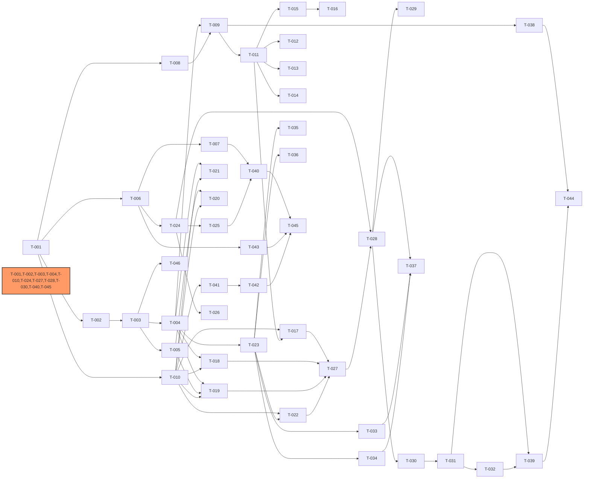

# Development Plan: IntelliSource
<!-- required_sections: ["## 1. 迭代规划", "## 2. 依赖图", "## 3. 任务卡详细"] -->
<!-- id: dev-plan-intellisource-v1 | author: tech-lead | status: approved -->
<!-- deps: arch-intellisource-v1 | consumers: developer, qa-engineer -->
<!-- volume: main -->

[NAV]

- §1 迭代规划 → Sprint 1..4 (总览表)
- §2 依赖图
- §3 任务卡详细 → 见Sprint分卷 (dev-plan-intellisource-v1-s1 ~ s4)
- §4 关键路径
- §5 风险项
[/NAV]

## 1. 迭代规划

### Sprint 1: 基础设施与数据层

| 任务ID | 任务名 | 模块 | 复杂度 | 依赖 | TDD测试点 | 状态 |
|--------|--------|------|--------|------|-----------|------|
| T-001 | 项目骨架与基础配置 | — | S | — | AC-项目结构 | todo |
| T-002 | 数据库连接管理与ORM基础 | M-009 | M | T-001 | AC-054 | todo |
| T-003 | ORM模型定义(全部实体含E-013) | M-009 | L | T-002 | AC-054, AC-055 | todo |
| T-004 | 数据访问层(Repository) | M-009 | L | T-003 | AC-054 | todo |
| T-005 | pgvector向量存储与检索 | M-009 | M | T-003 | AC-055, AC-056 | todo |
| T-006 | 结构化日志与可观测性基础 | M-010 | M | T-001 | AC-057, AC-058, AC-059 | todo |
| T-007 | 健康检查与指标端点 | M-010 | S | T-006 | AC-060 | todo |
| T-008 | 配置模型与校验器 | M-001 | M | T-001 | AC-001, AC-003 | todo |
| T-009 | 配置加载与热加载 | M-001 | M | T-008, T-004 | AC-002, AC-004 | todo |

### Sprint 2: 采集引擎与原子操作层

| 任务ID | 任务名 | 模块 | 复杂度 | 依赖 | TDD测试点 | 状态 |
|--------|--------|------|--------|------|-----------|------|
| T-010 | ToolSpec基类与工具注册中心 | M-003 | M | T-001 | AC-013, AC-015 | todo |
| T-011 | 采集器抽象基类与注册中心 | M-002 | M | T-009 | AC-005 | todo |
| T-012 | RSS采集适配器 | M-002 | M | T-011 | AC-006, AC-007 | todo |
| T-013 | Web爬虫采集适配器 | M-002 | M | T-011 | AC-006, AC-007 | todo |
| T-014 | API采集适配器 | M-002 | S | T-011 | AC-006, AC-007, AC-008 | todo |
| T-015 | 速率限制与代理管理 | M-002 | M | T-011 | AC-010, AC-011 | todo |
| T-016 | 频率自适应调度 | M-002 | M | T-015 | AC-009, AC-012 | todo |
| T-017 | 采集类原子操作(collect/parse) | M-003 | M | T-010, T-011 | AC-013, AC-016 | todo |
| T-018 | 处理类原子操作(fingerprint/dedup/tag/sentiment) | M-003 | M | T-010, T-004 | AC-013, AC-016, AC-017 | todo |
| T-019 | 存储类原子操作(store_processed/store_embedding) | M-003 | M | T-010, T-004, T-005 | AC-013, AC-016 | todo |
| T-020 | 检索类原子操作(search_fulltext/vector/hybrid) | M-003, M-008 | L | T-010, T-005 | AC-051, AC-056 | todo |
| T-021 | 聚类类原子操作(cluster_create/assign) | M-003 | S | T-010, T-004 | AC-013 | todo |
| T-022 | 分发类原子操作(match_subscriptions/push) | M-003, M-007 | M | T-010, T-023 | AC-013, AC-043 | todo |
| T-023 | 分发器基类与订阅规则匹配 | M-007 | M | T-004 | AC-043 | todo |

### Sprint 3: 内置Agent与LLM服务 + 分发渠道

| 任务ID | 任务名 | 模块 | 复杂度 | 依赖 | TDD测试点 | 状态 |
|--------|--------|------|--------|------|-----------|------|
| T-024 | LLM统一网关(litellm封装) | M-005 | M | T-006, T-004 | AC-023, AC-025 | todo |
| T-025 | 熔断器与成本追踪 | M-005 | L | T-024 | AC-024, AC-026 | todo |
| T-026 | 敏感词过滤 | M-005 | S | T-024 | AC-027 | todo |
| T-027 | Playbook定义与确定性执行器 | M-004, M-006 | L | T-017, T-018, T-019, T-022 | AC-019, AC-035, AC-037 | todo |
| T-028 | 内置编排Agent(ReAct主循环) | M-004 | L | T-027, T-024 | AC-018, AC-020, AC-021 | todo |
| T-029 | 多轮对话会话管理 | M-004 | M | T-028 | AC-053 | todo |
| T-030 | 任务触发管理与Celery任务定义 | M-006 | L | T-028 | AC-028, AC-029, AC-030 | todo |
| T-031 | 任务状态机与幂等保护 | M-006 | M | T-030 | AC-031, AC-032 | todo |
| T-032 | 工作流定义管理 | M-006 | M | T-031 | AC-034, AC-036, AC-039 | todo |
| T-033 | 微信公众号分发渠道 | M-007 | M | T-023 | AC-040, AC-044, AC-045 | todo |
| T-034 | 企业微信分发渠道 | M-007 | M | T-023 | AC-041, AC-044, AC-045 | todo |
| T-035 | 邮件分发渠道 | M-007 | S | T-023 | AC-042, AC-044, AC-045 | todo |
| T-036 | 推送频率控制与免打扰 | M-007 | S | T-023 | AC-046 | todo |

### Sprint 4: API/CLI/MCP与集成

| 任务ID | 任务名 | 模块 | 复杂度 | 依赖 | TDD测试点 | 状态 |
|--------|--------|------|--------|------|-----------|------|
| T-037 | Webhook回调处理(微信/企业微信) | M-007 | M | T-033, T-034, T-028 | AC-T037 | todo |
| T-038 | API路由层 — 信源管理 | M-011 | M | T-009 | AC-061, AC-065 | todo |
| T-039 | API路由层 — 任务与工作流 | M-011 | M | T-031, T-032 | AC-062, AC-063, AC-065 | todo |
| T-040 | API路由层 — 内容/检索/订阅/LLM/系统 | M-011 | M | T-020, T-023, T-025, T-007 | AC-061, AC-065 | todo |
| T-041 | 原子操作API端点(自动生成) | M-011, M-003 | M | T-010, T-040 | AC-066 | todo |
| T-042 | MCP Server | M-012 | M | T-010, T-041 | AC-066, AC-067, AC-068, AC-070 | todo |
| T-043 | 认证中间件与请求追踪 | M-011 | M | T-006 | AC-061 | todo |
| T-044 | CLI工具 | M-011 | M | T-038, T-039 | AC-064 | todo |
| T-045 | FastAPI应用入口与Docker部署 | M-011 | M | T-043, T-040, T-042 | AC-065 | todo |
| T-046 | Alembic数据库迁移 | M-009 | S | T-003 | AC-054 | todo |

## 2. 依赖图

<!-- 依赖图由 dep-analysis 脚本生成，环检测通过（无循环依赖） -->

## 3. 任务卡详细

> 任务卡详细见Sprint分卷:
>
> - Sprint 1: [dev-plan-intellisource-v1-s1](dev-plan-intellisource-v1-s1.md) (T-001 ~ T-009)
> - Sprint 2: [dev-plan-intellisource-v1-s2](dev-plan-intellisource-v1-s2.md) (T-010 ~ T-023)
> - Sprint 3: [dev-plan-intellisource-v1-s3](dev-plan-intellisource-v1-s3.md) (T-024 ~ T-036)
> - Sprint 4: [dev-plan-intellisource-v1-s4](dev-plan-intellisource-v1-s4.md) (T-037 ~ T-046)

## 4. 关键路径

<!-- 关键路径由 dep-analysis 脚本计算（权重: S=1, M=2, L=3），总权重 22 -->

**关键路径**: T-001(S) -> T-002(M) -> T-003(L) -> T-004(L) -> T-023(M) -> T-022(M) -> T-027(L) -> T-028(L) -> T-030(L) -> T-031(M) -> T-039(M) -> T-044(M)

**关键路径说明**: 从项目骨架出发，经过数据库连接、ORM 模型、数据访问层，到分发基类和原子操作封装，再到 Playbook/Agent 编排层，最终到任务触发管理和 API 集成层。这条路径横跨全部 4 个 Sprint，串联了存储层 → 原子操作层 → Agent 编排层 → 触发管理 → API 集成的核心价值链。

**次关键路径**:

- T-001 -> T-010 -> T-017 -> T-027 -> T-028 -> T-030 -> T-031 -> T-032 (ToolSpec 到 Agent 到工作流链路，权重 18)
- T-001 -> T-002 -> T-003 -> T-005 -> T-020 -> T-027 (向量检索到 Playbook 链路，权重 14)
- T-001 -> T-010 -> T-041 -> T-042 -> T-045 (ToolSpec 到 MCP 到部署链路，权重 10)

## 5. 风险项

| 风险 | 影响 | 缓解措施 |
|------|------|----------|
| 内置 Agent ReAct 循环稳定性 | Sprint 3 Agent 开发复杂度高 | Playbook 确定性执行器优先实现，Agent 降级时有兜底；使用 Mock LLM 测试 Agent 循环 |
| LLM API 调用不稳定导致集成测试困难 | Sprint 3 进度延迟 | 使用 Mock LLM 服务编写测试；Playbook 模式不依赖 LLM，可独立验证全链路 |
| pgvector 向量索引在大数据量下性能不确定 | 检索性能不达标 | T-005 中增加性能基准测试；预留 HNSW/IVFFlat 索引策略切换能力 |
| 微信/企业微信 API 对接周期长（审核、沙箱环境） | Sprint 3 分发渠道延迟 | 邮件渠道优先完成；微信/企业微信使用 Mock 接口先行开发 |
| MCP SDK 版本演进快，API 可能变化 | Sprint 4 MCP 集成风险 | 封装薄适配层隔离 MCP SDK 细节；MCP Server 依赖 ToolRegistry 而非直接实现 |
| 中文全文检索依赖 zhparser 扩展 | Docker 镜像构建复杂度 | T-045 中使用包含 zhparser 的 PostgreSQL Docker 镜像；提供备选方案（jieba + 应用层分词） |
