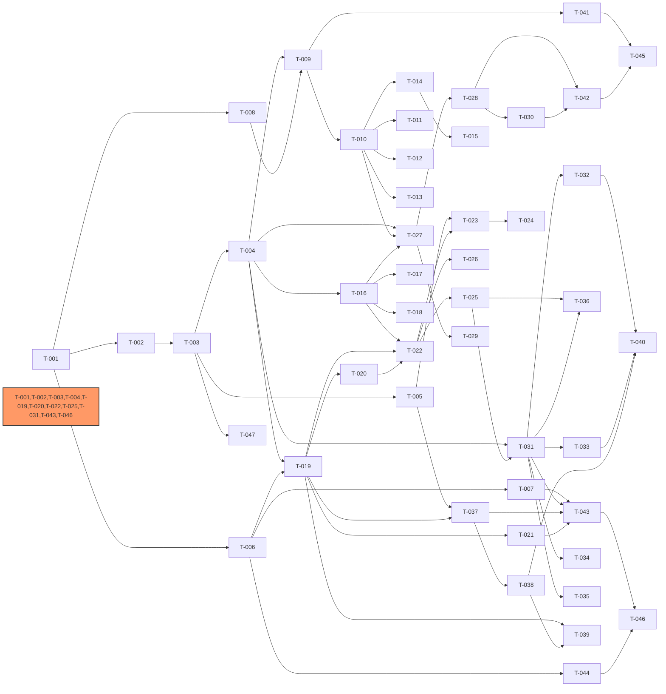

# Development Plan: IntelliSource
<!-- required_sections: ["## 1. 迭代规划", "## 2. 依赖图", "## 3. 任务卡详细"] -->
<!-- id: dev-plan-intellisource-v1 | author: tech-lead | status: approved -->
<!-- deps: arch-intellisource-v1 | consumers: developer, qa-engineer -->
<!-- volume: main -->

[NAV]

- §1 迭代规划 → Sprint 1..5 (总览表)
- §2 依赖图
- §3 任务卡详细 → 见Sprint分卷 (dev-plan-intellisource-v1-s1 ~ s5)
- §4 关键路径
- §5 风险项
[/NAV]

## 1. 迭代规划

### Sprint 1: 基础设施与数据层

| 任务ID | 任务名 | 模块 | 复杂度 | 依赖 | TDD测试点 | 状态 |
|--------|--------|------|--------|------|-----------|------|
| T-001 | 项目骨架与基础配置 | — | S | — | AC-项目结构 | todo |
| T-002 | 数据库连接管理与ORM基础 | M-009 | M | T-001 | AC-054 | todo |
| T-003 | ORM模型定义(全部实体) | M-009 | L | T-002 | AC-054, AC-055 | todo |
| T-004 | 数据访问层(Repository) | M-009 | L | T-003 | AC-054 | todo |
| T-005 | pgvector向量存储与检索 | M-009 | M | T-003 | AC-055, AC-056 | todo |
| T-006 | 结构化日志与可观测性基础 | M-010 | M | T-001 | AC-057, AC-058, AC-059 | todo |
| T-007 | 健康检查与指标端点 | M-010 | S | T-006 | AC-060 | todo |
| T-008 | 配置模型与校验器 | M-001 | M | T-001 | AC-001, AC-003 | todo |
| T-009 | 配置加载与热加载 | M-001 | M | T-008, T-004 | AC-002, AC-004 | todo |

### Sprint 2: 采集引擎与处理管道

| 任务ID | 任务名 | 模块 | 复杂度 | 依赖 | TDD测试点 | 状态 |
|--------|--------|------|--------|------|-----------|------|
| T-010 | 采集器抽象基类与注册中心 | M-002 | M | T-009 | AC-005 | todo |
| T-011 | RSS采集适配器 | M-002 | M | T-010 | AC-006, AC-007 | todo |
| T-012 | Web爬虫采集适配器 | M-002 | M | T-010 | AC-006, AC-007 | todo |
| T-013 | API采集适配器 | M-002 | S | T-010 | AC-006, AC-007, AC-008 | todo |
| T-014 | 速率限制与代理管理 | M-002 | M | T-010 | AC-010, AC-011 | todo |
| T-015 | 频率自适应调度 | M-002 | M | T-014 | AC-009, AC-012 | todo |
| T-016 | 处理管道引擎与处理器基类 | M-003 | M | T-004 | AC-013, AC-015, AC-016 | todo |
| T-017 | 管道条件分支与批处理模式 | M-003 | M | T-016 | AC-014, AC-017 | todo |
| T-018 | 内置处理器(解析/去重/打标/格式化) | M-003 | M | T-016 | AC-015 | todo |

### Sprint 3: LLM智能处理

| 任务ID | 任务名 | 模块 | 复杂度 | 依赖 | TDD测试点 | 状态 |
|--------|--------|------|--------|------|-----------|------|
| T-019 | LLM统一网关(litellm封装) | M-005 | M | T-006, T-004 | AC-028, AC-031 | todo |
| T-020 | 熔断器与降级管理器 | M-005 | L | T-019 | AC-029, AC-030 | todo |
| T-021 | LLM优先级队列与成本追踪 | M-005 | M | T-019 | AC-032, AC-033 | todo |
| T-022 | LLM结构化提取处理器 | M-004 | M | T-019, T-016 | AC-018, AC-021 | todo |
| T-023 | 语义去重处理器 | M-004 | L | T-022, T-005 | AC-019, AC-022 | todo |
| T-024 | 内容聚类处理器 | M-004 | L | T-023 | AC-020 | todo |
| T-025 | 摘要/打标/情感分析处理器 | M-004 | M | T-022 | AC-023, AC-024, AC-025 | todo |
| T-026 | 敏感词过滤与合规检查 | M-004 | S | T-022 | AC-026 | todo |

### Sprint 4: 任务编排与分发

| 任务ID | 任务名 | 模块 | 复杂度 | 依赖 | TDD测试点 | 状态 |
|--------|--------|------|--------|------|-----------|------|
| T-027 | Celery任务定义与任务链构建 | M-006 | L | T-010, T-016, T-004 | AC-034, AC-035 | todo |
| T-028 | 任务状态机与调度管理 | M-006 | M | T-027 | AC-038, AC-039 | todo |
| T-029 | 幂等保护与分布式锁 | M-006 | M | T-027 | AC-036, AC-037 | todo |
| T-030 | 工作流引擎 | M-006 | M | T-028 | AC-063 | todo |
| T-031 | 分发器基类与订阅规则匹配 | M-007 | M | T-004, T-025 | AC-043 | todo |
| T-032 | 微信公众号分发渠道 | M-007 | M | T-031 | AC-040, AC-044, AC-045 | todo |
| T-033 | 企业微信分发渠道 | M-007 | M | T-031 | AC-041, AC-044, AC-045 | todo |
| T-034 | 邮件分发渠道 | M-007 | S | T-031 | AC-042, AC-044, AC-045 | todo |
| T-035 | 推送频率控制与免打扰 | M-007 | S | T-031 | AC-046 | todo |
| T-036 | 推送内容LLM优化 | M-004 | M | T-025, T-031 | AC-047, AC-048, AC-049 | todo |

### Sprint 5: 检索/API/CLI与集成

| 任务ID | 任务名 | 模块 | 复杂度 | 依赖 | TDD测试点 | 状态 |
|--------|--------|------|--------|------|-----------|------|
| T-037 | 混合检索引擎 | M-008 | L | T-005, T-019 | AC-051, AC-056 | todo |
| T-038 | 意图理解与即时问答 | M-008 | M | T-037 | AC-050, AC-052 | todo |
| T-039 | 多轮对话管理与上下文压缩 | M-008 | L | T-038, T-019 | AC-053, AC-T039 | todo |
| T-040 | Webhook回调处理(微信/企业微信) | M-007 | M | T-032, T-033, T-038 | AC-T040 | todo |
| T-041 | API路由层 — 信源管理 | M-011 | M | T-009 | AC-061, AC-065 | todo |
| T-042 | API路由层 — 任务与工作流 | M-011 | M | T-028, T-030 | AC-062, AC-063, AC-065 | todo |
| T-043 | API路由层 — 内容/检索/订阅/LLM/系统 | M-011 | M | T-037, T-031, T-021, T-007 | AC-061, AC-065 | todo |
| T-044 | 认证中间件与请求追踪 | M-011 | M | T-006 | AC-061 | todo |
| T-045 | CLI工具 | M-011 | M | T-041, T-042 | AC-064 | todo |
| T-046 | FastAPI应用入口与Docker部署 | M-011 | M | T-044, T-043 | AC-065 | todo |
| T-047 | Alembic数据库迁移 | M-009 | S | T-003 | AC-054 | todo |

## 2. 依赖图

<!-- 依赖图由 dep-analysis 脚本生成，环检测通过（无循环依赖） -->

## 3. 任务卡详细

> 任务卡详细见Sprint分卷:
>
> - Sprint 1: [dev-plan-intellisource-v1-s1](dev-plan-intellisource-v1-s1.md) (T-001 ~ T-009)
> - Sprint 2: [dev-plan-intellisource-v1-s2](dev-plan-intellisource-v1-s2.md) (T-010 ~ T-018)
> - Sprint 3: [dev-plan-intellisource-v1-s3](dev-plan-intellisource-v1-s3.md) (T-019 ~ T-026)
> - Sprint 4: [dev-plan-intellisource-v1-s4](dev-plan-intellisource-v1-s4.md) (T-027 ~ T-036)
> - Sprint 5: [dev-plan-intellisource-v1-s5](dev-plan-intellisource-v1-s5.md) (T-037 ~ T-047)

## 4. 关键路径

<!-- 关键路径由 dep-analysis 脚本计算（权重: S=1, M=2, L=3），总权重 24 -->

**关键路径**: T-001(S) -> T-002(M) -> T-003(L) -> T-004(L) -> T-019(M) -> T-020(L) -> T-022(M) -> T-025(M) -> T-031(M) -> T-043(M) -> T-046(M)

**关键路径说明**: 从项目骨架出发，经过数据库连接、ORM模型、数据访问层，到 LLM 网关和熔断器，再到 LLM 处理器（结构化提取 -> 摘要/打标），最终到分发基类和 API 路由集成层。这条路径横跨全部 5 个 Sprint，串联了存储层 -> LLM 智能处理 -> 分发 -> API 集成的核心价值链，任何节点延迟会直接影响整体交付。

**次关键路径**:

- T-001 -> T-002 -> T-003 -> T-004 -> T-016 -> T-022 -> T-023 -> T-024 (处理管道到聚类链路，权重 20)
- T-001 -> T-002 -> T-003 -> T-005 -> T-037 -> T-038 -> T-039 (向量检索到即时检索链路，权重 16)
- T-001 -> T-008 -> T-009 -> T-010 -> T-027 -> T-028 -> T-030 (配置到任务编排链路，权重 16)

## 5. 风险项

| 风险 | 影响 | 缓解措施 |
|------|------|----------|
| LLM API 调用不稳定导致集成测试困难 | Sprint 3 进度延迟 | 使用 Mock LLM 服务编写测试；降级逻辑优先实现确保主流程不阻塞 |
| pgvector 向量索引在大数据量下性能不确定 | 检索性能不达标 | T-005 中增加性能基准测试；预留 HNSW/IVFFlat 索引策略切换能力 |
| 微信/企业微信 API 对接周期长（审核、沙箱环境） | Sprint 4 分发渠道延迟 | 邮件渠道优先完成；微信/企业微信使用 Mock 接口先行开发，实际对接异步推进 |
| Celery 任务链异常处理复杂度高 | 任务编排稳定性风险 | T-027 中充分覆盖异常场景 TDD 用例；引入任务状态持久化确保故障恢复 |
| 中文全文检索依赖 zhparser 扩展 | Docker 镜像构建和部署复杂度增加 | T-046 中使用包含 zhparser 的 PostgreSQL Docker 镜像；提供备选方案（jieba + 应用层分词） |
